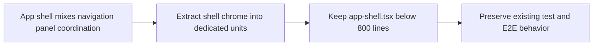

## item_073_reduce_app_shell_below_800_lines - Reduce app-shell.tsx below 800 lines

> From version: 1.3.0
> Schema version: 1.0
> Status: Done
> Understanding: 96%
> Confidence: 95%
> Progress: 100%
> Complexity: Medium
> Theme: Maintainability
> Reminder: Update status, understanding, confidence, progress and linked request/task references when you edit this doc.

# Problem

- `src/components/app-shell.tsx` at 948 lines is at the CONTRIBUTING.md threshold and will likely exceed it on the next feature addition.
- Navigation logic, panel coordination, and layout concerns are mixed in a single component.

# Scope

- In: extract navigation and panel coordination logic from `app-shell.tsx` into dedicated components or hooks; reduce the file below 800 lines.
- Out: visual changes to the shell layout; changes to panel internals; CSS work.

# Acceptance criteria

- AC1: `src/components/app-shell.tsx` is below 800 lines after extraction.
- AC2: Extracted units are testable in isolation and covered by existing or new unit tests.
- AC3: All existing E2E and unit tests pass without modification.

# Links

- Request: `logics/request/req_018_post_v1_3_code_quality_security_and_maintainability_audit.md`
- Product brief(s): (none)
- Architecture decision(s): `logics/architecture/adr_018_split_the_app_shell_and_ui_state_boundaries.md`
- Task(s): `task_040_orchestrate_post_v1_3_code_quality_security_and_maintainability_audit`

# Validation evidence

- `rtk npm run test -- tests/app.spec.tsx`
- `rtk npm run typecheck`
- `rtk npm run e2e`

## Progress notes

- `src/components/app-shell.tsx` now owns the app-state orchestration only and is reduced to 478 lines.
- Navigation chrome, topbar interactions, and toolbar rendering moved into `src/components/app-shell-chrome.tsx` so the shell stays below the backlog threshold without changing layout behavior.
- Validation passed with `rtk npm run typecheck`, `rtk npm run test -- tests/app.spec.tsx`, `rtk npm run e2e`, and the full `rtk npm run check` gate.
