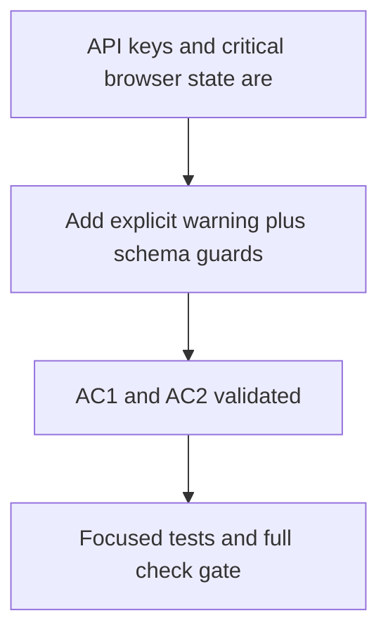

## item_074_harden_localstorage_api_key_warning_and_schema_validation - Harden localStorage: API key warning and schema validation

> From version: 1.3.0
> Schema version: 1.0
> Status: Done
> Understanding: 99%
> Confidence: 98%
> Progress: 100%
> Complexity: Low
> Theme: Security / Robustness
> Reminder: Update status, understanding, confidence, progress and linked request/task references when you edit this doc.

# Problem

- API keys (OpenAI, Gemini, Anthropic) are stored in `localStorage` with no UI warning that they are unencrypted and intended for local use only.
- Several `JSON.parse()` calls on `localStorage` data rely on graceful fallbacks but have no schema contract — silently corrupted or migrated data can produce unexpected behavior that is hard to diagnose.

# Scope

- In: an explicit inline warning in the Settings panel next to each API key input field; schema validation (Zod or TypeScript assertions) on all critical `localStorage` reads (settings, Bishop conversation, artifacts state); a clean empty-state fallback with a diagnostic log on validation failure.
- Out: encrypting keys in localStorage; migrating secrets to a different storage mechanism.

# Acceptance criteria

- AC1: A visible warning appears in Settings next to API key inputs stating that values are stored in plaintext in `localStorage` and are intended for local use only.
- AC2: Critical `localStorage` reads are validated against a declared schema; a validation failure produces a clean empty state and a diagnostic log message rather than a bare `JSON.parse()` throw or silent corruption.
- AC3: Unit tests cover the validation failure path for at least settings and Bishop conversation reads.

# Links

- Request: `logics/request/req_018_post_v1_3_code_quality_security_and_maintainability_audit.md`
- Product brief(s): (none)
- Architecture decision(s): `logics/architecture/adr_016_deepvault_persistence_and_storage_layout.md`
- Task(s): `task_040_orchestrate_post_v1_3_code_quality_security_and_maintainability_audit`

# Validation evidence

- `rtk npm run test -- tests/app.spec.tsx tests/settings-panel.spec.tsx tests/use-provider-secrets.spec.tsx tests/use-worker-settings.spec.ts tests/use-entra-settings.spec.ts tests/use-bishop-conversation.spec.tsx`
- `rtk npm run typecheck`
- `rtk npm run check`

## Progress notes

- Added explicit inline warning text under each OpenAI, Gemini, and Anthropic API key field in `src/components/panels/settings-panel.tsx`: secrets are stored in plaintext in browser `localStorage` and are intended for local/dev use only.
- Introduced shared `localStorage` parsing helpers in `src/lib/storage-schema.ts` so invalid JSON or invalid object shapes now produce a clean fallback state plus a diagnostic `console.warn`, instead of relying on bare `JSON.parse()` behavior.
- Applied validation to the critical persistence reads in `useProviderSecrets`, `useEntraSettings`, `useWorkerSettings`, `useBishopSettings`, `useBishopConversation`, and the persisted artifact filter/group state in `artifacts-panel`.
- Added regression coverage for both the warning UI and invalid-storage fallback paths in `tests/settings-panel.spec.tsx`, `tests/use-provider-secrets.spec.tsx`, `tests/use-worker-settings.spec.ts`, `tests/use-entra-settings.spec.ts`, and `tests/use-bishop-conversation.spec.tsx`.
