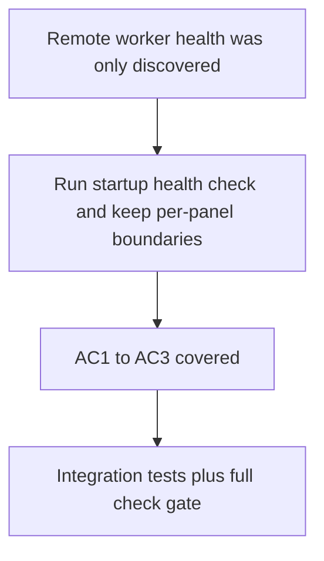

## item_075_add_worker_health_check_and_granular_error_boundaries - Add remote worker health check and granular panel error boundaries

> From version: 1.3.0
> Schema version: 1.0
> Status: Done
> Understanding: 99%
> Confidence: 98%
> Progress: 100%
> Complexity: Low
> Theme: Robustness / Operational
> Reminder: Update status, understanding, confidence, progress and linked request/task references when you edit this doc.

# Problem

- In live mode with a remote worker URL configured, the app does not check worker availability at startup — the user discovers the worker is unreachable only when they trigger an operation.
- Only one root-level `<ErrorBoundary>` exists; an exception during panel rendering takes down the entire app instead of isolating the failure to the affected panel.

# Scope

- In: a silent health check at app startup when a remote worker URL is configured, surfacing a worker availability indicator in Settings or the status bar; a granular `<ErrorBoundary>` wrapping each of the 6 panels (`explorer-panel`, `bishop-panel`, `sync-panel`, `artifacts-panel`, `ai-stats-panel`, `settings-panel`).
- Out: automatic worker reconnection or retry logic; changes to the worker API contract.

# Acceptance criteria

- AC1: When a remote worker URL is configured, the app performs a silent health check at startup and displays a worker availability indicator without blocking the UI.
- AC2: Each of the 6 panels is wrapped in its own `<ErrorBoundary>` that renders an isolated error message without crashing the rest of the app.
- AC3: A simulated panel exception in tests confirms the boundary contains the failure and leaves other panels functional.

# Links

- Request: `logics/request/req_018_post_v1_3_code_quality_security_and_maintainability_audit.md`
- Product brief(s): (none)
- Architecture decision(s): (none yet)
- Task(s): `task_040_orchestrate_post_v1_3_code_quality_security_and_maintainability_audit`

# Validation evidence

- `rtk npm run test -- tests/app-worker-health.spec.tsx tests/app-shell-error-boundary.spec.tsx tests/error-boundary.spec.tsx tests/app.spec.tsx tests/settings-panel.spec.tsx tests/use-worker-settings.spec.ts`
- `rtk npm run check`

## Progress notes

- Added `src/hooks/useWorkerHealth.ts` to run a silent startup `GET /api/health` check whenever `workerMode=remote` is configured with an https URL and token, without blocking the shell.
- Surfaced the dedicated worker availability state inside the Settings worker screen with an explicit startup-health card, covering reachable, degraded, unreachable, local, and misconfigured states.
- Kept the per-panel `ErrorBoundary` isolation in `src/components/app-shell.tsx` and added `tests/app-shell-error-boundary.spec.tsx` to prove that a crashing Explorer panel falls back locally while the rest of the shell remains usable.
- Added `tests/app-worker-health.spec.tsx` to verify the startup remote health check hits `/api/health` with the configured bearer token and renders the resulting availability indicator in Settings.
