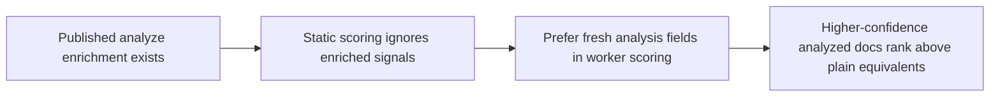

## item_077_integrate_analyze_enrichment_into_bishop_scoring - Integrate analyze enrichment fields into Bishop retrieval scoring

> From version: 1.3.0
> Schema version: 1.0
> Status: Done
> Understanding: 100%
> Confidence: 97%
> Progress: 100%
> Complexity: Medium
> Theme: Product / Quality
> Reminder: Update status, understanding, confidence, progress and linked request/task references when you edit this doc.

# Problem

- The `analyze` pipeline enriches documents with AI summaries, extracted keywords, and confidence scores, but Bishop retrieval scoring still uses static weights (title=8, summary=6, content=4, tags=5, path=2) with no awareness of enrichment state or confidence level.
- The enrichment exists but does not close the loop on answer quality — documents that have been deeply analyzed are not ranked higher than unenriched ones.

# Scope

- In: implement enrichment scoring in `worker/scoring.py` (the Python FastAPI worker) — factor in AI keywords, AI summary, and confidence score when available; apply a static weight fallback for unenriched documents; ensure `publish-analyzed-corpus` outputs enriched fields in a form that scoring can consume; add unit tests covering enriched vs unenriched document ranking.
- Out: semantic or vector retrieval; changes to the analyze pipeline output contract; new provider integrations.
- Note: `scoring.ts` is no longer the implementation target — scoring logic moves to Python as part of `adr_035`. This item's scope is unchanged but the implementation language is Python.

# Acceptance criteria

- AC1: Documents with a high confidence score rank higher than unenriched documents for equivalent queries; the scoring change is documented in `worker/scoring.py`.
- AC2: When an analyzed corpus is published, AI keywords and AI summary are indexed into the scoring path; the static weight fallback remains active for unenriched documents.
- AC3: Unit tests cover: unenriched document, document with high confidence, document with low confidence — all three cases produce explainable differential ranks.

# Links

- Request: `logics/request/req_019_post_v1_3_consolidation_enrichment_loop_ci_and_configuration_portability.md`
- Product brief(s): `logics/product/prod_010_add_a_post_ingest_ai_analysis_command_for_corpus_enrichment.md`
- Architecture decision(s): `logics/architecture/adr_014_deepvault_retrieval_ranking_quality_and_cost_policy.md`, `logics/architecture/adr_029_bound_post_ingest_analysis_contract_and_runtime_output.md`, `logics/architecture/adr_032_integrate_analyze_enrichment_fields_into_bishop_retrieval_scoring.md`
- Task(s): `task_041_orchestrate_post_v1_3_consolidation_enrichment_ci_and_configuration_portability`

# Validation evidence

- `python -m pytest worker/tests/test_scoring.py`
- `rtk npm run evaluate`
- `rtk npm run check`

# Delivery update

- `worker/scoring.py` now prefers fresh `analysis.summary`, `analysis.keywords`, and `analysis.sections` when the analysis state is `analyzed` and the confidence clears the scoring threshold.
- The confidence boost is explicitly bounded and documented inline so enriched matches outrank equivalent plain matches without overwhelming stronger raw evidence.
- Scoring now normalizes both the shipped analyze confidence scale (`55..95`) and older ratio-style payloads (`0..1`), closing the contract gap between analyze output and retrieval weighting.
- `worker/tests/test_scoring.py` now covers unenriched, high-confidence, low-confidence, and ratio-compatibility cases.
- Validation completed: `rtk python3 -m pytest worker/tests/test_scoring.py -q`, `rtk npm run typecheck`, and `rtk npm run evaluate`.
