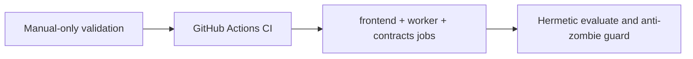

## item_078_add_github_actions_ci_workflow - Add GitHub Actions CI workflow

> From version: 1.3.0
> Schema version: 1.0
> Status: Done
> Understanding: 100%
> Confidence: 97%
> Progress: 100%
> Complexity: Low
> Theme: Operational / Quality
> Reminder: Update status, understanding, confidence, progress and linked request/task references when you edit this doc.

# Problem

- No automated CI workflow exists. Only local scripts (`npm run check`, `npm run ci:local`) are available.
- PRs are not protected by an automatic gate — regressions can land without anyone having manually run the check.

# Scope

- In: a GitHub Actions workflow that runs on every push to `main` and on open PRs; a first-wave `frontend` job runs typecheck/check/build, a `worker` job installs `worker/requirements.txt` and runs `worker/tests/`, and a `contracts` smoke job validates the worker health/runtime endpoints in hermetic mode; `evaluate` runs in hermetic mock mode with no ambient provider keys and no live corpus files; Playwright browser download cached to avoid inflating run times.
- In: add an anti-zombie gate to CI for the migration waves that retire browser/runtime paths, so the workflow can fail if runtime-active code still references legacy modules that are meant to be removed.
- Out: deployment automation; E2E tests in CI (Playwright is heavy — can be added in a follow-up); secrets management beyond hermetic mock mode.

# Acceptance criteria

- AC1: A GitHub Actions workflow is active on `main` and open PRs; a failure on any step blocks the merge.
- AC2: The workflow is hermetic: it uses no ambient provider API keys, has no access to live corpus files, and writes no artifacts outside `coverage/` and `dist/`.
- AC3: Playwright browser dependencies are cached across runs to keep CI time reasonable.
- AC4: The workflow has explicit first-wave jobs for `frontend`, `worker`, and `contracts` smoke validation, so browser checks and worker checks fail independently and visibly.
- AC5: The `contracts` smoke job validates at least `GET /api/health` and `GET /api/config/mode` against a locally started worker in CI.
- AC6: The migration anti-zombie guard can fail CI when runtime-active code still references legacy modules that a closed wave was expected to remove.

# Links

- Request: `logics/request/req_019_post_v1_3_consolidation_enrichment_loop_ci_and_configuration_portability.md`
- Product brief(s): (none)
- Architecture decision(s): (none yet)
- Task(s): `task_041_orchestrate_post_v1_3_consolidation_enrichment_ci_and_configuration_portability`

# Validation evidence

- GitHub Actions workflow passes on a clean branch with no local environment variables set.
- `rtk npm run check` passes locally to confirm parity before pushing.
- GitHub Actions run shows separate `frontend`, `worker`, and `contracts` jobs.
- The `contracts` job proves `/api/health` and `/api/config/mode` respond successfully in CI.

# Delivery update

- `.github/workflows/ci.yml` now defines separate `frontend`, `worker`, and `contracts` jobs on push/PR to `main`, plus an optional manual `e2e` job for Playwright.
- The frontend job now runs `typecheck`, the anti-zombie migration guard, a CI-safe `check` path with E2E/evaluate skipped inside `scripts/check.mjs`, an explicit build, and a hermetic strict `evaluate` run with its output redirected outside the repo tree.
- Hermetic support now includes `scripts/evaluate.ts --output ...`, so CI can run strict mock evaluation without writing snapshots into `data/eval/`.
- The worker smoke contract now lives in `scripts/worker-contract-smoke.py`, which starts the FastAPI worker and verifies `/api/health` plus `/api/config/mode` over real HTTP instead of only in-process tests.
- The anti-zombie guard now lives in `scripts/ci-anti-zombie-check.mjs` and fails when browser runtime code reintroduces banned imports or legacy `/api/worker/` paths.
- Local validation is complete with `rtk npm run ci:anti-zombie`, `rtk npm run typecheck`, `DEEPVAULT_CHECK_SKIP_E2E=1 DEEPVAULT_CHECK_SKIP_EVALUATE=1 rtk npm run check`, `rtk python3 -m pytest worker/tests -q`, and `rtk python3 scripts/worker-contract-smoke.py`.
- GitHub Actions run `24609268556` on `main` completed successfully with distinct `frontend`, `worker`, and `contracts` jobs green; `e2e` remained optional and untriggered as designed.
