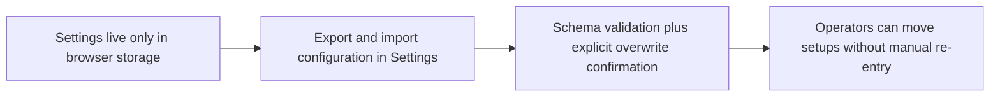

## item_079_add_configuration_export_and_import_to_settings - Add configuration export and import to the Settings panel

> From version: 1.3.0
> Schema version: 1.0
> Status: Done
> Understanding: 100%
> Confidence: 97%
> Progress: 100%
> Complexity: Low
> Theme: Product / Operational
> Reminder: Update status, understanding, confidence, progress and linked request/task references when you edit this doc.

# Problem

- API keys, Entra settings, worker URLs, and Bishop tuning parameters are stored in `localStorage` — lost when the user switches machine, browser, or clears storage.
- There is no way to share a working configuration across operators or between environments, which is a concrete blocker for team use.

# Scope

- In: an "Export configuration" button in Settings that downloads a local JSON file containing all persisted parameters; an "Import configuration" button that accepts a JSON file, validates its schema, and applies values after explicit user confirmation; a visible warning on export that the file contains secrets in plaintext.
- Out: encrypting the exported file; syncing configuration across machines automatically; multi-workspace profile management.

# Acceptance criteria

- AC1: "Export configuration" generates and downloads a JSON file containing all persisted parameters (API keys, Entra settings, worker URL, Bishop tuning); the file does not transit through any server.
- AC2: "Import configuration" accepts a JSON file produced by AC1 and applies the values only after explicit user confirmation and successful schema validation; existing values are overwritten only on confirmed import.
- AC3: A visible warning on export states that the file contains secrets in plaintext and must be treated as a sensitive file.
- AC4: Unit tests cover the export shape and the import validation failure path (malformed file produces a clear error, no partial write).

# Links

- Request: `logics/request/req_019_post_v1_3_consolidation_enrichment_loop_ci_and_configuration_portability.md`
- Product brief(s): `logics/product/prod_013_make_application_configuration_exportable_and_importable.md`
- Architecture decision(s): `logics/architecture/adr_016_deepvault_persistence_and_storage_layout.md`
- Task(s): `task_041_orchestrate_post_v1_3_consolidation_enrichment_ci_and_configuration_portability`

# Validation evidence

- `rtk npm run test -- tests/settings-panel.spec.tsx`
- `rtk npm run check`

# Delivery update

- Settings now exposes a dedicated configuration transfer section in the Worker view with `Export configuration` and `Import configuration` actions.
- Export is fully client-side and downloads a timestamped JSON file that includes runtime preferences, conversation-context state, Bishop tuning, provider secrets, Entra settings, and worker settings.
- Import now validates the JSON schema before any write, shows a confirmation dialog before overwrite, and applies the full configuration atomically only after confirmation.
- The export UI now displays an inline plaintext warning that the downloaded file contains secrets and must be treated as sensitive.
- Shared transfer logic now lives in `src/lib/settings-transfer.ts`, which normalizes and validates import payloads before the UI applies them.
- Validation completed with `rtk npm run test -- tests/settings-panel.spec.tsx`, `rtk npm run typecheck`, and `DEEPVAULT_CHECK_SKIP_E2E=1 DEEPVAULT_CHECK_SKIP_EVALUATE=1 rtk npm run check`.
- `rtk npm run evaluate` was rerun separately and still passes after the Settings changes. Full `rtk npm run check` remains partially blocked in the sandbox because `e2e` preview binding and sandboxed `tsx` IPC are not permitted locally.
