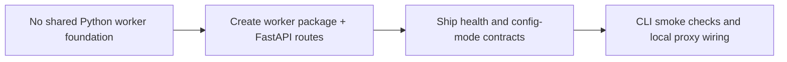

## item_080_python_fastapi_worker_foundation - Python FastAPI worker — foundation

> From version: 1.3.0
> Schema version: 1.0
> Status: Done
> Understanding: 97%
> Confidence: 96%
> Progress: 100%
> Complexity: Medium
> Theme: Architecture / Infrastructure
> Reminder: Update status, understanding, confidence, progress and linked request/task references when you edit this doc.

# Problem

- All non-frontend logic (bishop orchestration, scoring, corpus serving, job execution) currently lives either in browser TypeScript or in ad-hoc Node.js CLI scripts.
- There is no shared HTTP server that can serve as the backend for both local development and the hosted deployment.
- The browser cannot be a pure UI client without a worker API to call.

# Scope

- In: create the `worker/` Python package with `main.py` (FastAPI app), `config.py` (pydantic-settings reading env vars), and a working `GET /api/health` and `GET /api/config/mode` endpoint; configure the Vite dev proxy (`/api → http://localhost:8000`) so the browser can reach the worker in local dev mode; add `worker/requirements.txt` with pinned dependencies; add a `worker/Dockerfile` (Python 3.12 slim); document local dev setup (Python version, virtual env, `uvicorn` invocation alongside `npm run dev`).
- In: add a minimal first-party CLI over the same worker services with an entrypoint under `worker/cli/`; ship at least `worker health` and `worker config-mode` so the backend can be smoke-tested without the browser UI.
- In: pin the initial worker dependency set to `fastapi`, `uvicorn[standard]`, `httpx`, `pydantic-settings`, `python-jose[cryptography]`, `sse-starlette`, `pytest`, and `pytest-asyncio`; use `worker/tests/` as the canonical Python test location.
- In: establish the first-wave worker structure as `worker/app/{routes,services,auth,infra}`, `worker/cli/commands`, and `worker/tests/`; keep business logic out of HTTP routes and CLI commands.
- In: define the canonical `GET /api/config/mode` payload as `{ mode, workerVersion, corpusVersion, isOperator, features }` and adopt a standard worker error envelope `{ error: { code, message, details? } }`; source `workerVersion` from a single worker-owned version file and use ISO 8601 UTC timestamps in worker responses from day one.
- Out: corpus serving, bishop proxy, job execution, Entra auth — those are covered by items 081–088.

# Acceptance criteria

- AC1: `GET /api/health` returns `{ status: "ok", workerVersion, mode }` with a 200 response.
- AC2: `GET /api/config/mode` returns the agreed first-wave runtime projection `{ mode, workerVersion, corpusVersion, isOperator, features }`, with `mode` driven by the `WORKER_MODE` env var.
- AC3: The Vite dev server proxies all `/api/*` requests to `http://localhost:8000` — confirmed by a browser network tab showing the worker response origin.
- AC4: `worker/requirements.txt` is present with pinned versions; a `pip install -r requirements.txt` in a fresh venv succeeds.
- AC4: `worker/requirements.txt` is present with pinned versions for the agreed foundation stack (`fastapi`, `uvicorn[standard]`, `httpx`, `pydantic-settings`, `python-jose[cryptography]`, `sse-starlette`, `pytest`, `pytest-asyncio`); a `pip install -r requirements.txt` in a fresh venv succeeds.
- AC5: `worker/Dockerfile` builds without error and the container responds to `GET /api/health`.
- AC6: Local dev setup is documented (README or CONTRIBUTING section): Python version, venv creation, uvicorn invocation, how to run alongside `npm run dev`.
- AC7: The worker exposes a supported CLI entrypoint that returns the same mode/health information as the HTTP foundation endpoints via `worker health` and `worker config-mode`.
- AC8: The `worker/` skeleton contains the agreed top-level structure (`app/routes`, `app/services`, `app/auth`, `app/infra`, `cli/commands`, `tests`) and neither FastAPI routes nor CLI commands own business logic directly.
- AC9: `GET /api/config/mode` and worker error responses follow the agreed first-wave contracts so the browser can rely on a stable runtime projection and error shape from the start.
- AC10: `workerVersion` is read from a single worker-owned version source and all worker timestamps follow ISO 8601 UTC formatting.

# Links

- Request: `logics/request/req_020_host_nexus_as_a_shared_multi_user_web_application.md`
- Product brief(s): `logics/product/prod_014_host_nexus_as_a_shared_multi_user_web_application.md`
- Architecture decision(s): `logics/architecture/adr_035_python_fastapi_as_the_worker_runtime.md`, `logics/architecture/adr_034_nexus_hosted_deployment_topology_and_multi_user_access_model.md`
- Task(s): `task_042_orchestrate_python_worker_foundation_and_runtime_migration`

# Validation evidence

- `pip install -r worker/requirements.txt`
- `uvicorn worker.main:app --reload` → `curl http://localhost:8000/api/health`
- `rtk python3 -m worker.cli.main health`
- `rtk python3 -m worker.cli.main config-mode`
- `docker build -t nexus-worker ./worker` → `docker run --rm -p 8000:8000 nexus-worker` → `curl http://localhost:8000/api/health`
- `npm run dev` → browser network tab → `/api/health` returns worker response

## Progress notes

- Wave 1 foundation started on `1.4.0` with the initial `worker/` package, shared service layer, `GET /api/health`, `GET /api/config/mode`, CLI stubs, pinned requirements, Dockerfile, and Vite `/api` proxy wiring.
- The final direct bind/proxy smoke-check is now closed: `rtk python3 -m uvicorn worker.main:app --host 127.0.0.1 --port 8000` answered on `/api/health`, and `rtk npm run dev -- --host 127.0.0.1 --port 4174` successfully proxied `/api/health` to the worker on port `8000`.
- Route contracts, CLI checks, Python tests, README setup, and local proxy validation are now in place, so the foundation slice is complete and the remaining hosted work can build on top of it.
