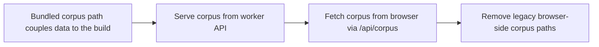

## item_082_corpus_endpoint_and_browser_bundle_cleanup - Corpus endpoint and browser bundle cleanup

> From version: 1.3.0
> Schema version: 1.0
> Status: In Progress
> Understanding: 98%
> Confidence: 97%
> Progress: 45%
> Complexity: Medium
> Theme: Architecture / Performance
> Reminder: Update status, understanding, confidence, progress and linked request/task references when you edit this doc.

# Problem

- The corpus is currently loaded from a bundled TypeScript file (`src/data/corpus.ts`) or a static JSON file. This couples the corpus to the build and prevents shared access across users.
- `src/lib/scoring.ts`, `src/lib/deepvault.ts`, and `src/data/corpus.ts` are browser-side modules that must be removed from the bundle now that the worker owns all business logic.
- The browser has no standard mechanism to detect that the worker is unreachable and show an appropriate offline state.

# Scope

- In: implement `GET /api/corpus` in `worker/corpus.py` — reads and returns `data/runtime/corpus-published.json`; supports `ETag` / `If-None-Match` for efficient caching; returns `{ schemaVersion, generatedAt, documents: [...] }`; in local mode (`WORKER_MODE=local`) serves `data/mock/corpus.json`; remove `src/data/corpus.ts` from the browser bundle; update the browser corpus loading path to fetch from `GET /api/corpus` at startup; remove `src/lib/scoring.ts` and `src/lib/deepvault.ts` from the browser bundle (browser no longer calls SharePoint or scores documents directly); add a `data/mock/corpus.json` file for local development mode; show an explicit offline error state in the browser when the worker is unreachable at corpus load time (last known corpus age + reconnect prompt).
- In: expose corpus inspection and validation through the first-party worker CLI (`worker corpus show`, `worker corpus validate`) over the same corpus-loading service used by the HTTP endpoint so operators and CI can inspect backend state without the browser UI.
- Out: Entra token gating on the corpus endpoint (covered by item_085); bishop proxy (item_083); job execution (item_084).

# Acceptance criteria

- AC1: `GET /api/corpus` returns the published corpus JSON with a 200 response and a valid `ETag` header.
- AC2: In local mode (`WORKER_MODE=local`), `GET /api/corpus` returns the mock corpus from `data/mock/corpus.json`.
- AC3: The browser fetches the corpus from `GET /api/corpus` at startup and on explicit refresh — no corpus is loaded from `src/data/corpus.ts` or any bundled import.
- AC4: `src/data/corpus.ts`, `src/lib/scoring.ts`, and `src/lib/deepvault.ts` are removed from the browser codebase. The production build contains no reference to them.
- AC5: When the worker is unreachable at startup, the browser shows an explicit offline state with the last known corpus timestamp and a reconnect action — it does not crash or show a blank screen.
- AC6: A repeated fetch with the same `ETag` returns `304 Not Modified` — the browser does not re-download an unchanged corpus.
- AC7: `worker corpus show` and `worker corpus validate` operate on the same published corpus source as `GET /api/corpus` and succeed without starting the browser UI.

# Links

- Request: `logics/request/req_020_host_nexus_as_a_shared_multi_user_web_application.md`
- Product brief(s): `logics/product/prod_014_host_nexus_as_a_shared_multi_user_web_application.md`
- Architecture decision(s): `logics/architecture/adr_035_python_fastapi_as_the_worker_runtime.md`, `logics/architecture/adr_034_nexus_hosted_deployment_topology_and_multi_user_access_model.md`, `logics/architecture/adr_027_pwa_cache_and_offline_fallback_strategy.md`
- Task(s): `task_042_orchestrate_python_worker_foundation_and_runtime_migration`

# Validation evidence

- `curl http://localhost:8000/api/corpus` → valid corpus JSON
- `curl -H "If-None-Match: <etag>" http://localhost:8000/api/corpus` → 304
- `rtk python3 -m worker.cli.main corpus show`
- `rtk python3 -m worker.cli.main corpus validate`
- `npm run build` → bundle contains no `corpus.ts`, `scoring.ts`, or `deepvault.ts` references (`grep -r "scoring" dist/`)
- Browser devtools: network tab shows corpus fetched from `/api/corpus`; kill worker → offline state shown

## Progress notes

- The worker now exposes `GET /api/corpus` with `ETag` support and local-mode loading from `data/mock/corpus.json`.
- The worker CLI now supports `worker corpus show` and `worker corpus validate` over the same corpus service as the HTTP route.
- The browser fetch path now targets `/api/corpus`, reuses `ETag` on repeat fetches, preserves the last successful fetch timestamp to make worker-offline states more explicit, and now runs through `src/lib/corpus-client.ts` instead of `src/data/corpus.ts` on the app path.
- The remaining work in this item is the full browser bundle cleanup (`src/data/corpus.ts`, `src/lib/scoring.ts`, and `src/lib/deepvault.ts` removal from the production path) plus final offline UX verification in the running app.
