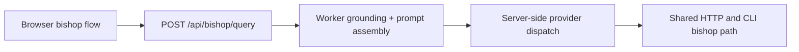

## item_083_bishop_proxy_endpoint - Bishop proxy endpoint on Python worker

> From version: 1.4.0
> Schema version: 1.0
> Status: Done
> Understanding: 100%
> Confidence: 99%
> Progress: 100%
> Complexity: High
> Theme: Architecture / Product
> Reminder: Update status, understanding, confidence, progress and linked request/task references when you edit this doc.

# Problem

- Bishop LLM calls are currently made directly from the browser using API keys stored in localStorage. This means API keys are exposed in the browser and team members must supply their own keys.
- In the Python FastAPI model, the worker proxies bishop queries — the browser sends a question, the worker performs grounding and calls the LLM provider with server-side keys, the browser receives the structured response.
- `src/lib/bishop.ts` must be removed from the browser bundle; all orchestration and adapter logic moves to `worker/bishop.py`.

# Scope

- In: implement `POST /api/bishop/query` in `worker/bishop.py` — receives `{ question, role, history }` from the browser; performs corpus grounding using `worker/scoring.py`; assembles the prompt; calls the configured LLM provider (OpenAI, Gemini, or Anthropic) using server-side env vars (`BISHOP_PROVIDER`, `OPENAI_API_KEY`, etc.); returns the full Bishop response shape (`{ answer, sources, confidence, status, trace }`); remove `src/lib/bishop.ts` from the browser codebase; update the browser Bishop UI to call `POST /api/bishop/query` instead of importing bishop.ts; add integration tests for the proxy endpoint.
- In: expose a first-party CLI debug path (`worker bishop query --question "..."`) over the same Bishop service used by the HTTP endpoint so developers and operators can validate grounding/provider behavior without the browser UI.
- Out: SSE streaming from the proxy endpoint (full response is acceptable in the first wave per resolved decisions); Entra token gating (item_085); new LLM providers.

# Acceptance criteria

- AC1: `POST /api/bishop/query` with `{ question, role }` returns the full Bishop response shape — answer, sources with document references, confidence, status, trace — within 30 seconds.
- AC2: The worker selects the LLM provider based on the `BISHOP_PROVIDER` env var and calls it with the server-side API key. No API key appears in any browser network request.
- AC3: `src/lib/bishop.ts` and all sub-modules are removed from the browser codebase. The production build contains no reference to them.
- AC4: The browser Bishop panel calls `POST /api/bishop/query` and renders the response identically to the previous behavior — answer, sources, confidence indicator, trace panel.
- AC5: Integration tests cover: successful query with grounded answer, query with no relevant documents (low confidence path), LLM provider error (fallback or error status returned gracefully).
- AC6: `worker bishop query --question "..."` returns the same structured response contract as the HTTP endpoint for the same worker configuration.

# Links

- Request: `logics/request/req_020_host_nexus_as_a_shared_multi_user_web_application.md`
- Product brief(s): `logics/product/prod_014_host_nexus_as_a_shared_multi_user_web_application.md`
- Architecture decision(s): `logics/architecture/adr_035_python_fastapi_as_the_worker_runtime.md`, `logics/architecture/adr_034_nexus_hosted_deployment_topology_and_multi_user_access_model.md`, `logics/architecture/adr_020_clarify_bishop_orchestration_states_and_response_contract.md`
- Depends on: `item_081_port_scoring_to_python_worker`, `item_082_corpus_endpoint_and_browser_bundle_cleanup`
- Task(s): `task_042_orchestrate_python_worker_foundation_and_runtime_migration`

# Validation evidence

- `curl -X POST http://localhost:8000/api/bishop/query -H "Content-Type: application/json" -d '{"question":"...", "role":"analyst"}'`
- `rtk python3 -m worker.cli.main bishop query --question "..."`
- Browser devtools: no API key in network requests
- `npm run build` → no `bishop.ts` reference in dist/
- `rtk python3 -m pytest worker/tests/test_bishop.py -v`

## Progress notes

- The worker now exposes a grounded Bishop proxy at `POST /api/bishop/query`, backed by a shared `BishopService` and mirrored by `worker bishop query --question "..."`.
- The worker proxy performs server-side provider dispatch for `openai`, `gemini`, and `anthropic` using worker env vars (`BISHOP_PROVIDER`, `BISHOP_MODEL`, provider API keys) and returns the structured Bishop response contract with `mode`, `trace`, `model`, token usage, and confidence metadata.
- The browser runtime path no longer imports `src/lib/bishop.ts` for conversation handling; it now uses a dedicated HTTP client against `/api/bishop/query`, keeping the worker as the primary orchestration path.
- Worker and app coverage now include successful provider-dispatched answers plus graceful fallback when provider keys are missing, upstream provider calls fail, or the worker cannot be reached.
- The last browser-side local fallback no longer imports `src/lib/deepvault.ts`; it now uses `src/lib/corpus-grounding.ts` so the Bishop client no longer depends on the legacy aggregate module at runtime.
- The shared `src/lib` barrel no longer re-exports Bishop orchestration helpers, which reduces the accidental public/runtime surface of the legacy `src/lib/bishop.ts` module to explicit test and script imports only.
- Explicit test/script imports now point to `src/lib/bishop-orchestration.ts`, and the legacy `src/lib/bishop.ts` compatibility facade has been removed.
- Worker and CLI validation now both exercise the shared Bishop service: `rtk python3 -m pytest worker/tests/test_bishop.py -v` passes, and `rtk python3 -m worker.cli.main bishop query --question "What is the budget for Q3 2025?"` returns the expected structured response contract.
