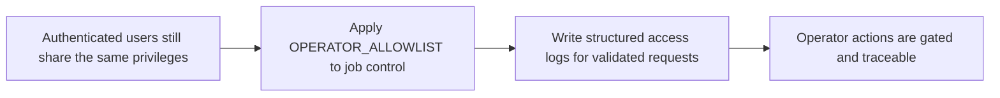

## item_086_operator_allowlist_and_access_log - Operator allowlist and structured access log

> From version: 1.3.0
> Schema version: 1.0
> Status: Done
> Understanding: 99%
> Confidence: 98%
> Progress: 100%
> Complexity: Low
> Theme: Security / Operations
> Reminder: Update status, understanding, confidence, progress and linked request/task references when you edit this doc.

# Problem

- In the hosted model, not all authenticated users should be able to trigger jobs or access Artifacts — job control is reserved for operators.
- There is no audit trail of who accessed which endpoint, making incident investigation difficult.
- Adding or removing an operator must be possible without redeploying the application.

# Scope

- In: implement operator gating in `worker/auth.py` — extract the `oid` claim from the validated Entra token; check it against `OPERATOR_ALLOWLIST` (comma-separated Entra object IDs from env var or config file); return `403 Forbidden` if the `oid` is not in the list when the request targets a job control or artifacts endpoint (`POST /api/jobs`, `POST /api/jobs/:id/cancel`, `GET /api/artifacts`); implement a structured JSON access log middleware in `worker/access_log.py` — write one log line per validated request (`{ ts, oid, endpoint, status }`); daily log file rotation; 30-day retention; retain logs in `data/logs/`.
- Out: Entra token validation (item_085); fine-grained per-endpoint permission tables; log viewer UI.

# Acceptance criteria

- AC1: A request to `POST /api/jobs` from an authenticated team member whose `oid` is not in `OPERATOR_ALLOWLIST` returns `403 Forbidden`.
- AC2: A request to `POST /api/jobs` from an operator (oid in `OPERATOR_ALLOWLIST`) is allowed.
- AC3: Adding an object ID to `OPERATOR_ALLOWLIST` and restarting the worker grants operator access within one restart cycle. Removing it revokes access within one restart cycle.
- AC4: Every validated request produces a JSON log line `{ ts, oid, endpoint, status }` in `data/logs/access-YYYY-MM-DD.json`.
- AC5: Log files rotate daily; files older than 30 days are deleted automatically.

# Links

- Request: `logics/request/req_020_host_nexus_as_a_shared_multi_user_web_application.md`
- Product brief(s): `logics/product/prod_015_user_authentication_and_access_management.md`
- Architecture decision(s): `logics/architecture/adr_034_nexus_hosted_deployment_topology_and_multi_user_access_model.md`
- Depends on: `item_085_entra_sso_msal_and_worker_token_validation`
- Task(s): `task_043_orchestrate_hosted_auth_access_and_deployment`

# Validation evidence

- Team member token → `POST /api/jobs` → 403
- Operator token → `POST /api/jobs` → 202
- Add oid to `OPERATOR_ALLOWLIST`, restart worker → previously denied user now gets 202
- `tail data/logs/access-$(date +%Y-%m-%d).json` → log lines visible after requests
- `python -m pytest worker/tests/test_operator_gate.py worker/tests/test_access_log.py -v`
- `rtk python3 -m pytest worker/tests -q`
- `rtk npm run test -- tests/app.spec.tsx tests/use-sync-operations.spec.tsx tests/worker-client.spec.ts tests/use-hosted-auth.spec.tsx`

# Outcome

- The worker now derives operator access from `OPERATOR_ALLOWLIST` and returns `403 Forbidden` for authenticated non-operators who attempt job-control actions.
- `GET /api/config/mode` accepts an optional bearer token and reports `isOperator` from the validated `oid`, so the browser can adapt hosted UI without inspecting claims itself.
- Validated requests now emit structured JSON access-log lines under `data/logs/access-YYYY-MM-DD.json` with daily file rollover by filename and automatic 30-day retention cleanup.
- Local development remains unchanged when `WORKER_AUTH_ENABLED=false`: operator gating is bypassed and no bearer token is required.
