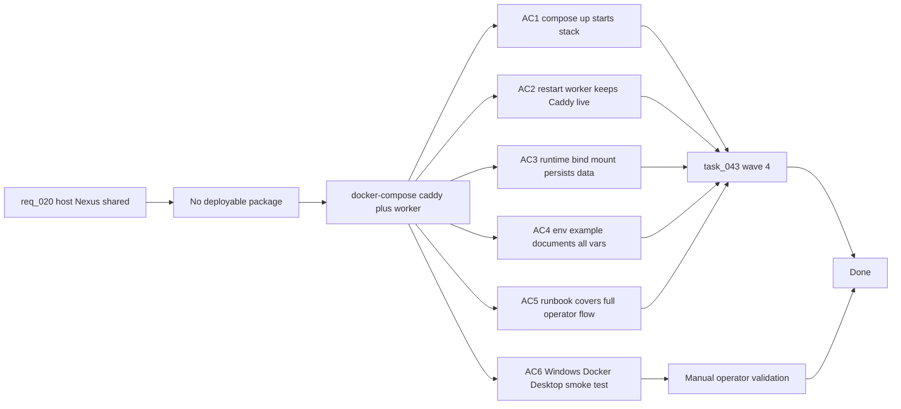

## item_088_docker_compose_deployment_package - Docker Compose deployment package (Caddy + Python worker, Windows)

> From version: 1.3.0
> Schema version: 1.0
> Status: Done
> Understanding: 99%
> Confidence: 99%
> Progress: 100%
> Complexity: Medium
> Theme: Infrastructure / Operations
> Reminder: Update status, understanding, confidence, progress and linked request/task references when you edit this doc.

# Problem

- There is no deployable package for the hosted Nexus instance — no `docker-compose.yml`, no Caddy config, no env file template, no deployment guide.
- Operators need a reproducible way to start, update, and restart the hosted instance on a Windows machine with Docker Desktop.

# Scope

- In: write `docker-compose.yml` with two services — `caddy` (serving `/dist` and proxying `/api/*` to the worker, ports 80/443) and `worker` (Python FastAPI, internal port 8000, bind mount `C:\\deepvault-nexus\\data\\runtime` as the default Windows host runtime path); write `Caddyfile` with static file serving and reverse proxy configuration; write `.env.example` listing all required env vars (`OPENAI_API_KEY`, `GEMINI_API_KEY`, `ANTHROPIC_API_KEY`, `ENTRA_TENANT_ID`, `ENTRA_CLIENT_ID`, `OPERATOR_ALLOWLIST`, `WORKER_AUTH_ENABLED`, `BISHOP_PROVIDER`, `WORKER_MODE`); write a deployment guide (operator runbook): how to build the Nexus static bundle, copy `/dist` into the Caddy volume, configure `.env`, run `docker compose up -d`, run `docker compose restart worker` for updates, and check `GET /api/health`; document Windows startup automation (Docker Desktop auto-start or Task Scheduler `docker compose up -d` on login); treat Caddy as the only documented first-wave reverse proxy.
- Out: Azure hosting; cloud CDN; high-availability setup; monitoring beyond `GET /api/health`.

# Acceptance criteria

- AC1: `docker compose up -d` from the repo root starts both containers with no errors. Caddy serves the Nexus static build at port 80. `/api/*` requests are proxied to the Python worker.
- AC2: `docker compose restart worker` updates the worker without restarting Caddy or disrupting static file serving.
- AC3: `data/runtime/` is a bind mount — corpus and job artifacts persist across container restarts.
- AC4: `.env.example` documents every required env var with a description and example value. Operators can copy it to `.env` and fill in secrets.
- AC5: The deployment guide covers the full runbook: initial setup, updating the static build, updating the worker, adding an operator, revoking an operator, checking worker health.
- AC6: The stack runs on a Windows machine with Docker Desktop + WSL2 — validated by a manual smoke test: team member browser → Nexus URL → authenticated → corpus loaded → Bishop query answered.

# Links

- Request: `logics/request/req_020_host_nexus_as_a_shared_multi_user_web_application.md`
- Product brief(s): `logics/product/prod_014_host_nexus_as_a_shared_multi_user_web_application.md`
- Architecture decision(s): `logics/architecture/adr_034_nexus_hosted_deployment_topology_and_multi_user_access_model.md`, `logics/architecture/adr_035_python_fastapi_as_the_worker_runtime.md`
- Depends on: `item_080` through `item_087` (all worker and auth work must be complete before deployment packaging)
- Task(s): `task_043_orchestrate_hosted_auth_access_and_deployment`

# Validation evidence

- `docker compose up -d` → no errors → `curl http://localhost/api/health` → 200
- `docker compose restart worker` → Caddy still serving → worker healthy after restart
- Kill and recreate worker container → `data/runtime/corpus-published.json` still present
- Windows Docker Desktop: `docker compose up -d` on startup → Nexus accessible at configured local network URL
- Manual smoke test: team member browser → URL → corpus loaded → Bishop query → answer received
