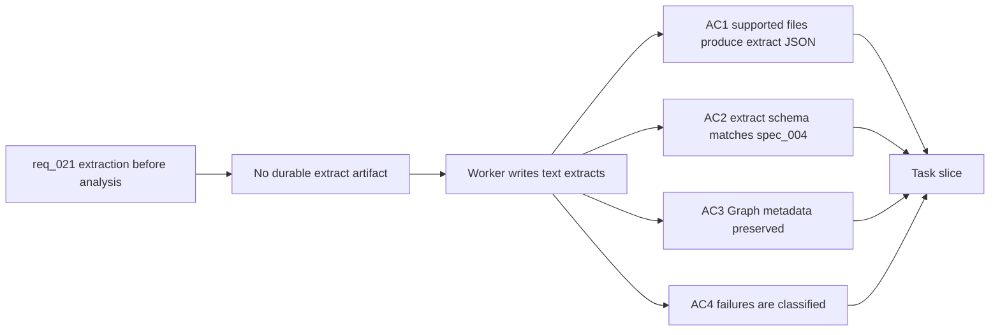

## item_089_worker_text_extract_artifacts_for_sharepoint_documents - Worker text extract artifacts for SharePoint documents

> From version: 1.5.1
> Schema version: 1.0
> Status: Done
> Understanding: 98%
> Confidence: 94%
> Progress: 100%
> Complexity: High
> Theme: Data / Worker / Corpus
> Reminder: Update status, understanding, confidence, progress and linked request/task references when you edit this doc.

# Problem

- The worker currently publishes corpus documents directly, and many Office/PDF entries degrade to `Source: ... Path: ...` placeholder content.
- The Logics data schema already defines raw extract files, but the worker does not consistently write them as durable artifacts before chunking or analysis.
- Without extract artifacts, later analysis cannot distinguish real document evidence from metadata fallback.

# Scope

- In: add worker-side extraction artifact writing under the runtime data layout for supported SharePoint files; include source id, source type, site id, display name, path, author fields where available, last modified, content type, extracted timestamp, and normalized plain text.
- In: keep SharePoint as the source of truth while persisting derived extract files locally.
- In: handle supported file types first, including text/HTML-like content plus the first wave of Office/PDF formats that can be extracted without OCR.
- In: record extraction result metadata so downstream steps can tell `full_text`, `partial_text`, `metadata_only`, and `unreadable`.
- Out: OCR for image-only scans; semantic indexing; broad UI work.

# Acceptance criteria

- AC1: A worker export/ingest run writes one extract JSON artifact per supported document with non-empty extracted text when the source body is readable.
- AC2: Extract files follow the `spec_004` extract schema closely enough that chunking and analysis can consume them without reinterpreting corpus rows.
- AC3: Extract artifacts preserve source metadata needed for traceability: source id, site id, display name, library path, author or modifier when available, last modified, content type, and extracted timestamp.
- AC4: Documents that cannot produce useful body text have an explicit extraction state and reason instead of silently falling back to metadata-only content.
- AC5: Worker tests cover at least one successful text extract, one metadata-only fallback, and one unsupported or unreadable source.

# Links

- Request: `logics/request/req_021_enforce_real_text_extraction_before_post_ingest_analysis.md`
- Spec(s): `logics/specs/spec_004_deepvault_data_schema_and_storage_contracts.md`
- Architecture decision(s): `logics/architecture/adr_003_hybrid_knowledge_store_and_retrieval_model.md`, `logics/architecture/adr_016_deepvault_persistence_and_storage_layout.md`
- Depends on: `item_084_job_execution_in_python_worker`
- Task(s): `task_044_orchestrate_extract_backed_analysis_pipeline`

# Validation evidence

- Implemented `RuntimeStore.extract_artifact_relative_path(...)` and worker live export extract artifact writing under the configured runtime store.
- Corpus documents now carry `extractionStatus`, `extractionReason`, and `extractPath` when exported from the Graph worker path.
- Extended worker extraction beyond text-like files by downloading bounded binary content and extracting OOXML body text for DOCX/PPTX/XLSX, with optional PDF text extraction through `pypdf`.
- `rtk python3 -m pytest worker/tests/test_live_export_service.py` passed with coverage for successful text extract, metadata-only unsupported source, and empty text download classified as unreadable.
