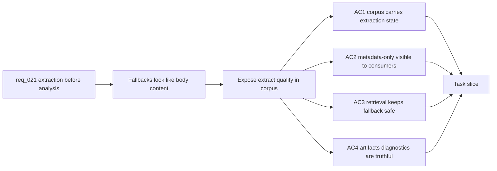

## item_090_corpus_contract_for_extract_quality_and_metadata_only_sources - Corpus contract for extract quality and metadata-only sources

> From version: 1.5.1
> Schema version: 1.0
> Status: Ready
> Understanding: 93%
> Confidence: 90%
> Progress: 0%
> Complexity: Medium
> Theme: Data Contract / Retrieval / Artifacts
> Reminder: Update status, understanding, confidence, progress and linked request/task references when you edit this doc.

# Problem

- Metadata-only placeholders are currently stored in `content`, so downstream surfaces may treat them as actual document evidence.
- Operators need to know whether a document was analyzed from body text, partial text, or metadata only.
- Retrieval and artifacts diagnostics should expose extraction quality without forcing users to inspect raw JSON.

# Scope

- In: extend the corpus document contract with minimal extraction quality metadata, such as `extractionStatus`, `extractionReason`, `extractPath`, or equivalent fields aligned with the implementation.
- In: make metadata-only and unreadable states explicit in corpus validation, artifacts diagnostics, and analysis reports.
- In: preserve baseline queryability for metadata-only documents while preventing them from masquerading as full-text documents.
- In: update relevant Logics schema docs if the corpus shape changes.
- Out: UI redesign; OCR; replacing the retrieval ranking model.

# Acceptance criteria

- AC1: Corpus documents expose a clear extraction quality state for full-text, partial-text, metadata-only, and unreadable outcomes.
- AC2: Existing corpus validation accepts the new fields and rejects malformed extraction metadata where validation already applies.
- AC3: Artifacts diagnostics can show whether a document is full-text, partial, metadata-only, or unreadable.
- AC4: Retrieval and Bishop source assembly preserve access to metadata-only documents but do not present placeholder text as document body evidence.
- AC5: Tests cover corpus validation and at least one artifact diagnostic for a metadata-only document.

# Links

- Request: `logics/request/req_021_enforce_real_text_extraction_before_post_ingest_analysis.md`
- Product brief(s): `logics/product/prod_006_improve_ingestion_metadata_and_chunking_for_bishop_hints.md`, `logics/product/prod_010_add_a_post_ingest_ai_analysis_command_for_corpus_enrichment.md`
- Spec(s): `logics/specs/spec_004_deepvault_data_schema_and_storage_contracts.md`, `logics/specs/spec_006_deepvault_prompt_and_context_assembly.md`
- Depends on: `item_089_worker_text_extract_artifacts_for_sharepoint_documents`
- Task(s): `task_044_orchestrate_extract_backed_analysis_pipeline`

# Validation evidence

- Corpus shape tests for valid and invalid extraction metadata.
- Artifact panel or API response fixture showing extraction quality.
- A retrieval/Bishop fixture proving metadata-only placeholders are not treated as authoritative body text.
