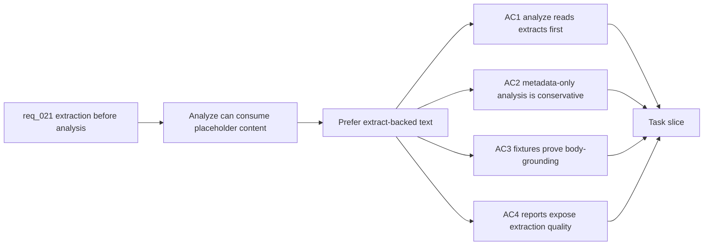

## item_091_analyze_pipeline_uses_extract_backed_text - Analyze pipeline uses extract-backed text

> From version: 1.5.1
> Schema version: 1.0
> Status: Done
> Understanding: 94%
> Confidence: 91%
> Progress: 100%
> Complexity: High
> Theme: Analysis / Worker / Quality
> Reminder: Update status, understanding, confidence, progress and linked request/task references when you edit this doc.

# Problem

- The analysis pipeline can currently produce provider-backed summaries from metadata-only corpus rows.
- This creates plausible but weak summaries, such as treating a template title and source path as enough evidence for a policy summary.
- Analysis should be enriched by real extracted text when available and conservative when only metadata exists.

# Scope

- In: update `npm run analyze` and worker-backed analyze jobs to prefer extract-backed body text over corpus placeholder content.
- In: include extraction state in analysis decisions, exclusion reasons, fallback reasons, and reports.
- In: make provider prompts explicit when text is metadata-only so remote analysis cannot overstate evidence.
- In: add fixtures for `.docx` or `.pdf` body text, metadata-only fallback, and a mixed run.
- Out: OCR; new provider integrations; replacing the `analysis` block contract.

# Acceptance criteria

- AC1: Analyze uses extract-backed text as the primary input when an extract artifact is available and current.
- AC2: Metadata-only documents are either excluded from provider analysis or analyzed with a low-confidence conservative summary that explicitly states the body text is unavailable.
- AC3: A `.docx` or `.pdf` fixture with real body text produces an analysis summary and sections grounded in that body text.
- AC4: The same fixture represented as metadata-only remains flagged as metadata-only and does not produce a substantive body-content summary.
- AC5: Analyze report metrics expose how many selected documents used full text, partial text, metadata-only fallback, or unreadable content.
- AC6: Tests prove that extract-backed text is preferred over `Source:` / `Path:` placeholder content.

# Links

- Request: `logics/request/req_021_enforce_real_text_extraction_before_post_ingest_analysis.md`
- Product brief(s): `logics/product/prod_010_add_a_post_ingest_ai_analysis_command_for_corpus_enrichment.md`
- Architecture decision(s): `logics/architecture/adr_029_bound_post_ingest_analysis_contract_and_runtime_output.md`
- Depends on: `item_089_worker_text_extract_artifacts_for_sharepoint_documents`, `item_090_corpus_contract_for_extract_quality_and_metadata_only_sources`
- Task(s): `task_044_orchestrate_extract_backed_analysis_pipeline`

# Validation evidence

- `npm run analyze` resolves an analysis input by reading `extractPath` first, then uses corpus content only when it is not metadata-only placeholder text.
- Worker-backed analyze uses the same extract-first input selection and excludes `metadata_only` / `unreadable` placeholder rows conservatively.
- Analyze reports now include `extractionQuality` counts for `full_text`, `partial_text`, `metadata_only`, `unreadable`, and `unknown`.
- Validation passed: `rtk npm run test -- tests/analyze-corpus.spec.ts`, `rtk python3 -m pytest worker/tests/test_jobs.py`, and `rtk npm run typecheck`.
