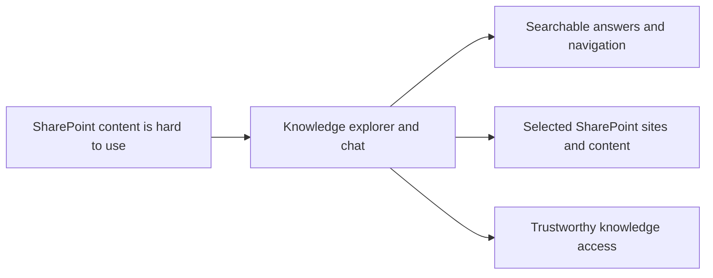

## prod_000_sharepoint_knowledge_graph_product_vision - SharePoint knowledge graph product vision
> Date: 2026-04-10
> Status: Proposed
> Related request: `logics/request/req_000_v0_bootstrap_and_initial_foundations.md`
> Related backlog: `logics/backlog/item_000_graph_discovery_and_pilot_scope.md`, `logics/backlog/item_001_sharepoint_ingestion_and_sync_pipeline.md`, `logics/backlog/item_002_hybrid_knowledge_store_and_retrieval.md`, `logics/backlog/item_003_explorer_ui_for_sharepoint_navigation.md`, `logics/backlog/item_004_teams_bot_chat_and_permissions.md`, `logics/backlog/item_005_runtime_config_and_operations.md`, `logics/backlog/item_006_local_companion_app_for_explorer_and_chat.md`, `logics/backlog/item_007_llm_provider_abstraction_for_openai_and_gemini.md`, `logics/backlog/item_008_local_explorer_shell_and_navigation.md`, `logics/backlog/item_009_local_chat_surface_and_answer_flow.md`, `logics/backlog/item_010_local_sync_status_and_operational_view.md`, `logics/backlog/item_011_hosted_backend_core.md`, `logics/backlog/item_012_teams_bot_channel_and_permissions.md`, `logics/backlog/item_013_v2_operations_runbook_and_release_readiness.md`
> Related task: `logics/tasks/task_005_v1_local_development_and_validation_milestone.md`, `logics/tasks/task_006_v2_hosted_industrialization_and_teams_readiness_milestone.md`, `logics/tasks/task_007_v2_operations_runbook_and_release_readiness.md`
> Related architecture: `logics/architecture/adr_001_identity_and_access_model_for_sharepoint_knowledge_graph.md`, `logics/architecture/adr_002_sharepoint_ingestion_and_sync_pipeline.md`, `logics/architecture/adr_003_hybrid_knowledge_store_and_retrieval_model.md`, `logics/architecture/adr_004_teams_bot_architecture_for_llm_chat.md`, `logics/architecture/adr_005_explorer_ui_for_sharepoint_navigation.md`, `logics/architecture/adr_006_runtime_configuration_and_operations.md`, `logics/architecture/adr_007_local_companion_app_architecture_for_explorer_and_chat.md`, `logics/architecture/adr_008_llm_provider_abstraction_for_openai_and_gemini.md`, `logics/architecture/adr_009_permission_aware_retrieval_and_source_filtering.md`, `logics/architecture/adr_010_sharepoint_sync_orchestration_and_refresh_policy.md`, `logics/architecture/adr_011_observability_audit_and_answer_traceability.md`, `logics/architecture/adr_012_local_companion_runtime_for_explorer_and_chat.md`, `logics/architecture/adr_013_hosted_backend_and_teams_chat_channel.md`, `logics/architecture/adr_014_deepvault_retrieval_ranking_quality_and_cost_policy.md`, `logics/architecture/adr_015_deepvault_security_audit_logging_and_retention_boundaries.md`, `logics/architecture/adr_016_deepvault_persistence_and_storage_layout.md`
> Reminder: Update status, linked refs, scope, decisions, success signals, open questions, the Azure/Render hosting decision, and DeepVault/Nexus naming when you edit this doc. Keep the default decisions section current. For any UX/UI or frontend work tied to this product, use `logics/skills/logics-ui-steering/SKILL.md`. Reviewed during the 2026-04-10 release/doc sync.

# Overview
DeepVault helps teams turn SharePoint into a usable knowledge base.
It should ingest selected SharePoint sites, keep the content searchable, and make it easy to browse or ask questions from that knowledge.
The backend should behave like a knowledge platform with separate ingestion, storage, retrieval, and answer-generation layers.
The product should support both a local development surface and a hosted production surface, each with a clear role.
`Nexus` is the internal tooling and orchestration brain that keeps the delivery plan, docs, and contracts aligned.
The hosted production surface should prefer Azure as the deployment target when cost and complexity stay reasonable, with Render kept as the practical fallback.
The first value is reliable discovery and retrieval from real company content, not a generic chat demo.
Teams can be the final delivery channel once the backend is hosted, but the product should not depend on it for the local development path.
The chat experience should be able to switch between OpenAI and Gemini behind a single product contract.
Permission checks and answer provenance should remain visible so users can trust where responses come from.
The local exploration UI is `DeepVault - Navy`, the local LLM chatbot is `DeepVault - Bishop`, and the Teams chatbot is `DeepVault - Gordon`.
The delivery roadmap splits into a V1 local validation milestone and a V2 hosted industrialization milestone.

# Product problem
Important company knowledge lives in SharePoint, but it is difficult to explore, keep current, and query across sites.
Users need a way to find content, understand what is available, and later ask natural-language questions without losing traceability to the source.

# Target users and situations
- Internal team members who need to find documents, lists, or pages in SharePoint through `DeepVault - Navy`.
- Knowledge workers who want a fast way to search and browse company content.
- Future chat users who want answers grounded in SharePoint sources through `DeepVault - Bishop` or `DeepVault - Gordon`.

# Goals
- Make selected SharePoint sites searchable and browsable.
- Surface a clear explorer view for sites, libraries, folders, and lists in `DeepVault - Navy`.
- Prepare the same content for a future LLM chat experience.
- Keep answers traceable to their SharePoint source.

# Non-goals
- Replacing SharePoint as the source of truth.
- Building a full admin or content-management platform.
- Supporting write-back or editing of SharePoint content.
- Solving every permission model edge case on day one.

# Scope and guardrails
- In: a local development and test surface with search, browse, chat, and sync visibility via `DeepVault - Navy` and `DeepVault - Bishop`.
- In: a hosted production surface with governed channels and centrally managed retrieval.
- In: an Azure-first production hosting path, with Render as the simpler fallback if Azure becomes too heavy or expensive.
- In: content ingestion, content indexing, and source-linked retrieval.
- In: a retrieval layer that filters by user rights before context is assembled for the LLM.
- In: ingestion, sync, and audit signals that make refresh state and answer provenance inspectable.
- In: a provider-agnostic chat experience that can use OpenAI or Gemini through the same backend contract.
- Out: a fake human profile, generic chat without permissions, or a broad tenant-wide rollout.

# Key product decisions
- The product is a knowledge access layer, not a replacement for SharePoint.
- The first release should prioritize trust, traceability, and discoverability over breadth.
- The experience should support both navigation and question answering, but the backend must stay permission-aware.
- The LLM provider should remain swappable so quality, cost, and availability can be tuned without changing the product surface.
- The retrieval layer should apply user permissions before content is passed into the LLM prompt.
- The product is split into two strategy briefs: one local-first for development and tests, and one hosted for production with `DeepVault - Gordon` at the end.
- The local development surface should prove the product value before any hosted backend or Teams channel is introduced.
- The hosted production surface should preserve the same retrieval and permission model while moving the runtime behind a hosted backend.
- The hosted backend should default to Azure so the enterprise identity, secrets, and operational model stay close to Microsoft, with Render available as the fallback option.
- The persistence layout should keep source data, derived content, retrieval indexes, audit, and secrets in separate layers so the product stays easy to operate.
- Any UX/UI or frontend implementation work for `DeepVault - Navy`, `DeepVault - Bishop`, or `DeepVault - Gordon` should use the `logics-ui-steering` skill before layout or styling decisions are made.
- The initial pilot should remain configurable so the scope can expand without code changes.
- The configuration model should stay environment-driven rather than moving straight to a full admin UI.
- `DeepVault - Navy` and `DeepVault - Bishop` should be the validation surfaces, and the hosted backend plus `DeepVault - Gordon` should be the operational surface.
- The product should expose enough observability to explain what was ingested, when it was refreshed, and which sources fed an answer.

# Success signals
- The pilot sites are ingested successfully and stay current.
- Users can find content faster than by manual SharePoint browsing.
- `DeepVault - Navy` and `DeepVault - Bishop` make the structure and content of the pilot sites understandable.
- Later, chat answers can be traced back to source documents or lists.
- The first pilot users can tell whether the system is useful by coverage, freshness, browse speed, or answer quality.
- The chat backend can route through OpenAI or Gemini without changing the user-facing app.
- The platform can explain sync state, retrieval filters, and answer provenance without leaving `DeepVault - Navy` or `DeepVault - Bishop`.
- The hosted backend can be reused by the local app and by Teams without reworking the product contract.
- The hosted backend has a clear deployment target choice, with Azure preferred and Render documented as the fallback if needed.

# Roadmap
## V1: Local development and validation
- Focus: `DeepVault - Navy`, `DeepVault - Bishop`, shared foundations, and local sync visibility.
- Goal: prove the end-to-end SharePoint discovery, ingestion, retrieval, and answer loop without external hosting.
- Primary tasks: `logics/tasks/task_000_sharepoint_foundations_and_shared_contracts.md`, `logics/tasks/task_001_local_companion_vertical_slice.md`, `logics/tasks/task_002_ingestion_sync_and_retrieval_hardening.md`

## V2: Hosted industrialization and Teams readiness
- Focus: Azure-hosted backend, scheduling, operations, and `DeepVault - Gordon`.
- Goal: move from a validated local product to a governed, schedulable, production-ready service.
- Primary tasks: `logics/tasks/task_003_hosted_backend_core_delivery.md`, `logics/tasks/task_004_teams_channel_and_permissions_delivery.md`

# References
- `logics/request/req_000_sharepoint_knowledge_graph_kickoff.md`
- `logics/backlog/item_000_graph_discovery_and_pilot_scope.md`
- `logics/backlog/item_001_sharepoint_ingestion_and_sync_pipeline.md`
- `logics/backlog/item_002_hybrid_knowledge_store_and_retrieval.md`
- `logics/backlog/item_003_explorer_ui_for_sharepoint_navigation.md`
- `logics/backlog/item_004_teams_bot_chat_and_permissions.md`
- `logics/backlog/item_005_runtime_config_and_operations.md`
- `logics/backlog/item_006_local_companion_app_for_explorer_and_chat.md`
- `logics/backlog/item_007_llm_provider_abstraction_for_openai_and_gemini.md`
- `logics/backlog/item_008_local_explorer_shell_and_navigation.md`
- `logics/backlog/item_009_local_chat_surface_and_answer_flow.md`
- `logics/backlog/item_010_local_sync_status_and_operational_view.md`
- `logics/backlog/item_011_hosted_backend_core.md`
- `logics/backlog/item_012_teams_bot_channel_and_permissions.md`
- `logics/backlog/item_013_v2_operations_runbook_and_release_readiness.md`
- `logics/tasks/task_005_v1_local_development_and_validation_milestone.md`
- `logics/tasks/task_006_v2_hosted_industrialization_and_teams_readiness_milestone.md`
- `logics/tasks/task_007_v2_operations_runbook_and_release_readiness.md`
- `logics/architecture/adr_001_identity_and_access_model_for_sharepoint_knowledge_graph.md`
- `logics/architecture/adr_002_sharepoint_ingestion_and_sync_pipeline.md`
- `logics/architecture/adr_003_hybrid_knowledge_store_and_retrieval_model.md`
- `logics/architecture/adr_004_teams_bot_architecture_for_llm_chat.md`
- `logics/architecture/adr_005_explorer_ui_for_sharepoint_navigation.md`
- `logics/architecture/adr_006_runtime_configuration_and_operations.md`
- `logics/architecture/adr_007_local_companion_app_architecture_for_explorer_and_chat.md`
- `logics/architecture/adr_008_llm_provider_abstraction_for_openai_and_gemini.md`
- `logics/architecture/adr_009_permission_aware_retrieval_and_source_filtering.md`
- `logics/architecture/adr_010_sharepoint_sync_orchestration_and_refresh_policy.md`
- `logics/architecture/adr_011_observability_audit_and_answer_traceability.md`
- `logics/architecture/adr_012_local_companion_runtime_for_explorer_and_chat.md`
- `logics/architecture/adr_013_hosted_backend_and_teams_chat_channel.md`
- `logics/architecture/adr_014_deepvault_retrieval_ranking_quality_and_cost_policy.md`
- `logics/architecture/adr_015_deepvault_security_audit_logging_and_retention_boundaries.md`
- `logics/architecture/adr_016_deepvault_persistence_and_storage_layout.md`
# Open questions
- Which metric should be the primary success signal in the pilot: coverage, freshness, browse speed, or answer quality?
- Which additional SharePoint sites should enter scope after the pilot?
- What should be the default cadence for scheduled refreshes?
- Which local companion app views should ship first: explorer, chat, or sync status?
- Which LLM provider should be the default: OpenAI, Gemini, or configurable fallback routing?
- Which observability signals should be visible to end users versus kept in backend logs?

# Default decisions
- Primary pilot metric: freshness and answer quality, with coverage as a supporting metric.
- Post-pilot expansion: one adjacent SharePoint site at a time.
- Scheduled refresh cadence: daily incremental refresh by default.
- First local validation surface: explorer, then chat, then sync status.
- LLM provider choice: OpenAI primary, Gemini fallback.
- Observability split: surface crawl progress, last refresh, and answer provenance; keep sensitive detail backend-only.
