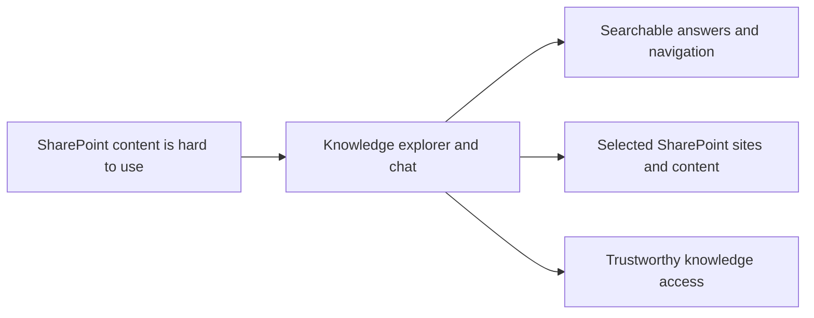

## prod_000_sharepoint_knowledge_graph_product_vision - SharePoint knowledge graph product vision
> Date: 2026-04-10
> Status: Proposed
> Related request: `logics/request/req_000_sharepoint_knowledge_graph_kickoff.md`
> Related backlog: (none yet)
> Related task: (none yet)
> Related architecture: `logics/architecture/adr_001_identity_and_access_model_for_sharepoint_knowledge_graph.md`, `logics/architecture/adr_002_sharepoint_ingestion_and_sync_pipeline.md`, `logics/architecture/adr_003_hybrid_knowledge_store_and_retrieval_model.md`, `logics/architecture/adr_004_teams_bot_architecture_for_llm_chat.md`, `logics/architecture/adr_005_explorer_ui_for_sharepoint_navigation.md`, `logics/architecture/adr_006_runtime_configuration_and_operations.md`, `logics/architecture/adr_007_local_companion_app_architecture_for_explorer_and_chat.md`, `logics/architecture/adr_008_llm_provider_abstraction_for_openai_and_gemini.md`, `logics/architecture/adr_009_permission_aware_retrieval_and_source_filtering.md`, `logics/architecture/adr_010_sharepoint_sync_orchestration_and_refresh_policy.md`, `logics/architecture/adr_011_observability_audit_and_answer_traceability.md`
> Reminder: Update status, linked refs, scope, decisions, success signals, and open questions when you edit this doc.

# Overview
The product helps teams turn SharePoint into a usable knowledge base.
It should ingest selected SharePoint sites, keep the content searchable, and make it easy to browse or ask questions from that knowledge.
The backend should behave like a knowledge platform with separate ingestion, storage, retrieval, and answer-generation layers.
The user experience should start with a local companion app that combines a small explorer for navigation with a chat surface and sync status.
The first value is reliable discovery and retrieval from real company content, not a generic chat demo.
Teams can still become a later channel, but the product should not depend on it for the first release.
The chat experience should be able to switch between OpenAI and Gemini behind a single product contract.
Permission checks and answer provenance should remain visible so users can trust where responses come from.

# Product problem
Important company knowledge lives in SharePoint, but it is difficult to explore, keep current, and query across sites.
Users need a way to find content, understand what is available, and later ask natural-language questions without losing traceability to the source.

# Target users and situations
- Internal team members who need to find documents, lists, or pages in SharePoint.
- Knowledge workers who want a fast way to search and browse company content.
- Future chat users who want answers grounded in SharePoint sources.

# Goals
- Make selected SharePoint sites searchable and browsable.
- Surface a clear explorer view for sites, libraries, folders, and lists.
- Prepare the same content for a future LLM chat experience.
- Keep answers traceable to their SharePoint source.

# Non-goals
- Replacing SharePoint as the source of truth.
- Building a full admin or content-management platform.
- Supporting write-back or editing of SharePoint content in V1.
- Solving every permission model edge case on day one.

# Scope and guardrails
- In: A pilot experience for a small set of SharePoint sites, with search, browse, local chat, and future Teams readiness.
- In: Content ingestion, content indexing, and source-linked retrieval.
- In: A retrieval layer that filters by user rights before context is assembled for the LLM.
- In: Ingestion, sync, and audit signals that make refresh state and answer provenance inspectable.
- In: A governed local companion app path for chat when the product reaches that stage.
- In: A provider-agnostic chat experience that can use OpenAI or Gemini through the same backend contract.
- Out: A fake human profile, generic chat without permissions, or a broad tenant-wide rollout at V1.

# Key product decisions
- The product is a knowledge access layer, not a replacement for SharePoint.
- The first release should prioritize trust, traceability, and discoverability over breadth.
- The experience should support both navigation and question answering, but the backend must stay permission-aware.
- The LLM provider should remain swappable so quality, cost, and availability can be tuned without changing the product surface.
- The retrieval layer should apply user permissions before content is passed into the LLM prompt.
- The initial pilot should remain configurable so the scope can expand without code changes.
- The pilot configuration should stay environment-driven in V1 rather than moving straight to a full admin UI.
- The first release should ship the local companion app as a core validation surface, even if the Teams channel is added later.
- The product should expose enough observability to explain what was ingested, when it was refreshed, and which sources fed an answer.

# Success signals
- The pilot sites are ingested successfully and stay current.
- Users can find content faster than by manual SharePoint browsing.
- The explorer UI and local chat make the structure and content of the pilot sites understandable.
- Later, chat answers can be traced back to source documents or lists.
- The first pilot users can tell whether the system is useful by coverage, freshness, browse speed, or answer quality.
- The chat backend can route through OpenAI or Gemini without changing the user-facing app.
- The platform can explain sync state, retrieval filters, and answer provenance without leaving the local companion app.

# References
- `logics/request/req_000_sharepoint_knowledge_graph_kickoff.md`
- `logics/architecture/adr_001_identity_and_access_model_for_sharepoint_knowledge_graph.md`
- `logics/architecture/adr_002_sharepoint_ingestion_and_sync_pipeline.md`
- `logics/architecture/adr_003_hybrid_knowledge_store_and_retrieval_model.md`
- `logics/architecture/adr_004_teams_bot_architecture_for_llm_chat.md`
- `logics/architecture/adr_005_explorer_ui_for_sharepoint_navigation.md`
- `logics/architecture/adr_006_runtime_configuration_and_operations.md`
- `logics/architecture/adr_009_permission_aware_retrieval_and_source_filtering.md`
- `logics/architecture/adr_010_sharepoint_sync_orchestration_and_refresh_policy.md`
- `logics/architecture/adr_011_observability_audit_and_answer_traceability.md`

# Open questions
- Which metric should be the primary success signal in the pilot: coverage, freshness, browse speed, or answer quality?
- Which additional SharePoint sites should enter scope after the pilot?
- What should be the default cadence for scheduled refreshes?
- Which local companion app views should ship first: explorer, chat, or sync status?
- Which LLM provider should be the default in V1: OpenAI, Gemini, or configurable fallback routing?
- Which observability signals should be visible to end users versus kept in backend logs?
