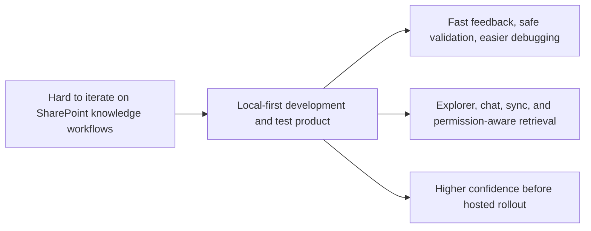
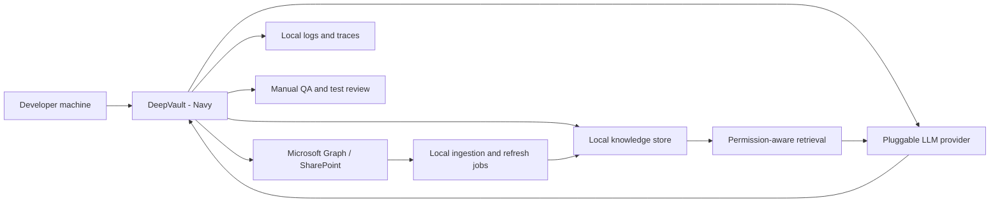

## prod_001_local_first_development_and_test_strategy - DeepVault - Navy local-first development and test strategy
> Date: 2026-04-10
> Status: Proposed
> Related request: `logics/request/req_000_sharepoint_knowledge_graph_kickoff.md`
> Related backlog: `logics/backlog/item_006_local_companion_app_for_explorer_and_chat.md`, `logics/backlog/item_008_local_explorer_shell_and_navigation.md`, `logics/backlog/item_009_local_chat_surface_and_answer_flow.md`, `logics/backlog/item_010_local_sync_status_and_operational_view.md`
> Related task: (none yet)
> Related architecture: `logics/architecture/adr_007_local_companion_app_architecture_for_explorer_and_chat.md`, `logics/architecture/adr_008_llm_provider_abstraction_for_openai_and_gemini.md`, `logics/architecture/adr_009_permission_aware_retrieval_and_source_filtering.md`, `logics/architecture/adr_011_observability_audit_and_answer_traceability.md`, `logics/architecture/adr_012_local_companion_runtime_for_explorer_and_chat.md`
> Reminder: Update status, linked refs, scope, decisions, success signals, open questions, and DeepVault/Navy/Bishop naming when you edit this doc. Default local validation is explorer first, then chat, then sync.

# Overview
This brief defines the local-first strategy for development and testing.
The core value is a fast feedback loop for explorer, chat, sync, and retrieval behavior without depending on a hosted deployment.
`DeepVault - Navy` is the place to validate data flow, permissions, answer quality, and operational visibility before anything is promoted.
Teams is intentionally out of the critical path for engineering work.

# Product problem
The team needs a way to develop and test SharePoint ingestion, retrieval, and answer flows quickly.
If the only path is a hosted channel, iteration slows down, debugging gets harder, and test coverage becomes riskier.
The product needs a local environment where the team can explore content, simulate answers, and inspect sync and provenance behavior with low friction.

# Target users and situations
- Engineers and product builders validating the SharePoint knowledge experience.
- Testers who need repeatable local scenarios for navigation, retrieval, and response quality.
- Internal reviewers who want to inspect what the system ingested and how it responded in `DeepVault - Navy`.

# Goals
- Enable fast local iteration on explorer, chat, and sync behavior in `DeepVault - Navy`.
- Keep the same retrieval and permission model available for development and test runs.
- Make it easy to observe ingestion, refresh, and answer provenance without a hosted dependency.

# Non-goals
- Making Teams the primary surface for day-to-day development.
- Optimizing for tenant-wide scale before the product mechanics are proven locally.
- Replacing the hosted runtime strategy that is meant for production operations.

# Scope and guardrails
- In: `DeepVault - Navy`, local retrieval flow, local sync visibility, and provider-agnostic chat testing.
- In: permission-aware retrieval and basic audit visibility for development and test use.
- Out: production channel packaging, enterprise rollout controls, and heavy operational tooling.

# Key product decisions
- Local development should be the fastest path for validating product behavior.
- The same answer quality and permission rules used later in hosted delivery should be testable locally.
- `DeepVault - Navy` should remain the primary proving ground for explorer and chat UX changes.
- Observability should be rich enough for debugging, but light enough to stay usable during rapid iteration.

# Success signals
- Engineers can validate new behavior locally without waiting for hosted deployment cycles in `DeepVault - Navy`.
- Testers can reproduce explorer, chat, and sync issues in a controlled local environment.
- The team can explain what was ingested, what was filtered, and how an answer was produced from local runs.
- Local validation catches product issues before they reach a hosted channel.

# Target infrastructure

# Positioning
- This brief is the local experimentation and validation variant for `DeepVault - Navy`.
- It supports the main product vision by proving behavior before hosted delivery.
- It should stay lightweight and avoid production-operating detail.

# References
- `logics/request/req_000_sharepoint_knowledge_graph_kickoff.md`
- `logics/backlog/item_006_local_companion_app_for_explorer_and_chat.md`
- `logics/backlog/item_008_local_explorer_shell_and_navigation.md`
- `logics/backlog/item_009_local_chat_surface_and_answer_flow.md`
- `logics/backlog/item_010_local_sync_status_and_operational_view.md`
- `logics/architecture/adr_007_local_companion_app_architecture_for_explorer_and_chat.md`
- `logics/architecture/adr_008_llm_provider_abstraction_for_openai_and_gemini.md`
- `logics/architecture/adr_009_permission_aware_retrieval_and_source_filtering.md`
- `logics/architecture/adr_011_observability_audit_and_answer_traceability.md`
- `logics/architecture/adr_012_local_companion_runtime_for_explorer_and_chat.md`

# Open questions
- Which local validation path should be the default for daily engineering work: explorer, chat, or sync checks?
- How much operational detail should remain visible in the local app versus backend logs?
- Which test data set best represents the pilot sites without becoming too noisy?

# Default decisions
- Default daily validation path: explorer first, chat second, sync checks third.
- Local operational visibility: enough detail to debug provenance and refresh state, but no secrets or raw infrastructure detail.
- Test data baseline: real pilot sites plus a small controlled synthetic corpus.
