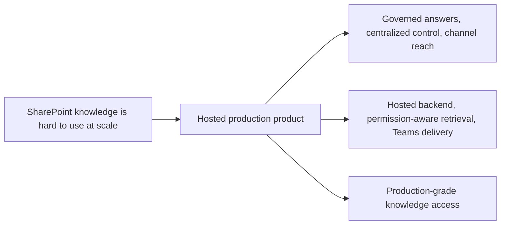
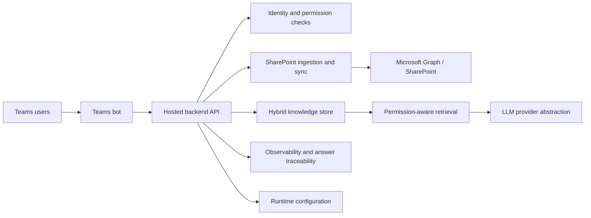

## prod_002_hosted_production_strategy_with_teams_at_the_end - Hosted production strategy with Teams at the end
> Date: 2026-04-10
> Status: Proposed
> Related request: `logics/request/req_000_sharepoint_knowledge_graph_kickoff.md`
> Related backlog: `logics/backlog/item_004_teams_bot_chat_and_permissions.md`, `logics/backlog/item_005_runtime_config_and_operations.md`, `logics/backlog/item_011_hosted_backend_core.md`, `logics/backlog/item_012_teams_bot_channel_and_permissions.md`
> Related task: (none yet)
> Related architecture: `logics/architecture/adr_001_identity_and_access_model_for_sharepoint_knowledge_graph.md`, `logics/architecture/adr_002_sharepoint_ingestion_and_sync_pipeline.md`, `logics/architecture/adr_003_hybrid_knowledge_store_and_retrieval_model.md`, `logics/architecture/adr_004_teams_bot_architecture_for_llm_chat.md`, `logics/architecture/adr_006_runtime_configuration_and_operations.md`, `logics/architecture/adr_009_permission_aware_retrieval_and_source_filtering.md`, `logics/architecture/adr_010_sharepoint_sync_orchestration_and_refresh_policy.md`, `logics/architecture/adr_011_observability_audit_and_answer_traceability.md`, `logics/architecture/adr_013_hosted_backend_and_teams_chat_channel.md`
> Reminder: Update status, linked refs, scope, decisions, success signals, and open questions when you edit this doc.

# Overview
This brief defines the production strategy where the backend is hosted and Teams is the final delivery surface.
The core value is a governed, scalable experience that centralizes ingestion, retrieval, permission checks, and answer delivery in one place.
The local app can remain useful for exploration and validation, but the production contract is the hosted backend plus Teams.
The sequence matters: backend first, Teams at the end of the chain.

# Product problem
The organization needs a reliable way to operationalize SharePoint knowledge access.
A production product must centralize ingestion, permissions, refresh, answer traceability, and channel handling so the experience can be governed and supported.
Teams is the final user-facing channel because it matches the enterprise context and reduces adoption friction.

# Target users and situations
- Employees who want trustworthy answers from SharePoint content in Teams.
- Platform owners who need governed access, auditability, and operational control.
- Support and admin teams who need visibility into ingestion, refresh, and answer provenance.

# Goals
- Deliver a hosted backend that can be reused by multiple channels.
- Make Teams the primary production chatbot surface.
- Keep permission-aware retrieval and answer traceability intact end to end.

# Non-goals
- Letting Teams bypass the permission model.
- Turning the product into a generic chat experience without source grounding.
- Keeping production behavior dependent on a developer workstation.

# Scope and guardrails
- In: hosted ingestion and retrieval, configuration-driven sync, observability, and Teams delivery.
- In: governed identity, permission-aware answer assembly, and source traceability.
- Out: local-only development shortcuts, experimental UI surface changes, and unmanaged tenant-wide rollout.

# Key product decisions
- The hosted backend is the production contract, not the local app.
- Teams should be the final delivery step, not the place where core product logic lives.
- Configuration, permissions, and observability must be managed centrally enough to support operations.
- The product should preserve the same grounding and provenance rules across channels.

# Success signals
- Users get grounded answers in Teams without revealing unauthorized content.
- Operators can explain what was ingested, when it was refreshed, and how an answer was assembled.
- The backend can support Teams without duplicating retrieval or permission logic.
- The production flow remains stable as new content sources or sites are added.

# Target infrastructure

# Positioning
- This brief is the production delivery variant.
- It keeps the hosted backend and Teams channel at the end of the chain.
- It should stay focused on operating model and user value, not local development mechanics.

# References
- `logics/request/req_000_sharepoint_knowledge_graph_kickoff.md`
- `logics/backlog/item_004_teams_bot_chat_and_permissions.md`
- `logics/backlog/item_005_runtime_config_and_operations.md`
- `logics/backlog/item_011_hosted_backend_core.md`
- `logics/backlog/item_012_teams_bot_channel_and_permissions.md`
- `logics/architecture/adr_001_identity_and_access_model_for_sharepoint_knowledge_graph.md`
- `logics/architecture/adr_002_sharepoint_ingestion_and_sync_pipeline.md`
- `logics/architecture/adr_003_hybrid_knowledge_store_and_retrieval_model.md`
- `logics/architecture/adr_004_teams_bot_architecture_for_llm_chat.md`
- `logics/architecture/adr_006_runtime_configuration_and_operations.md`
- `logics/architecture/adr_009_permission_aware_retrieval_and_source_filtering.md`
- `logics/architecture/adr_010_sharepoint_sync_orchestration_and_refresh_policy.md`
- `logics/architecture/adr_011_observability_audit_and_answer_traceability.md`
- `logics/architecture/adr_013_hosted_backend_and_teams_chat_channel.md`

# Open questions
- Which production metric should matter most first: freshness, answer quality, or trust/auditability?
- How much of the local app should remain supported as a secondary surface after production launch?
- What operational controls need to be exposed to admins versus kept internal?
