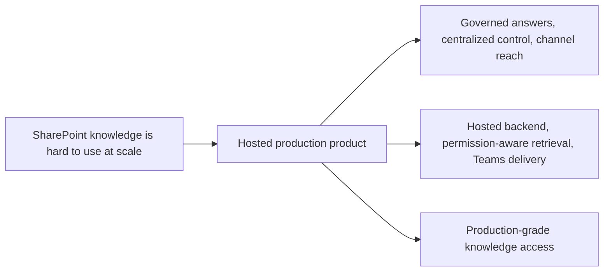
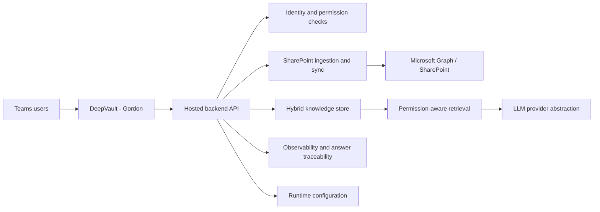

## prod_002_hosted_production_strategy_with_teams_at_the_end - DeepVault - Gordon hosted production strategy
> Date: 2026-04-10
> Status: Proposed
> Related request: `logics/request/req_000_sharepoint_knowledge_graph_kickoff.md`
> Related backlog: `logics/backlog/item_004_teams_bot_chat_and_permissions.md`, `logics/backlog/item_005_runtime_config_and_operations.md`, `logics/backlog/item_011_hosted_backend_core.md`, `logics/backlog/item_012_teams_bot_channel_and_permissions.md`, `logics/backlog/item_013_v2_operations_runbook_and_release_readiness.md`
> Related task: `logics/tasks/task_006_v2_hosted_industrialization_and_teams_readiness_milestone.md`, `logics/tasks/task_007_v2_operations_runbook_and_release_readiness.md`
> Related architecture: `logics/architecture/adr_001_identity_and_access_model_for_sharepoint_knowledge_graph.md`, `logics/architecture/adr_002_sharepoint_ingestion_and_sync_pipeline.md`, `logics/architecture/adr_003_hybrid_knowledge_store_and_retrieval_model.md`, `logics/architecture/adr_004_teams_bot_architecture_for_llm_chat.md`, `logics/architecture/adr_006_runtime_configuration_and_operations.md`, `logics/architecture/adr_009_permission_aware_retrieval_and_source_filtering.md`, `logics/architecture/adr_010_sharepoint_sync_orchestration_and_refresh_policy.md`, `logics/architecture/adr_011_observability_audit_and_answer_traceability.md`, `logics/architecture/adr_013_hosted_backend_and_teams_chat_channel.md`, `logics/architecture/adr_014_deepvault_retrieval_ranking_quality_and_cost_policy.md`, `logics/architecture/adr_015_deepvault_security_audit_logging_and_retention_boundaries.md`, `logics/architecture/adr_016_deepvault_persistence_and_storage_layout.md`
> Reminder: Update status, linked refs, scope, decisions, success signals, open questions, the Azure/Render hosting decision, and DeepVault/Gordon naming when you edit this doc. Default production priority is trust and auditability. For any UX/UI or frontend work tied to this strategy, use `logics/skills/logics-ui-steering/SKILL.md`. Reviewed during the 2026-04-10 release/doc sync.

# Overview
This brief defines the production strategy where the backend is hosted and Teams is the final delivery surface.
The core value is a governed, scalable experience that centralizes ingestion, retrieval, permission checks, and answer delivery in one place.
`DeepVault - Navy` and `DeepVault - Bishop` can remain useful for exploration and validation, but the production contract is the hosted backend plus `DeepVault - Gordon`.
The sequence matters: backend first, Teams at the end of the chain.
The preferred hosting target is Azure when the platform cost and operational overhead stay reasonable; Render remains the fallback if we need a simpler production path.

# Product problem
The organization needs a reliable way to operationalize SharePoint knowledge access.
A production product must centralize ingestion, permissions, refresh, answer traceability, and channel handling so the experience can be governed and supported.
Teams is the final user-facing channel because it matches the enterprise context and reduces adoption friction.

# Target users and situations
- Employees who want trustworthy answers from SharePoint content in `DeepVault - Gordon`.
- Platform owners who need governed access, auditability, and operational control.
- Support and admin teams who need visibility into ingestion, refresh, and answer provenance.

# Goals
- Deliver a hosted backend that can be reused by multiple channels.
- Make `DeepVault - Gordon` the primary production chatbot surface.
- Keep permission-aware retrieval and answer traceability intact end to end.
- Prefer Azure for hosting the shared runtime and operational services, with Render as the backup option.

# Non-goals
- Letting Teams bypass the permission model.
- Turning the product into a generic chat experience without source grounding.
- Keeping production behavior dependent on a developer workstation.

# Scope and guardrails
- In: hosted ingestion and retrieval, configuration-driven sync, observability, and Teams delivery.
- In: governed identity, permission-aware answer assembly, and source traceability.
- Out: local-only development shortcuts, experimental UI surface changes, and unmanaged tenant-wide rollout.

# Key product decisions
- The hosted backend is the production contract, not `DeepVault - Navy` or `DeepVault - Bishop`.
- `DeepVault - Gordon` should be the final delivery step, not the place where core product logic lives.
- Configuration, permissions, and observability must be managed centrally enough to support operations.
- The product should preserve the same grounding and provenance rules across channels.
- The backend should run on Azure by default so identity, secrets, and operations stay aligned with Microsoft-native delivery.
- The persistence layout should separate source blobs, relational state, retrieval indexes, audit, and secrets so production remains supportable.
- Any UX/UI or frontend implementation for `DeepVault - Gordon` or secondary local surfaces should use the `logics-ui-steering` skill before interface decisions are finalized.

# Success signals
- Users get grounded answers in Teams without revealing unauthorized content.
- Operators can explain what was ingested, when it was refreshed, and how an answer was assembled.
- The backend can support Teams without duplicating retrieval or permission logic.
- The production flow remains stable as new content sources or sites are added.

# Target infrastructure

# Hosting target
- Default target: Azure
- Fallback target: Render
- Shared-runtime guidance: use the Azure path when cost and complexity stay acceptable, and switch to Render if we need a lighter operational footprint.

# Positioning
- This brief is the production delivery variant for `DeepVault - Gordon`.
- It keeps the hosted backend and Teams channel at the end of the chain.
- It should stay focused on operating model and user value, not local development mechanics.

# References
- `logics/request/req_000_sharepoint_knowledge_graph_kickoff.md`
- `logics/backlog/item_004_teams_bot_chat_and_permissions.md`
- `logics/backlog/item_005_runtime_config_and_operations.md`
- `logics/backlog/item_011_hosted_backend_core.md`
- `logics/backlog/item_012_teams_bot_channel_and_permissions.md`
- `logics/backlog/item_013_v2_operations_runbook_and_release_readiness.md`
- `logics/tasks/task_006_v2_hosted_industrialization_and_teams_readiness_milestone.md`
- `logics/tasks/task_007_v2_operations_runbook_and_release_readiness.md`
- `logics/architecture/adr_001_identity_and_access_model_for_sharepoint_knowledge_graph.md`
- `logics/architecture/adr_002_sharepoint_ingestion_and_sync_pipeline.md`
- `logics/architecture/adr_003_hybrid_knowledge_store_and_retrieval_model.md`
- `logics/architecture/adr_004_teams_bot_architecture_for_llm_chat.md`
- `logics/architecture/adr_006_runtime_configuration_and_operations.md`
- `logics/architecture/adr_009_permission_aware_retrieval_and_source_filtering.md`
- `logics/architecture/adr_010_sharepoint_sync_orchestration_and_refresh_policy.md`
- `logics/architecture/adr_011_observability_audit_and_answer_traceability.md`
- `logics/architecture/adr_013_hosted_backend_and_teams_chat_channel.md`
- `logics/architecture/adr_014_deepvault_retrieval_ranking_quality_and_cost_policy.md`
- `logics/architecture/adr_015_deepvault_security_audit_logging_and_retention_boundaries.md`
- `logics/architecture/adr_016_deepvault_persistence_and_storage_layout.md`
# Post-V2 support model for Navy and Bishop

`DeepVault - Navy` and `DeepVault - Bishop` are not deprecated after V2 launches. Their role changes:

| Surface | Pre-V2 role | Post-V2 role |
|---|---|---|
| DeepVault - Navy | Primary local explorer for validation | Internal operator tool for content inspection and ingestion debugging |
| DeepVault - Bishop | Primary local chat for answer quality testing | Internal QA surface for retrieval and ranking regression checks |
| DeepVault - Gordon | Planned Teams channel | Primary production user-facing channel |

Both Navy and Bishop remain maintained as internal tools. They are not promoted to end users. They do not receive feature investment beyond what is needed to keep them useful for operators and engineers. They are the fastest way to validate retrieval behavior without going through Teams, so they remain the preferred debugging path in production incidents.

Navy and Bishop will not be published to end users, will not be promoted in change communications, and will not be expected to match the UX quality of Gordon. Their continued existence is a deliberate operational choice, not a transition phase.

# Open questions
- What operational controls need to be exposed to admins versus kept internal?
- What Azure services should host the backend, secrets, and storage for the first production slice?

# Default decisions
- Primary production metric: trust and auditability first, then freshness and answer quality.
- Local surfaces post-V2: `DeepVault - Navy` and `DeepVault - Bishop` remain as internal operator and QA tools, not primary user channels.
- Admin controls: site list, refresh controls, provider switch, and audit summary.
- Azure layout: compute, storage, Key Vault, and monitoring for the first slice.
- Scheduling and automation: Azure Functions timer triggers for refresh jobs, GitHub Actions for CI/CD, and Power Automate only for future business workflows if needed.
