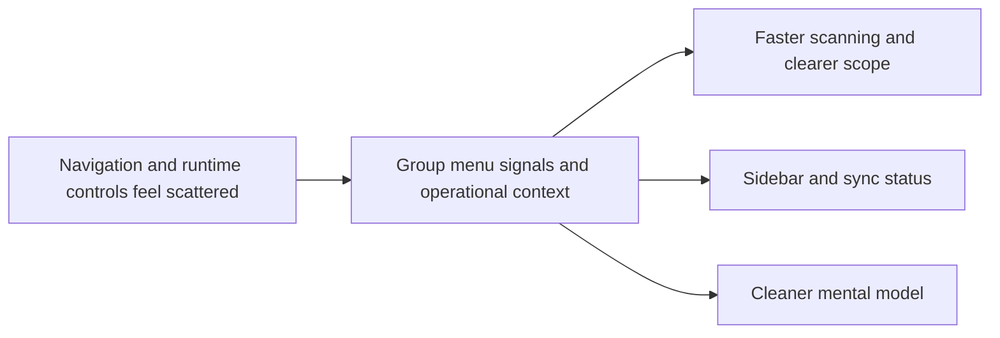

## prod_003_navigation_and_runtime_control_clarity - Navigation and runtime control clarity
> Date: 2026-04-11
> Status: Proposed
> Related request: req_012_add_leading_icons_to_navigation, req_013_move_site_selector_into_runtime, req_014_move_runtime_under_sync_status
> Related backlog: item_043_add_leading_icons_to_navigation, item_044_move_site_selector_into_runtime, item_045_move_runtime_under_sync_status
> Related task: task_017_orchestrate_navigation_and_runtime_ui_changes
> Related architecture: (none yet)
> Reminder: Update status, linked refs, scope, decisions, success signals, and open questions when you edit this doc.

# Overview
Make the main navigation easier to scan and move execution controls into the operational area of the app.
The sidebar should feel lighter and more deliberate, while the active runtime context remains visible where users inspect sync state.
The expected outcome is a clearer mental model for navigation, scope, and operational status without changing the core corpus behavior.

# Product problem
Users need to find primary navigation faster and understand the active runtime scope without jumping between disconnected UI areas.

# Target users and situations
- Power users who switch between Explorer, Bishop, and Sync status frequently
- Operators who need to inspect scope, role, and provider while monitoring sync state

# Goals
- Make the sidebar more scannable and visually structured
- Keep runtime controls visible in the operational part of the app
- Preserve current behavior while improving clarity

# Non-goals
- No changes to corpus semantics or retrieval logic
- No new navigation destinations or routing changes
- No redesign of the overall app shell beyond the targeted movement of controls

# Scope and guardrails
- In: leading icons for primary navigation, runtime control placement, and sync-status grouping
- Out: unrelated feature work, corpus data changes, or new operational controls

# Key product decisions
- Use visual hierarchy to make the sidebar easier to scan
- Treat runtime controls as operational context rather than a standalone conceptual area
- Keep the selected scope legible even when it moves deeper into the sync view

# Success signals
- Users can identify the active area of the app with less visual effort
- Runtime scope is easier to find during sync-related work
- No reported confusion around the new placement of navigation and runtime controls

# References
- `logics/request/req_012_add_leading_icons_to_navigation.md`
- `logics/request/req_013_move_site_selector_into_runtime.md`
- `logics/request/req_014_move_runtime_under_sync_status.md`
- `logics/backlog/item_043_add_leading_icons_to_navigation.md`
- `logics/backlog/item_044_move_site_selector_into_runtime.md`
- `logics/backlog/item_045_move_runtime_under_sync_status.md`
- `logics/tasks/task_017_orchestrate_navigation_and_runtime_ui_changes.md`

# Open questions
- Should the runtime panel be visually nested under Sync status or presented as a distinct subsection within it?
