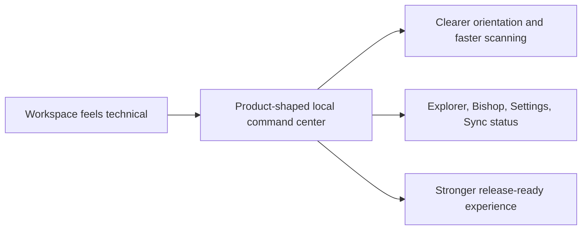

## prod_004_nexus_v1_1_0_product_direction_and_release_pulse - Nexus V1.1.0 product direction and release pulse
> Date: 2026-04-13
> Status: Active
> Related request: `req_003_nexus_v1_1_ui_and_product_polish`
> Related backlog: `item_019_shell_rebrand_and_split_layout`, `item_020_compact_live_state_and_sync_panels`, `item_045_move_runtime_under_sync_status`
> Related task: (none yet)
> Related architecture: `adr_022_separate_runtime_controls_from_sync_operations`
> Reminder: Update status, linked refs, scope, decisions, success signals, and open questions when you edit this doc.

# Overview
Nexus V1.1.0 makes the app feel like a product surface rather than an internal workspace.
The first impression is now a short getting-started moment, followed by a cleaner shell, clearer navigation, and less visual noise.
Users can stay oriented in Explorer, Bishop, Settings, and Sync status without hunting for the current runtime state.
The release keeps the product local-first and keeps Teams or Azure out of the day-to-day experience.

# Product problem
The app now works well, but the user experience needs to read like a finished product instead of a developer console.
People should understand what the app does, where the scope lives, and where operational status lives as soon as they open it.
The release needs to remove unnecessary mental overhead without changing the local-first nature of the product.

# Target users and situations
- Engineers and product builders validating the local Nexus surface.
- Reviewers who need to understand scope, state, and job progress quickly.
- Operators who inspect grounded answers and sync status during local testing.

# Goals
- Make the first-run experience explain the product clearly.
- Keep the core navigation areas easy to scan.
- Keep runtime controls discoverable without making them dominate the shell.
- Keep operational detail available on demand instead of inline everywhere.

# Non-goals
- Introducing Azure or Teams as the primary release surface.
- Changing retrieval semantics, ingestion behavior, or the data model in this release.
- Turning the app into a generic dashboard with no product narrative.

# Scope and guardrails
- In: getting started modal, cleaner product copy, compact sync/status presentation, runtime controls in Settings, and a more guided local-first shell.
- In: hover-based help, compact buttons, and conversation context that stays enabled by default.
- Out: hosted backend packaging, Teams-first workflows, and broader platform changes.

# Key product decisions
- Present the app as `Nexus`, not as a technical build label.
- Use onboarding and hover help to reduce always-visible explanatory text.
- Keep the runtime scope in `Settings`, where users configure the app, not where they monitor jobs.
- Make `Sync status` the operational cockpit, with the progress stream and recent runs grouped together.
- Keep Bishop conversation continuity available by default so the chat feels stateful across questions.

# Success signals
- Users can explain the app and its main areas within the first screen.
- Runtime controls are easy to find without competing with operational status.
- The sync surface reads as a concise cockpit rather than a long report.
- Local validation still passes without any regressions in Explorer, Bishop, or sync flows.

# References
- `logics/request/req_003_nexus_v1_1_ui_and_product_polish.md`
- `logics/backlog/item_019_shell_rebrand_and_split_layout.md`
- `logics/backlog/item_020_compact_live_state_and_sync_panels.md`
- `logics/backlog/item_045_move_runtime_under_sync_status.md`
- `logics/architecture/adr_022_separate_runtime_controls_from_sync_operations.md`

# Open questions
- Should the `Getting started` modal stay on every load, or become a first-launch / on-demand help surface in a later release?
