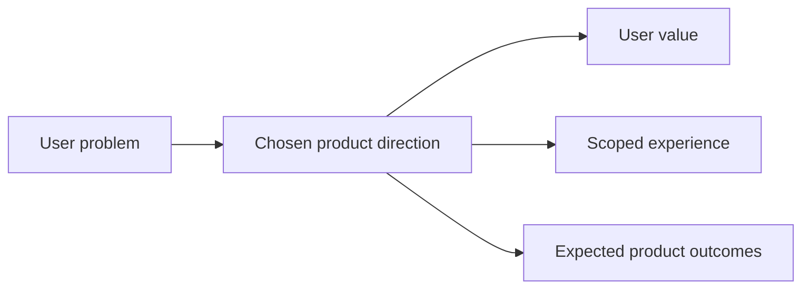

## prod_005_split_sync_status_into_dedicated_operations_screens - Split Sync Status into dedicated operations screens
> Date: 2026-04-14
> Status: Proposed
> Related request: `logics/request/req_017_implement_the_full_app_worker_corpus_and_shell_plan.md`
> Related backlog: `logics/backlog/item_060_split_sync_status_into_dedicated_operations_screens.md`
> Related task: `logics/tasks/task_028_split_sync_status_into_dedicated_operations_screens.md`
> Related architecture: `logics/architecture/adr_023_split_execution_runtime_from_the_app_and_share_corpus_artifacts.md`, `logics/architecture/adr_024_split_sync_status_into_dedicated_operations_screens.md`
> Reminder: Update status, linked refs, scope, decisions, success signals, and open questions when you edit this doc. Decisions resolved: routes first, Status -> Operations -> History -> Config -> Recovery ordering.

# Overview
Split the current Sync Status experience into a summary surface and dedicated operations screens.
Keep the summary surface lightweight and readable.
Move configuration, live operations, run history, and error recovery into focused screens that reduce panel overload and make the app easier to operate.
Keep the wording and hierarchy consistent across the app so operators can move between summary, operations, history, config, and recovery without relearning the UI.

# Product problem
Sync Status is carrying too many responsibilities at once.
It currently mixes live job state, telemetry, checkpoint status, fallback state, and operational controls in a way that makes the screen harder to scan and harder to extend.
Operators need a clearer separation between system summary, live execution, history, config, and recovery.
The current experience also makes it harder to tell which surface is the default place to look first when something changes in the worker or corpus.

# Target users and situations
- Operators who launch, monitor, resume, and debug ingestion or live export runs.
- Users who need to understand what the worker is doing without opening the terminal.

# Goals
- Keep Sync Status as a concise summary.
- Add dedicated screens or views for operations, run history, configuration, and error recovery.
- Reduce context switching while improving readability and trust in the current system state.
- Make it easier to surface worker state, corpus state, and job state without overload.
- Make the app feel like a cockpit with clear entry points rather than a single overloaded status page.

# Non-goals
- No redesign of the underlying worker or corpus model in this brief.
- No change to the job execution contract itself.
- No requirement to rebuild all operational views at once.
- No requirement to decide the exact UI component tree in this brief.

# Scope and guardrails
- In: screen decomposition, navigation changes, summary vs detailed views, clearer labels and state separation.
- Out: backend execution changes, worker protocol changes, corpus schema changes.
- The brief should stay product-first and avoid prescribing implementation details that belong in architecture.

# Key product decisions
- Sync Status becomes the summary panel, not the place where every operational feature lives.
- Live operations, history, config, and recovery deserve focused screens because they answer different operator questions.
- The new screens should use consistent state terminology so operators can move between them without relearning the system.
- The screen split should make the default path obvious: summary first, then deeper inspection and control where needed.

# Success signals
- Operators can identify the current state of the system faster.
- The summary panel becomes shorter and easier to scan.
- Fewer interactions are needed to find history, configuration, or recovery information.
- The UI feels less overloaded during active ingestion and export runs.
- The product feels easier to navigate without adding extra cognitive load.

# References
- `logics/architecture/adr_023_split_execution_runtime_from_the_app_and_share_corpus_artifacts.md`
- `logics/architecture/adr_024_split_sync_status_into_dedicated_operations_screens.md`

# Open questions
- Decision note: use explicit routes for the first iteration so deep links, keyboard navigation, and summary-to-detail handoff stay predictable.
- Keep the screen ordering as Status, Operations, History, Config, and Recovery unless a later implementation issue forces a re-sequence.
