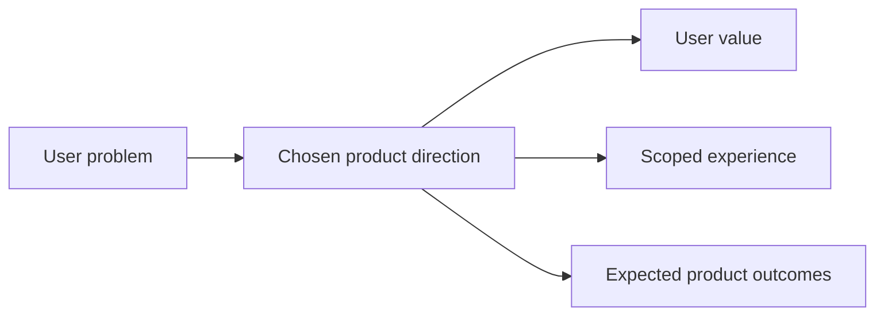

## prod_006_improve_ingestion_metadata_and_chunking_for_bishop_hints - Improve ingestion metadata and chunking for Bishop hints
> Date: 2026-04-14
> Status: Proposed
> Related request: `logics/request/req_017_implement_the_full_app_worker_corpus_and_shell_plan.md`
> Related backlog: `logics/backlog/item_062_improve_corpus_metadata_chunking_and_bishop_hints.md`
> Related task: `logics/tasks/task_030_improve_corpus_metadata_chunking_and_bishop_hints.md`
> Related architecture: `logics/architecture/adr_003_hybrid_knowledge_store_and_retrieval_model.md`, `logics/architecture/adr_016_deepvault_persistence_and_storage_layout.md`, `logics/architecture/adr_023_split_execution_runtime_from_the_app_and_share_corpus_artifacts.md`, `logics/architecture/adr_026_improve_ingestion_metadata_and_chunking_for_bishop_hints.md`
> Reminder: Update status, linked refs, scope, decisions, success signals, and open questions when you edit this doc. Decisions resolved: required metadata fields and optional extensions are now explicit.

# Overview
Improve the corpus signals that ingestion produces so retrieval has richer context to work with.
Make Bishop hints less generic by giving them better metadata, better chunk boundaries, and stronger structural signals.
Keep the change local-first and compatible with the existing permission-aware pipeline.
The product value is better answer quality and less operator guesswork when retrieval is weak.

# Product problem
The current corpus shape is too thin for some questions and produces generic fallback hints too often.
Short or vague prompts do not always surface the right passage even when the source document exists.
Operators need the retrieval layer to carry more document context without changing the source-of-truth model or the permission rules.

# Target users and situations
- Operators and users who depend on Bishop answers and retrieval quality.
- People who need the corpus to explain why an answer is weak and what extra context would help.

# Goals
- Preserve richer metadata and structural context during ingestion.
- Improve chunk boundaries so the resulting retrieval signals are more useful.
- Reduce generic Bishop fallback hints by feeding them better corpus data.

# Non-goals
- No permission model changes.
- No hosted-backend or remote-worker requirement.
- No redesign of the answer flow itself.

# Scope and guardrails
- In: ingestion metadata, chunking context, retrieval-quality signals, and Bishop hint inputs.
- Out: UI polish, sync operations, theme work, and unrelated app shell changes.

# Key product decisions
- Prefer better retrieval context over minimal document shape.
- Keep the change additive so the current local-first corpus pipeline stays intact.
- Treat Bishop hints as a downstream beneficiary of better corpus shape, not as a separate product surface.

# Success signals
- Fewer generic "add a better title or site name" hints.
- Better source relevance for short or vague questions.
- Clearer structural traceability from a chunk back to the source section or heading.

# References
- `logics/architecture/adr_003_hybrid_knowledge_store_and_retrieval_model.md`
- `logics/architecture/adr_016_deepvault_persistence_and_storage_layout.md`
- `logics/architecture/adr_023_split_execution_runtime_from_the_app_and_share_corpus_artifacts.md`
- `logics/architecture/adr_026_improve_ingestion_metadata_and_chunking_for_bishop_hints.md`

# Open questions
- Decision note: required fields in the first wave are `schemaVersion`, `generatedAt`, `source`, `documents[*].id`, `siteId`, `kind`, `title`, `path`, `webUrl`, and `updatedAt`.
- Keep `author`, `sections`, `fileType`, `chunkMetadata`, and `retrievalSignals` optional extensions unless a later contract review promotes them.
