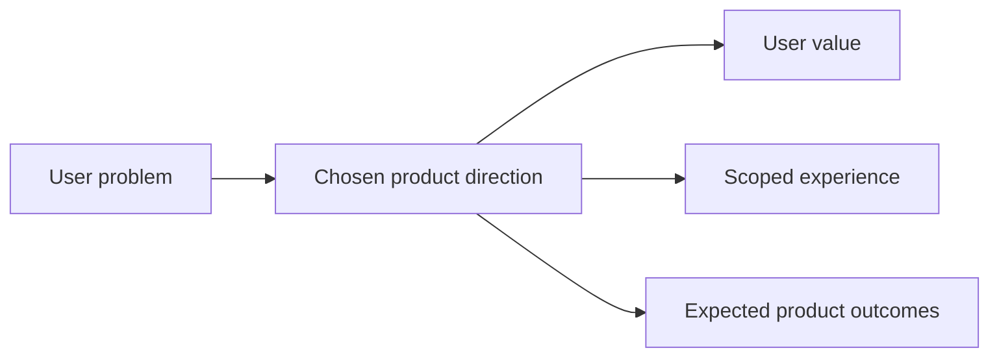

## prod_007_add_a_discrete_light_and_dark_theme_switch_in_the_sidebar - Add a discrete light and dark theme switch in the sidebar
> Date: 2026-04-14
> Status: Proposed
> Related request: `logics/request/req_017_implement_the_full_app_worker_corpus_and_shell_plan.md`
> Related backlog: `logics/backlog/item_063_add_persisted_sidebar_theme_switch.md`
> Related task: `logics/tasks/task_031_add_persisted_sidebar_theme_switch.md`
> Related architecture: `logics/architecture/adr_025_add_a_discrete_light_and_dark_theme_switch_with_persisted_shell_mode.md`
> Reminder: Update status, linked refs, scope, decisions, success signals, and open questions when you edit this doc. Decisions resolved: system fallback only on first launch, then persisted user choice wins.

# Overview
Add a discrete light and dark theme switch to the sidebar so users can choose their preferred shell mode without leaving the main navigation.
Keep the control low in the rail, visually refined, and consistent with the existing shell language.
Persist the choice locally so the app opens in the last selected mode.
The product value is a calmer, more comfortable shell without adding noise to the navigation.

# Product problem
The app currently has no obvious, low-friction theme control in the shell.
Users who work in the app for long sessions need a quick way to switch appearance while keeping the sidebar uncluttered.
The experience should feel native to the shell, not like a settings form bolted onto the navigation rail.

# Target users and situations
- Frequent app users who spend long sessions in the shell.
- Operators who want a low-noise control for appearance preferences.

# Goals
- Provide a discrete light/dark theme switch in the sidebar.
- Make the control easy to find but visually secondary to primary navigation.
- Persist the selection locally and restore it on reload.

# Non-goals
- No custom theme designer.
- No backend preference sync.
- No redesign of the navigation structure itself.

# Scope and guardrails
- In: sidebar placement, theme affordance, persistence, and shell-wide application.
- Out: broader visual redesigns, additional color modes, and server-side preference storage.

# Key product decisions
- Use a slider-style control instead of a dropdown or checkbox to keep the interaction polished and discreet.
- Keep the control at the bottom of the sidebar so it does not compete with navigation.
- Apply the theme consistently across the shell, panels, and modal surfaces.

# Success signals
- Users can switch theme without hunting through settings.
- The sidebar still reads as compact and uncluttered.
- The selected theme survives reloads and remains consistent across the shell.

# References
- `logics/architecture/adr_025_add_a_discrete_light_and_dark_theme_switch_with_persisted_shell_mode.md`

# Open questions
- Decision note: follow system appearance only on first launch when there is no stored preference, then keep the persisted user choice authoritative.
