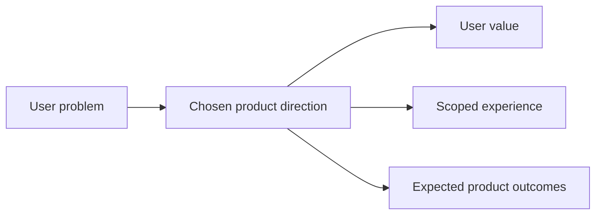

## prod_008_make_ingestion_and_live_export_operable_across_app_and_cli - Make ingestion and live export operable across app and CLI
> Date: 2026-04-14
> Status: Proposed
> Related request: (none yet)
> Related backlog: (none yet)
> Related task: (none yet)
> Related architecture: `logics/architecture/adr_023_split_execution_runtime_from_the_app_and_share_corpus_artifacts.md`
> Reminder: Update status, linked refs, scope, decisions, success signals, and open questions when you edit this doc.

# Overview
Make ingestion and live export feel operable from both the app and the CLI.
Users should be able to inspect the effective configuration, understand what a run is doing, and recover from failures without guessing.
The product value is less friction during long-running runs and less ambiguity between UI-driven and terminal-driven workflows.
The experience should stay local-first while preparing for a dedicated worker runtime.

# Product problem
Ingestion and live export are powerful but still too fragmented across surfaces.
Operators need clearer answers about what config is active, how far a run has progressed, what telemetry matters, and how to resume or recover a failed run.
The same operational model should be understandable whether the user is in the app or in the CLI.

# Target users and situations
- Operators who launch and monitor ingestion or live export runs.
- Power users who want the CLI and the app to expose the same operational model.

# Goals
- Make ingestion and live export configurable, observable, and recoverable from both the app and the CLI.
- Keep the effective configuration understandable without opening the source code or the scripts.
- Reduce guesswork during progress, resume, and failure handling.

# Non-goals
- No backend redesign beyond what is needed for operability.
- No replacement of the current local-first runtime model.
- No requirement to make the app the only way to run jobs.

# Scope and guardrails
- In: editable ingestion parameters, resume behavior, ingestion progress, CLI parity, shared config contract, execution telemetry, retry/failure policy, persisted config, run manifest, and validation coverage.
- Out: unrelated UI polish, theme work, and non-operational app shell changes.

# Key product decisions
- Treat the app and CLI as two clients for the same operational model.
- Prefer explicit configuration and visible run state over hidden defaults.
- Make resume and failure handling understandable enough to trust without consulting the logs first.

# Success signals
- Users can tell what a run is doing and how to continue it.
- The CLI and app present the same operational story.
- Fewer generic questions are needed when a run is slow or fails.

# References
- `logics/architecture/adr_023_split_execution_runtime_from_the_app_and_share_corpus_artifacts.md`

# Open questions
- Which controls should be editable in the first wave versus surfaced read-only from the effective config?
