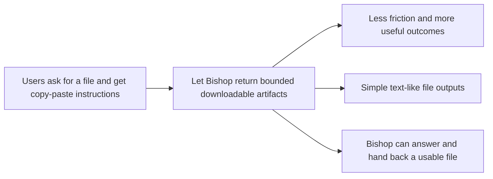

## prod_009_enable_bishop_generated_document_artifacts - Enable Bishop generated document artifacts
> Date: 2026-04-16
> Status: Proposed
> Related request: (none yet)
> Related backlog: (none yet)
> Related task: `logics/tasks/task_036_orchestrate_bishop_generated_document_artifacts.md`
> Related architecture: `logics/architecture/adr_017_bishop_llm_orchestration_after_local_grounding.md`, `logics/architecture/adr_020_clarify_bishop_orchestration_states_and_response_contract.md`
> Reminder: Update status, linked refs, scope, decisions, success signals, and open questions when you edit this doc.

# Overview
Let Bishop produce simple downloadable artifacts when the user asks for a document, not only a chat answer.
The first product step should cover lightweight file outputs that feel native inside the current local-first chat surface.
The goal is to remove the "copy this into a file yourself" dead-end and make Bishop feel action-capable without turning it into a broad file editor.

# Product problem
Users naturally ask Bishop to generate deliverables such as a `.txt`, `.md`, `.json`, or `.csv` file.
Today the product stops at prose and forces the user to manually copy content into another tool, which makes Bishop feel artificially limited even when it already knows the content to generate.
That mismatch weakens trust in the assistant and breaks the flow from request to usable outcome.

# Target users and situations
- Operators who want Bishop to produce a small deliverable directly from the chat.
- Reviewers who need a generated artifact they can inspect, export, or reuse without manual reformatting.
- Local users validating whether Bishop can move from "answering" to "producing" within bounded guardrails.

# Goals
- Let Bishop return simple downloadable artifacts from the chat when the request clearly asks for one.
- Keep the experience obvious and low-friction inside the existing Bishop surface.
- Start with a bounded artifact set that is easy to trust and easy to validate locally.

# Non-goals
- No general-purpose document editor inside Bishop.
- No first-wave support for rich binary office formats such as `.docx`, `.xlsx`, or `.pdf`.
- No hidden file generation side effects when the user only asked for a normal answer.

# Scope and guardrails
- In: explicit artifact requests, downloadable text-like outputs, clear file naming, visible artifact affordances in the chat UI, and local validation of the returned content shape.
- In: a visible `Download` action in the Bishop message header, placed before the confidence and improvement pills when an artifact is available.
- In: a dedicated `Artifact` row in the Bishop right-side trace panel, shown under `Confidence` with a `Download` action when the current answer includes a file artifact.
- In: first-wave formats such as plain text, Markdown, JSON, and CSV.
- Out: background persistence, automatic saving to arbitrary filesystem locations, collaborative editing, and large document packaging workflows.

# Key product decisions
- Treat artifact generation as a distinct Bishop outcome, not as a prose-only answer variant.
- Require explicit user intent before producing a downloadable file.
- Keep a normal Bishop text answer in every artifact-bearing turn; the file complements the answer and does not replace it.
- Start with bounded text-like artifacts so the product value lands quickly without introducing rich-format complexity.
- Keep the chat answer and the downloadable artifact linked in the same turn so provenance and user intent remain clear.
- Surface artifact download where users already inspect answer status and quality signals, by placing the `Download` action in the Bishop message header ahead of the `100%` and `?` pills.
- Mirror that artifact affordance in the right-side trace panel with a dedicated `Artifact` entry under `Confidence`, so users can still download from the diagnostics surface.

# Success signals
- Users can request a simple file and download it directly from Bishop without copy-paste.
- Fewer responses fall back to "I cannot create a file here" for supported artifact requests.
- Generated artifacts feel predictable enough that local users can validate them as part of normal Bishop evaluation.
- Users can discover the artifact action without scanning the full message body because the `Download` affordance sits in the message header next to the existing answer controls.
- Users can still retrieve the file from the right-side trace panel while inspecting confidence and provenance, instead of having to return to the message body.
- Artifact-bearing turns still read like normal Bishop answers instead of collapsing into file-only responses.

# References
- `logics/specs/spec_002_deepvault_bishop_chat_flow_and_answer_quality.md`
- `logics/specs/spec_006_deepvault_prompt_and_context_assembly.md`
- `logics/architecture/adr_017_bishop_llm_orchestration_after_local_grounding.md`
- `logics/architecture/adr_020_clarify_bishop_orchestration_states_and_response_contract.md`

# Open questions
- Which artifact formats should be included in the first shipped wave beyond `.txt`, `.md`, `.json`, and `.csv`?
- Should artifact generation live entirely in the app for the first wave, or should some outputs immediately require the worker boundary?
- How should Bishop present artifact generation failures so users can distinguish model failure, contract failure, and unsupported format requests?
