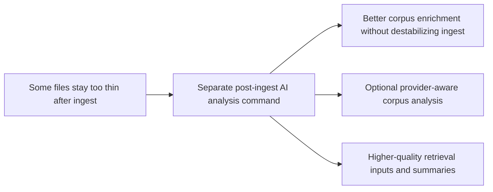

## prod_010_add_a_post_ingest_ai_analysis_command_for_corpus_enrichment - Add a post-ingest AI analysis command for corpus enrichment
> Date: 2026-04-17
> Status: Proposed
> Related request: (none yet)
> Related backlog: (none yet)
> Related task: (none yet)
> Related architecture: `logics/architecture/adr_002_sharepoint_ingestion_and_sync_pipeline.md`, `logics/architecture/adr_003_hybrid_knowledge_store_and_retrieval_model.md`, `logics/architecture/adr_014_deepvault_retrieval_ranking_quality_and_cost_policy.md`, `logics/architecture/adr_016_deepvault_persistence_and_storage_layout.md`, `logics/architecture/adr_023_split_execution_runtime_from_the_app_and_share_corpus_artifacts.md`
> Reminder: Update status, linked refs, scope, decisions, success signals, and open questions when you edit this doc. Keep the command separate from baseline ingestion unless a later decision explicitly merges them.

# Overview
Add a dedicated command that runs after ingest and enriches the corpus through bounded AI analysis only when it is needed.
The baseline ingestion path should stay deterministic, cheap, and restartable, while the new command handles optional, provider-aware document understanding.
The product value is better summaries, richer structural hints, and stronger retrieval inputs for files that are currently too thin, too large, or not directly readable.
The experience should stay local-first and operationally safe even when remote providers are slow, unavailable, or too expensive to use broadly.

# Product problem
The current ingest and live export path can fetch text and derive simple summaries, but it does not deeply analyze every file.
That is acceptable for the baseline pipeline, yet it leaves weak corpus entries for files such as large documents, rich office files, scans, or items whose extracted text is too poor to support good retrieval and answer quality.
If AI analysis is pushed directly into ingest, the most reliable operational path becomes slower, costlier, and harder to recover.
The product needs a separate command that can enrich the corpus after ingest without making the base sync path fragile.

# Target users and situations
- Operators who want a clean ingest first and an optional enrichment pass second.
- Teams trying to improve retrieval quality for difficult files without paying AI cost on every document.
- Reviewers who need the corpus to expose better summaries, sections, keywords, or document classification before Bishop uses it.

# Goals
- Introduce a dedicated post-ingest command for AI-based corpus enrichment.
- Keep baseline ingest reliable even when the AI provider path is unavailable.
- Apply AI analysis selectively so cost and runtime stay bounded.
- Improve the corpus shape for documents that currently produce weak or metadata-only entries.

# Non-goals
- No requirement to run AI analysis during every ingest by default.
- No first-wave redesign of the main ingest command into a provider-dependent workflow.
- No hidden mutation of the source-of-truth SharePoint content.
- No assumption that every file type must be fully interpreted in the first wave.

# Scope and guardrails
- In: a new command that reads an existing corpus, identifies candidates for enrichment, calls a supported AI provider, and writes enriched analysis fields back into a derived corpus artifact or a versioned analysis block.
- In: provider-aware retries, bounded failure behavior, delta-friendly reprocessing, and observability about which files were analyzed and why.
- In: explicit analysis modes such as `off`, `necessary`, and `all`, with `necessary` as the expected default for the new command.
- In: enrichment outputs such as improved summary, structural sections, keywords, document type hints, confidence, provider trace, and analysis timestamp.
- In: an explicit exclusion policy for oversized, unreadable, encrypted, binary, or known-unsupported files so the command can skip them deterministically before calling a provider.
- In: a first-wave usage contract for retrieval and Bishop so the new analysis fields improve answer grounding rather than remaining passive metadata.
- Out: collapsing ingest and analyze into one always-on command, broad UI work, tenant-wide automation assumptions, or unbounded provider spend.

# Key product decisions
- Keep ingest and AI analysis as separate commands with separate operational responsibilities.
- Treat AI analysis as an enrichment pass, not as the source of truth for the corpus baseline.
- Prefer selective analysis over blanket analysis across all files.
- Default to analyzing only documents that are likely to benefit materially from provider help.
- Exclude files early when size, format, or readability makes useful AI analysis unlikely or operationally unsafe.
- Do not let provider errors block the availability of the baseline corpus.
- Keep enriched fields additive and versionable so the baseline corpus contract can evolve safely.
- Preserve enough provider traceability that operators can explain which model touched which document and when.
- Make the first wave good enough for Bishop and retrieval to consume directly, not only for offline inspection.

# Mandatory delivery scope
- Define a stable first-wave analysis contract with a dedicated `analysis` block instead of overwriting top-level corpus fields immediately.
- Define deterministic reanalysis rules so the command can tell whether a document is fresh, stale, failed, excluded, or never analyzed.
- Define exactly which analysis fields retrieval and Bishop may consume in wave one, and in what priority order relative to existing local fields.
- Define a bounded processing state model that survives provider failures without making the corpus ambiguous.
- Define a minimum quality-and-cost validation loop before the command is considered ready for routine use.

# First-wave analysis contract
- The first wave should write analysis under a dedicated `analysis` block on each document rather than overwriting the existing `summary`, `directAnswer`, or `content` fields.
- The `analysis` block should be versioned and additive, with a shape close to:
  - `status`
  - `version`
  - `provider`
  - `model`
  - `analyzedAt`
  - `contentHash`
  - `summary`
  - `keywords`
  - `sections`
  - `documentType`
  - `confidence`
  - `excludedReason`
  - `failureReason`
- Existing top-level corpus fields remain the baseline fallback contract in wave one. This avoids breaking current retrieval behavior while letting Bishop adopt the richer fields incrementally.

# Reanalysis policy
- Reanalysis should key primarily off a stable content hash, with `updatedAt` used as a secondary freshness signal when a reliable content hash cannot be produced.
- A document should be reanalyzed when its content hash changes, when the stored analysis version changes, when the previous status is `failed` and a retry policy allows another attempt, or when the previous status is `stale`.
- The first-wave processing states should be `not_analyzed`, `analyzed`, `excluded`, `failed`, and `stale`.
- `stale` means the document has prior analysis data that no longer matches the current content or analysis contract and must not be treated as fresh.
- `excluded` is a terminal state for the current run but not necessarily forever; a later elevated mode may re-open some soft exclusions.

# Retrieval and Bishop usage contract
- Retrieval should keep using the current local fields as the baseline contract, but may prefer `analysis.summary` over the heuristic summary when `analysis.status = analyzed` and the analysis version is current.
- Bishop should treat `analysis.sections` and `analysis.keywords` as higher-quality context hints when present, especially for files that were previously metadata-only or weakly extracted.
- In wave one, `analysis.summary` should improve grounding, source previews, and retrieval hints, but it should not replace raw retrieved text as the evidence basis.
- If both local and analyzed summaries exist, the preferred order should be:
  - `analysis.summary` when current and confident
  - existing top-level `summary`
  - existing fallback metadata-only summary
- The first visible Bishop win should be fewer weak answers and fewer generic improvement hints on documents that already exist in the corpus but were previously poorly represented.

# Bishop impact
- Bishop should answer better on difficult file types because the corpus will carry stronger summaries, more meaningful structure, and better document hints before prompt assembly.
- The product should expect improvement on PDF, DOCX, PPTX, scan-like, and low-text documents where today Bishop often receives only shallow or metadata-only context.
- P10 does not create a separate Bishop intelligence layer; it improves the quality of the corpus that Bishop already depends on for local grounding.

# Candidate triggers for "analysis needed"
- The document fell back to metadata-only content.
- The file is non-textual or poorly extracted by the current export path.
- The file is large enough that the baseline extract is too shallow to be useful.
- The heuristic summary is too weak, generic, or empty.
- The file type is known to benefit from richer structural analysis, such as `pdf`, `docx`, `pptx`, image-based documents, or scanned exports.

# Exclusion policy expectations
- Hard exclusions should apply before provider routing for files that are above a maximum size limit, use a known unsupported MIME type or extension, are binary-only, are encrypted or access-protected, or are otherwise known to be unreadable by the product.
- Soft exclusions should skip AI analysis when the expected value is too low for the current mode, such as files whose local extraction is already good enough or documents that exceed the standard cost envelope without being in an explicitly elevated mode.
- Every skipped file should carry a persisted exclusion reason so operators can distinguish `file_too_large`, `unsupported_file_type`, `binary_only`, `encrypted_or_protected`, `unreadable_content`, `insufficient_expected_value`, and similar categories without reading raw logs.
- The command should report exclusion totals alongside analyzed and failed totals so cost-control behavior is visible by default.

# Processing state and fallback expectations
- Provider failure must never remove or corrupt the baseline corpus fields produced by ingest.
- When analysis is unavailable, retrieval and Bishop must continue to operate against the baseline corpus exactly as they do today.
- Failed analysis should be visible as a document-level state, not silently collapsed into "not analyzed".
- Excluded documents should remain queryable through their baseline corpus fields if those baseline fields exist.

# Quality and cost validation expectations
- The first wave should ship with a small but explicit validation set of difficult files, such as at least one PDF, one DOCX, one PPTX, one weak-text export, and one excluded file.
- Validation should compare before-and-after retrieval usefulness or Bishop grounding quality on that set, not only whether analysis objects were written.
- The command should expose bounded run metrics including selected documents, analyzed documents, excluded documents, failed documents, and estimated provider cost or token usage.
- The first-wave default mode should stop selecting additional files once a bounded run budget is reached rather than expanding indefinitely.

# Success signals
- Retrieval and Bishop grounding improve on files that were previously thin or weakly summarized.
- Operators can run enrichments without destabilizing or re-running the baseline ingest flow.
- AI spend stays understandable because the command can explain which files were analyzed and which were skipped.
- Provider outages degrade gracefully to "baseline corpus only" instead of breaking the ingestion pipeline.
- The enriched corpus remains auditable enough to distinguish local extracted content from AI-derived analysis.

# User experience expectations
- The operator can run the new command after ingest without learning a separate product model.
- The command should report how many documents were scanned, selected, analyzed, skipped, retried, and failed.
- A later app surface may expose enrichment state, but the first product value should already be usable from the CLI and shared runtime artifacts.

# References
- `logics/product/prod_006_improve_ingestion_metadata_and_chunking_for_bishop_hints.md`
- `logics/product/prod_008_make_ingestion_and_live_export_operable_across_app_and_cli.md`
- `logics/architecture/adr_002_sharepoint_ingestion_and_sync_pipeline.md`
- `logics/architecture/adr_003_hybrid_knowledge_store_and_retrieval_model.md`
- `logics/architecture/adr_014_deepvault_retrieval_ranking_quality_and_cost_policy.md`
- `logics/architecture/adr_016_deepvault_persistence_and_storage_layout.md`
- `logics/architecture/adr_023_split_execution_runtime_from_the_app_and_share_corpus_artifacts.md`

# Open questions
- Decision note: first wave should use a dedicated `analysis` block, not overwrite top-level summary fields.
- Decision note: the first mandatory candidate set should prioritize `pdf`, `docx`, `pptx`, scan-like documents, and low-text documents that degraded to metadata-only or weak extraction.
- Decision note: the first provider path should support one primary provider only; cross-provider fallback can wait until the analysis contract is stable.
- Decision note: the default threshold for "analysis needed" should bias toward clear value, not broad coverage. Metadata-only, weak-summary, unreadable, and priority file-type cases should be selected first.
- Open question: what should be the first-wave hard size ceiling, and should larger files be permanently excluded or deferred to a separate elevated mode?
- Decision note: the first artifact should be a rewritten corpus file that includes the additive `analysis` block, with a sidecar format optional only if later operability work needs it.
