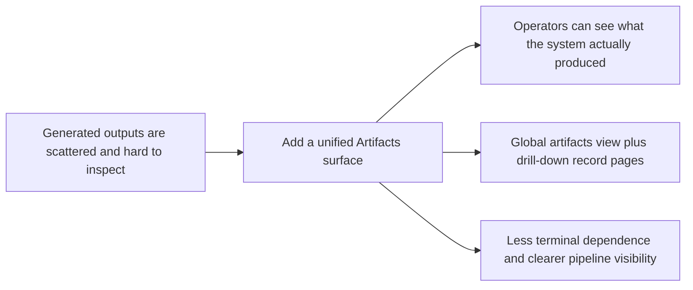

## prod_011_add_an_artifacts_visualization_surface_for_generated_outputs - Add an Artifacts visualization surface for generated outputs
> Date: 2026-04-17
> Status: Validated
> Related request: (none yet)
> Related backlog: `logics/backlog/item_070_ship_artifacts_inspection_surface.md`
> Related task: `logics/tasks/task_038_orchestrate_artifacts_visualization_surface_for_generated_outputs.md`
> Related architecture: `logics/architecture/adr_003_hybrid_knowledge_store_and_retrieval_model.md`, `logics/architecture/adr_016_deepvault_persistence_and_storage_layout.md`, `logics/architecture/adr_023_split_execution_runtime_from_the_app_and_share_corpus_artifacts.md`, `logics/architecture/adr_030_artifacts_surface_information_model_and_processed_record.md`
> Reminder: Update status, linked refs, scope, decisions, success signals, and open questions when you edit this doc. Keep this surface focused on visualization and inspection of generated outputs before expanding it into a broader operations area.

# Overview
Add a new top-level `Artifacts` section after `Worker` so operators can inspect everything the system has generated in one place.
The first product value is a unified visualization surface for corpus files, sync snapshots, evaluation outputs, manifests, and future analysis artifacts rather than making users infer state from terminal logs or local files.
The section should answer a simple operator question: what has the system actually produced, and what does a given generated item contain.
It should also allow drill-down into a SharePoint file's processed record so ingestion and analysis outcomes are inspectable at the document level.

# Product problem
Today the product can generate many useful outputs, but they are fragmented across runtime files, worker jobs, local storage, and terminal logs.
Operators can run ingest, sync, evaluate, and later AI analysis, yet they do not have a single product surface that shows what those runs actually produced.
That makes it harder to verify whether a SharePoint file was ingested, whether it was analyzed, what summary or structure exists for it, and which run produced the current artifact.
The absence of a unified generated-output view creates unnecessary dependence on terminal inspection and file-path hunting.

# Target users and situations
- Operators who want to inspect generated outputs after running ingest, sync, evaluate, or future analysis commands.
- Reviewers trying to understand whether a specific SharePoint file was ingested and analyzed correctly.
- Developers debugging corpus quality, analysis quality, or Bishop grounding behavior without reading raw runtime files by hand.

# Goals
- Add a unified product surface that visualizes generated artifacts across the pipeline.
- Let users inspect a specific SharePoint file's processed record, including ingestion and analysis state when available.
- Make generated outputs understandable without requiring the terminal or manual filesystem browsing.
- Prepare a natural inspection surface for future analysis artifacts introduced by P10.

# Non-goals
- No replacement of the SharePoint explorer with a second document browser.
- No requirement to make artifacts editable in the first wave.
- No mandate to expose every raw runtime file as-is.
- No requirement to turn the section into a general-purpose admin console.

# Scope and guardrails
- In: a top-level `Artifacts` navigation entry after `Worker`.
- In: a default global view that shows generated outputs across the system, with filtering and grouping.
- In: artifact categories such as active corpus files, sync snapshots, evaluation outputs, manifests, and later post-ingest analysis outputs.
- In: drill-down pages or panels for a specific generated item, especially for a SharePoint file's processed record.
- In: filters and regrouping by type, date, producing run, status, and source document.
- Out: editing generated artifacts, re-running jobs from this section in wave one, or expanding the section into a full file manager.

# Key product decisions
- Name the section `Artifacts` because it should cover all generated outputs, not only the active corpus.
- Make the first view global by default so users can see the total set of generated outputs before filtering down.
- Allow regrouping and filtering inside the section rather than splitting outputs into many top-level destinations.
- Treat the SharePoint file record view as a key scenario, not a secondary add-on.
- Keep the first wave read-only and inspection-first.
- Prefer product-shaped summaries of generated outputs over raw path dumps, while still exposing source paths and artifact provenance.

# Core user journeys
- See all generated outputs in one place after running jobs.
- Filter the list to only corpus, snapshots, evaluations, manifests, or analysis outputs.
- Group outputs by run, by type, by date, or by source file.
- Open a processed SharePoint file record and inspect what the system generated from it.
- Confirm whether a file was ingested, analyzed, excluded, failed, or left unchanged.

# SharePoint file record expectations
- A processed SharePoint file record should show source identity: title, site, path, URL, kind, and timestamps.
- It should show ingestion state: whether the file was ingested, when, from which run, and what baseline summary or extracted content shape exists.
- It should show analysis state when available: `not_analyzed`, `analyzed`, `excluded`, `failed`, or `stale`, plus provider/model provenance where relevant.
- It should show derived outputs that help explain product behavior, such as summary, sections, keywords, chunk hints, or exclusion/failure reasons.
- It should help answer practical questions like "was this file processed", "what was generated from it", and "why is Bishop weak on this source".

# First-wave artifact categories
- Corpus artifacts: current mock/live corpus files and derived corpus variants.
- Sync artifacts: sync snapshots, checkpoint outputs, and run manifests when available.
- Evaluation artifacts: evaluation reports and summaries.
- Worker artifacts: job manifests, effective config snapshots, and related run metadata where useful.
- Analysis artifacts: reserved first-class slot for P10 outputs once post-ingest analysis is implemented.

# Information model expectations
- Every artifact shown in the global list should carry at least a display name, artifact type, producing run or source, status, timestamp, and artifact location.
- The section should support grouping by:
  - artifact type
  - producing run
  - date
  - source document
- The section should support filtering by:
  - artifact type
  - status
  - source site
  - analyzed vs not analyzed

# Visual and interaction direction
- The section should feel like a technical artifact catalog, not like a second SharePoint explorer and not like a live operations dashboard.
- The default desktop layout should use two levels:
  - a global artifacts list or grouped list as the main browsing surface
  - a detail panel or drill-down record view for the selected artifact
- The top of the section should provide a compact control bar with:
  - search
  - filters for type, status, run, and date
  - grouping controls such as `All`, `By type`, `By run`, and `By source`
- The global list should stay compact and scan-friendly, with each artifact row or card showing:
  - display name
  - artifact type
  - source or producing run
  - status
  - timestamp
  - path or location hint
- Status should use consistent visual badges for states such as `ingested`, `analyzed`, `excluded`, `failed`, and `stale`.
- The detail surface for a processed SharePoint file should organize information into clear blocks such as:
  - identity
  - ingestion
  - analysis
  - derived outputs
  - diagnostics
- On desktop, prefer list-plus-detail. On narrow screens, the detail view can open as a separate full view rather than forcing a cramped split layout.
- The section should optimize for fast inspection and traceability, not for editing or bulk file management in the first wave.

# Success signals
- Operators can answer "what did the system generate" without opening the terminal.
- A specific SharePoint file's ingestion and analysis record can be inspected from the product surface.
- Fewer debugging steps require manual filesystem browsing or grep-like exploration.
- The section becomes the natural place to validate future P10 analysis outputs.

# Relationship to Bishop
- The Artifacts section should make it easier to explain Bishop behavior by exposing the processed record behind a source document.
- It should help operators diagnose whether a weak Bishop answer comes from missing ingestion, weak extraction, missing analysis, exclusion, or stale generated data.
- The section is not a Bishop feature directly, but it should reduce guesswork about the generated data Bishop relies on.

# References
- `logics/product/prod_008_make_ingestion_and_live_export_operable_across_app_and_cli.md`
- `logics/product/prod_010_add_a_post_ingest_ai_analysis_command_for_corpus_enrichment.md`
- `logics/architecture/adr_003_hybrid_knowledge_store_and_retrieval_model.md`
- `logics/architecture/adr_016_deepvault_persistence_and_storage_layout.md`
- `logics/architecture/adr_023_split_execution_runtime_from_the_app_and_share_corpus_artifacts.md`

# Open questions
- Which artifact categories should ship in the very first visible wave: corpus plus snapshots only, or include evaluation outputs and manifests immediately?
- Should the default grouping be by artifact type or by producing run?
- How much raw artifact content should be previewable inline before the UI becomes too heavy?
- Should the processed SharePoint file record live as a side panel, a full detail view, or both?

# Delivery update
- The first-wave `Artifacts` tab now ships as a top-level read-only inspection surface with filtering, grouping, and processed-record detail blocks.
- The current artifact families are processed files, analysis artifacts, sync runs, and generated answer artifacts.
