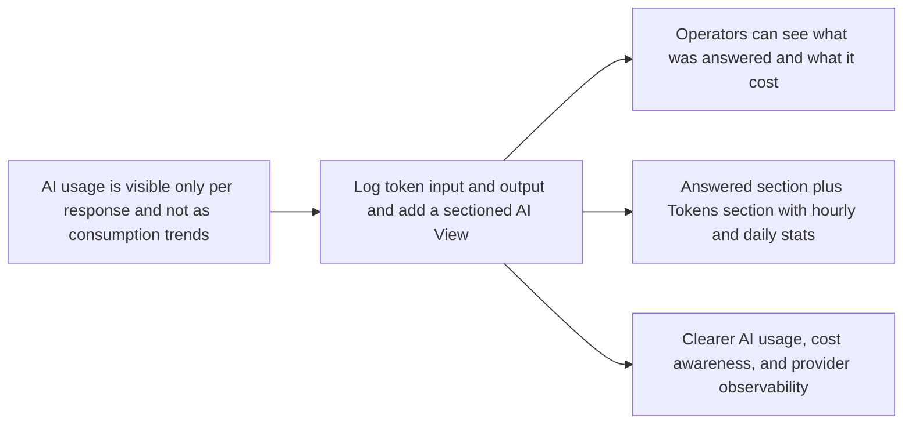

## prod_012_add_ai_consumption_observability_and_sectioned_ai_view - Add AI consumption observability and a sectioned AI View
> Date: 2026-04-17
> Status: Proposed
> Related request: (none yet)
> Related backlog: (none yet)
> Related task: `logics/tasks/task_039_orchestrate_ai_consumption_observability_and_sectioned_ai_view.md`
> Related architecture: `logics/architecture/adr_008_llm_provider_abstraction_for_openai_and_gemini.md`, `logics/architecture/adr_011_observability_audit_and_answer_traceability.md`, `logics/architecture/adr_014_deepvault_retrieval_ranking_quality_and_cost_policy.md`, `logics/architecture/adr_015_deepvault_security_audit_logging_and_retention_boundaries.md`, `logics/architecture/adr_017_bishop_llm_orchestration_after_local_grounding.md`
> Reminder: Update status, linked refs, scope, decisions, success signals, and open questions when you edit this doc. Keep the first wave focused on bounded usage visibility rather than building a full analytics suite.

# Overview
Extend `AI View` so the product can show not only answered responses, but also token consumption over time.
The first product step is to log both input and output token usage for each AI response and surface those stats in a dedicated `Tokens` section alongside the existing answer-oriented view.
This gives operators a direct way to understand daily and hourly AI consumption without needing provider dashboards or raw logs.
The experience should stay local-first, privacy-aware, and operationally useful rather than turning into a broad BI product.

# Product problem
The system already knows enough to report token usage per response, but the product does not yet expose that information as a usable observability surface.
Operators can inspect individual AI responses, yet they cannot easily answer questions such as how many tokens were consumed today, how usage changed by hour, or how much input versus output traffic was generated.
That makes it harder to reason about cost, burstiness, provider behavior, and whether a rise in usage came from larger prompts or larger answers.
The product needs a dedicated AI consumption view that makes usage inspectable in aggregate while preserving the current response-centric value of `AI View`.

# Target users and situations
- Operators who want to monitor token consumption trends by day and by hour.
- Developers comparing usage patterns across providers or prompt changes.
- Reviewers who need to connect "what was answered" with "what it consumed".

# Goals
- Log input and output token counts for each AI response where provider data is available.
- Add a section selector inside `AI View`, similar in spirit to the section navigation used in `Settings`.
- Keep one section focused on answered responses and another focused on token consumption.
- Make hourly and daily token usage visible without needing external dashboards.

# Non-goals
- No full cost billing engine in the first wave.
- No tenant-wide analytics system.
- No exposure of raw prompts or raw provider payloads beyond what is already intentionally visible.
- No requirement to support arbitrary custom chart builders.

# Scope and guardrails
- In: per-response logging of input tokens and output tokens.
- In: an `AI View` section selector with first-wave sections `Answered` and `Tokens`.
- In: daily and hourly token usage summaries.
- In: totals split into at least `input`, `output`, and `total`.
- In: provider-aware consumption summaries when the provider returns usage data.
- In: a local dedicated usage store for bounded AI consumption events rather than relying on transient in-memory state alone.
- Out: advanced forecasting, cost allocation by user/team, or raw prompt archival.

# Key product decisions
- Keep `AI View` as the home for response intelligence and usage observability rather than creating a separate analytics screen first.
- Split the view into sections so response review and token consumption do not compete for the same layout.
- Log input and output tokens separately, not only total tokens.
- Prefer daily and hourly rollups first because they answer the most immediate operational questions.
- Keep the first wave privacy-aware: token counts are logged, but raw prompts and raw provider payloads are not expanded as analytics data.
- Store first-wave token events in a local dedicated append-only usage store rather than only in `localStorage`.
- Use a `7 day` default history window, with a `Today` focus for the hourly breakdown.
- Render timestamps in local time in the UI; keep UTC as the storage/reference format only.
- Exclude estimated cost from the first wave until model/pricing mapping is stable enough to trust.
- Show provider-level splits in the first wave; defer model-level breakdowns.

# First-wave sections inside AI View
- `Answered`: the existing answer-oriented section, focused on answered responses, traceability, and response review.
- `Tokens`: a new consumption section focused on token metrics, daily totals, hourly distribution, and provider usage splits.

# Tokens section expectations
- Show a daily summary of token usage for the current day and recent days.
- Show an hourly breakdown so operators can spot bursts and usage concentration.
- Distinguish `input tokens`, `output tokens`, and `total tokens`.
- Support at least lightweight grouping or filtering by provider when usage data is present.
- Make the relationship between answer volume and token volume visible enough to explain spikes.
- Default the visible history range to the last `7 days`.
- Default the hourly view to `Today` in local time.

# Logging expectations
- Each AI response record should capture:
  - provider
  - model when known
  - timestamp
  - status
  - input token count
  - output token count
  - total token count
- The first-wave storage model should be a bounded local append-only usage store that can back hourly and daily rollups without depending on the live response list.
- When a provider does not return split usage, the product should keep the event but mark it as partial usage data rather than pretending the split is authoritative.
- Responses that never call the remote provider, such as grounded local no-answer outcomes, should remain distinguishable from true provider-backed token events and should not be counted as remote token consumption.

# Visual and interaction direction
- `AI View` should gain a compact section switcher like `Settings`, with clear section buttons for `Answered` and `Tokens`.
- `Answered` remains the qualitative review surface.
- `Tokens` should feel like a compact operational analytics panel, not a finance dashboard.
- The top of `Tokens` should show a few concise KPIs:
  - today input
  - today output
  - today total
  - answered count
- Below that, show:
  - a daily trend view
  - an hourly distribution view
  - optional provider split summaries
- The section should stay readable even when usage is low, and it should avoid empty chart chrome when there is little or no data.

# Relationship to Bishop
- This brief improves visibility into Bishop's remote provider usage rather than changing Bishop's answer generation behavior directly.
- It should help explain whether a high-usage period came from more answered requests, larger grounded prompts, or longer generated answers.
- It also creates a safer basis for future budgeting and provider comparison work.

# Data interpretation expectations
- The first wave should clearly separate:
  - provider-backed token events
  - local/no-provider outcomes
  - partial usage events where only a total token count is known
- Provider-backed token events should power the main consumption charts.
- Local/no-provider outcomes may still appear as answer activity in `Answered`, but they should not inflate `Tokens` consumption metrics.

# Success signals
- Operators can see daily and hourly token consumption directly in the product.
- Input and output tokens are visible as separate signals rather than only a combined total.
- `AI View` becomes easier to scan because response review and token review are separated into sections.
- Usage spikes can be investigated without reading raw logs or external provider dashboards first.

# References
- `logics/architecture/adr_008_llm_provider_abstraction_for_openai_and_gemini.md`
- `logics/architecture/adr_011_observability_audit_and_answer_traceability.md`
- `logics/architecture/adr_014_deepvault_retrieval_ranking_quality_and_cost_policy.md`
- `logics/architecture/adr_015_deepvault_security_audit_logging_and_retention_boundaries.md`
- `logics/architecture/adr_017_bishop_llm_orchestration_after_local_grounding.md`

# Open questions
- How much history should the local dedicated usage store retain before compaction or rollover is needed?
- Should the first visible `Tokens` section include per-provider comparison cards only, or also a lightweight per-provider trend line in wave one?
- When estimated cost is introduced later, should it live inside `Tokens` or become a separate section or summary mode?
