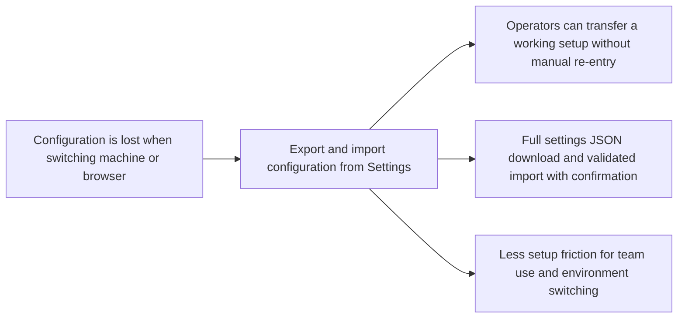

## prod_013_make_application_configuration_exportable_and_importable - Make application configuration exportable and importable

> Date: 2026-04-18
> Status: Proposed
> Related request: `logics/request/req_019_post_v1_3_consolidation_enrichment_loop_ci_and_configuration_portability.md`
> Related backlog: `logics/backlog/item_079_add_configuration_export_and_import_to_settings.md`
> Related task: `logics/tasks/task_041_orchestrate_post_v1_3_consolidation_enrichment_ci_and_configuration_portability.md`
> Related architecture: `logics/architecture/adr_016_deepvault_persistence_and_storage_layout.md`
> Reminder: Update status, linked refs, scope, decisions, success signals, and open questions when you edit this doc.

# Overview

Let operators download their full application configuration as a local JSON file and restore it on another machine or browser by importing that file through the Settings panel.
The first product value is removing the manual re-entry of API keys, Entra settings, worker URLs, and Bishop tuning parameters every time an operator changes device or sets up a new environment.
The experience must stay local-first: the file is generated and consumed entirely in the browser, never transiting a server, and the product must warn clearly that the file contains secrets in plaintext.

# Product problem

Every operator-specific setting — API keys for OpenAI, Gemini, and Anthropic; Entra client ID and tenant; worker URL and token; Bishop retrieval limits and model selection — lives in `localStorage`.
That storage is browser-local and session-tied: it disappears when the user switches browser, wipes storage, or moves to another machine.
There is no way today to share a working configuration with a colleague or restore a known-good setup after a browser reset.
This is a concrete operational blocker for teams using the tool across multiple environments or onboarding a new operator who needs to replicate an existing setup.

# Target users and situations

- Operators setting up a second machine or browser and needing to replicate an existing configuration without re-entering each key manually.
- Teams where one operator configures the tool and shares the setup file with colleagues.
- Developers switching between a local dev environment and a staging SharePoint environment.
- Operators recovering after a browser storage reset or a profile migration.

# Goals

- Let operators export their full persisted configuration as a single downloadable JSON file from the Settings panel.
- Let operators import a configuration file produced by the export, with explicit confirmation before any values are overwritten.
- Validate the imported file against a schema before applying any values so a malformed or incompatible file cannot corrupt the current settings.
- Make the security implication of exporting secrets in plaintext visible and unavoidable through a warning on the export UI.

# Non-goals

- No encryption of the exported file in the first wave — the warning is the required deliverable.
- No automatic sync of configuration across machines or browsers — no backend is involved.
- No multi-workspace profile management — a single export/import of the active configuration is the scope.
- No selective export of individual settings — the first wave exports the full configuration as a unit.
- No import of configuration files produced by older incompatible versions without a migration path — schema validation will reject incompatible formats cleanly.

# Scope and guardrails

- In: an "Export configuration" button in the Settings panel that triggers a local file download.
- In: the exported JSON includes all persisted parameters: API keys (OpenAI, Gemini, Anthropic), Entra settings (client ID, tenant, client secret, site names), worker URL and token, and Bishop tuning (model, retrieval limits, history settings).
- In: a visible plaintext warning on the export UI, displayed before or alongside the download button.
- In: an "Import configuration" button that opens a file picker, validates the file schema, shows a confirmation dialog with the list of settings that will be overwritten, and applies values only on explicit confirmation.
- In: a clean error state if the imported file fails schema validation, with a clear message identifying the problem — no partial write.
- Out: encrypting the configuration file.
- Out: partial export (e.g. API keys only).
- Out: merging imported values with existing ones — import is a full overwrite of the configuration on confirmed import.
- Out: automatic configuration sync, cloud backup, or server-side storage.

# Key product decisions

- Keep export and import entirely client-side: the JSON file is generated in the browser and read in the browser — no server call is made at any point.
- Use a single flat JSON structure for the first wave rather than a versioned nested format — simpler to implement and validate; add a `version` field to support future migrations.
- Require explicit user confirmation before overwriting: a confirmation dialog should list the categories of settings that will be replaced (API keys, Entra, worker, Bishop tuning) without showing raw secret values.
- Display the plaintext warning prominently — not as a tooltip or footnote. The user must see it before or during the export action.
- Schema validation on import is mandatory and must reject the file before any write if the structure is missing required fields or contains unexpected types.
- The import file picker should accept only `.json` files to reduce the risk of accidental wrong-file imports.

# Core user journeys

- Open Settings, find the export button, read the warning, click export, receive a `.json` file locally.
- On a new machine: open Settings, find the import button, select the previously exported file, review the confirmation dialog, confirm, see settings applied immediately.
- Import a malformed file: see a clear error message, no settings changed.
- Import a file from an incompatible version: see a schema validation error, no settings changed.

# Warning expectations

- The export warning should state explicitly that the file contains API keys and other secrets stored in plaintext.
- It should recommend treating the file like a password — do not commit it to version control, do not share it in unencrypted channels.
- The warning should appear inline in the Settings panel near the export button, not only in a modal that can be dismissed without reading.

# Import confirmation expectations

- The confirmation dialog should list the categories of settings that will be overwritten: API keys, Entra configuration, worker settings, Bishop tuning.
- It should not display raw secret values in the confirmation dialog.
- A "Cancel" action should leave all existing settings unchanged.
- A "Confirm" action should apply the full imported configuration atomically — all or nothing.

# Visual and interaction direction

- Export and import controls should live in a dedicated subsection within Settings, clearly labeled (e.g. "Configuration backup").
- Export: a button labeled "Export configuration" with the plaintext warning displayed immediately below or above it.
- Import: a button labeled "Import configuration" that opens the file picker directly; schema validation and confirmation happen after file selection.
- Keep the controls compact — this is an operational utility, not a prominent product feature.
- Error states on import should be clear and actionable: identify what failed (missing field, wrong type, version mismatch) without exposing raw schema internals.

# Success signals

- An operator can move from one machine to another and restore a working configuration in under two minutes.
- A new team member can receive a configuration file and be set up without any manual key entry.
- A malformed import file produces a clear error and leaves existing settings unchanged.
- The plaintext warning is seen by every operator who uses the export — it is not skippable without awareness.

# References

- `logics/architecture/adr_016_deepvault_persistence_and_storage_layout.md`
- `logics/request/req_018_post_v1_3_code_quality_security_and_maintainability_audit.md` (localStorage warning — AC3)

# Open questions

- Should the exported filename include a timestamp to make versioned backups easier to manage (e.g. `deepvault-config-2026-04-18.json`)?
- Should the confirmation dialog show a diff between the imported values and current values (categories only, not raw secrets) to help the user understand what changes?
- Should a future wave add selective import (apply only API keys, skip Entra) or is full-overwrite sufficient for the foreseeable use cases?
