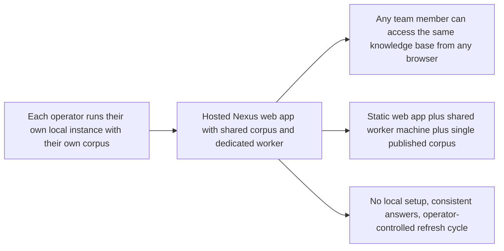

## prod_014_host_nexus_as_a_shared_multi_user_web_application - Host Nexus as a shared multi-user web application

> Date: 2026-04-18
> Status: Validated
> Related request: `logics/request/req_020_host_nexus_as_a_shared_multi_user_web_application.md`
> Related backlog: `logics/backlog/item_080_python_fastapi_worker_foundation.md`, `logics/backlog/item_081_port_scoring_to_python_worker.md`, `logics/backlog/item_082_corpus_endpoint_and_browser_bundle_cleanup.md`, `logics/backlog/item_083_bishop_proxy_endpoint.md`, `logics/backlog/item_084_job_execution_in_python_worker.md`, `logics/backlog/item_085_entra_sso_msal_and_worker_token_validation.md`, `logics/backlog/item_086_operator_allowlist_and_access_log.md`, `logics/backlog/item_087_hosted_mode_ui.md`, `logics/backlog/item_088_docker_compose_deployment_package.md`
> Related task: `logics/tasks/task_042_orchestrate_python_worker_foundation_and_runtime_migration.md`, `logics/tasks/task_043_orchestrate_hosted_auth_access_and_deployment.md`
> Related architecture: `logics/architecture/adr_013_hosted_backend_and_teams_chat_channel.md`, `logics/architecture/adr_016_deepvault_persistence_and_storage_layout.md`, `logics/architecture/adr_023_split_execution_runtime_from_the_app_and_share_corpus_artifacts.md`, `logics/architecture/adr_034_nexus_hosted_deployment_topology_and_multi_user_access_model.md`
> Reminder: Update status, linked refs, scope, decisions, success signals, and open questions when you edit this doc. This is the next major architectural pivot after the quality and consolidation waves. Keep decisions grounded in the existing worker boundary contract from adr_023.

# Overview

Move Nexus from a local-first per-operator tool to a shared hosted web application accessible from any browser, backed by a single shared corpus and a dedicated worker machine that owns job execution and corpus serving.
The product value is that any team member can open a URL and immediately access the same knowledge base — the same Explorer, the same Bishop answers, the same corpus state — without any local setup.
Operators retain exclusive control over job execution (ingest, analyze, evaluate) through the worker machine, while team members get a read-quality knowledge access surface out of the box.
This pivot builds directly on the worker boundary established in `adr_023` — the worker is already the right architectural unit; it now becomes a shared service rather than a per-developer local process.



# Product problem

Nexus is currently a local-first tool: each operator runs their own instance, manages their own corpus file, and keeps their own API keys and configuration in browser localStorage.
This means every person who wants to use Navy or Bishop must set up the full local environment — Node, dependencies, environment variables, SharePoint credentials — before they can query a single document.
It also means there is no single source of truth for the corpus: two operators on the same team may be working from different versions of the same SharePoint content, with different enrichment states, different sync timestamps, and different retrieval configurations.
When the team wants to share Bishop answers or Explorer results, they have to share screenshots or copy-paste content — there is no shared URL, no shared state, no shared history.
The local-first model was the right choice for the validation phase. It is the wrong model for a team that wants to use the tool daily without friction.

# Target users and situations

**Team members (read access):**
- Knowledge workers who want to search and browse SharePoint content through Navy without any local setup.
- Employees who want to ask Bishop a question and get a grounded answer from the shared corpus.
- Reviewers who want to inspect what the corpus contains, what has been analyzed, and what Bishop can answer from it.
- New team members who need access to company knowledge on day one, not after a multi-hour setup.

**Operators (job control):**
- The person or team responsible for keeping the corpus fresh: running ingest, analyze, and evaluate on a schedule or on demand.
- Operators who need to inspect job history, run manifests, and artifact state through the Artifacts panel.
- Administrators who configure which SharePoint sites are in scope, which provider is active, and what the Bishop retrieval limits are.

# Goals

- Make the Nexus web app accessible from any browser via a shared URL, with no local installation required for team members.
- Serve a single shared corpus to all users so that Explorer and Bishop see the same documents at the same version.
- Run all job execution (ingest, analyze, evaluate, export-live) on a dedicated worker machine, not on each user's browser or developer laptop.
- Move API keys and sensitive configuration from browser localStorage to server-side configuration on the worker machine.
- Protect the hosted app with Entra authentication so only authorized team members can access it.
- Preserve the local-first development path so developers can still run a local instance against mock or live data during development and testing.

# Non-goals

- Not a real-time collaborative editing tool — users see the same corpus, but they do not edit it concurrently.
- Not a full enterprise admin console with fine-grained per-user permission management in the first wave.
- Not a replacement for the local development mode — the local-first path must continue to work for developers.
- Not a multi-tenant SaaS product — the first wave targets a single team or organization sharing one corpus.
- Not a Teams bot (that is the `DeepVault - Gordon` direction from `adr_013`) — Nexus remains a web app.
- Not a migration away from the current worker boundary contract — `adr_023` defines that boundary and it stays intact.

# Scope and guardrails

**In scope:**
- Static hosting of the Nexus React build, served at a shared URL accessible from any browser.
- The worker machine exposes the corpus as a versioned JSON endpoint that the browser fetches at startup instead of loading a bundled or localStorage corpus.
- The worker machine owns API keys (OpenAI, Gemini, Anthropic, Entra) as server-side environment variables — they are no longer stored in browser localStorage.
- Bishop LLM calls are proxied through the worker machine so provider API keys never reach the browser.
- Entra SSO protects the hosted Nexus app — unauthenticated requests are redirected to login.
- Two access levels: team members (read access: Explorer, Bishop, and Sync history) and operators (read + job control + Artifacts).
- A single worker machine per deployment serving all connected browsers.
- The local-first development mode (mock corpus, local worker, no SSO) continues to work with no changes for developers.

**Out of scope:**
- Multi-worker scheduling or distributed job queues in the first wave.
- Per-user corpus filtering or per-user permission enforcement beyond the Entra authentication gate (role-based access remains at the corpus level as today).
- Teams or Slack integration — Nexus remains a standalone web app.
- High-availability or geo-distributed deployment in the first wave.
- Mobile-native app — the hosted web app on mobile browsers is acceptable.

# Key product decisions

- **Docker Compose on Windows is the deployment unit**: two containers (`caddy` and `worker`) on the same local network machine, managed by a single `docker-compose.yml`. No Azure, no cloud dependency. `docker-compose up -d` starts everything; `docker-compose restart worker` updates the worker independently.
- **The first-wave Windows runtime path is fixed**: operator docs and deployment examples use `C:\\deepvault-nexus\\data\\runtime` as the bind-mounted runtime directory so the deployment package stays deterministic.
- **Caddy proxies `/api/*` to the worker container** so the browser sees a single origin — no CORS configuration needed. Caddy handles HTTPS automatically (self-signed or ACME), which matters for Entra redirect URIs that may require HTTPS for non-localhost URLs. The `data/runtime/` directory is a bind mount to a Windows host path so corpus data persists across container restarts.
- **The Nexus frontend is a static build** served by the Caddy container. No server-side rendering is needed.
- **The worker container is a Python FastAPI service** (`worker/main.py`) — the single backend for corpus serving, job execution, LLM proxying, and scoring. It exposes `GET /api/corpus`, `POST /api/bishop/query`, `POST /api/jobs`, `GET /api/jobs/:id/events` (SSE), `GET /api/artifacts`, `GET /api/health`, and `GET /api/config/mode`. The existing Node.js CLI scripts (ingest, analyze, evaluate, export-live) are replaced by Python equivalents in the worker service. See `adr_035_python_fastapi_as_the_worker_runtime`.
- **API keys never reach the browser** in the hosted model. The worker reads them from server-side environment variables. The Settings panel API key inputs are hidden or disabled in hosted mode.
- **Bishop LLM calls are proxied** through the worker. The browser sends a grounded query request to the worker, the worker calls the LLM provider with its server-side keys, and returns the response to the browser.
- **Entra SSO is the access gate** for the hosted app. The browser authenticates once via Entra; the resulting token is attached to requests to the worker for identity-based access control.
- **HTTPS via Caddy is the default hosted assumption** for non-localhost URLs. The first wave does not document a parallel Nginx setup.
- **The corpus endpoint replaces the bundled mock and the live-corpus.json file**. The browser fetches `GET /api/corpus` at startup. If the worker is unreachable, the app shows an explicit offline state — it does not fall back to a bundled mock in production.
- **Operator role is enforced by the worker**, not by the browser. The job trigger endpoints (`POST /api/jobs`) are gated by `OPERATOR_ALLOWLIST` after token validation.
- **Operator state is surfaced by the worker**, and the browser uses that runtime flag to decide which hosted-only controls are rendered.
- **Local development mode stays aligned with the worker model**. Setting `WORKER_MODE=local` keeps a local Python worker, local mock corpus, Vite `/api` proxying, and no SSO.
- **State ownership is explicit**. Shared business state (corpus, jobs, manifests, artifacts, runtime flags, audit signals) is worker-owned; browser storage is limited to local UI preferences and short-lived view state.
- **The first hosted wave uses deterministic file-backed persistence**, not a transactional shared database. Runtime artifacts live under `data/runtime/` and are projected through worker APIs/CLI.

# Deployment topology

```
Team members (browsers) — any browser on the local network
        │
        ▼
[ Windows machine on local network ]
  └── docker-compose
        ├── caddy container (port 80/443, auto-HTTPS)
        │     ├── /           → serves Nexus static build (/dist)
        │     └── /api/*      → reverse proxy → worker container (no CORS needed)
        │
        └── worker container (Python FastAPI, internal port 8000)
              ├── GET /api/health
              ├── GET /api/config/mode     ← hosted/local mode indicator
              ├── GET /api/corpus          ← shared corpus JSON
              ├── POST /api/bishop/query   ← LLM proxy (server-side keys)
              ├── POST /api/jobs           ← operators only
              ├── GET /api/jobs/:id/events ← SSE stream
              └── GET /api/artifacts       ← operators only
                    │
                    ├── .env file: OPENAI_API_KEY, GEMINI_API_KEY, ANTHROPIC_API_KEY, ENTRA_*
                    ├── .env file: OPERATOR_ALLOWLIST (Entra object IDs)
                    ├── volume: ./data/runtime/ ← corpus, manifests, checkpoints (persisted)
                    └── SharePoint + Graph API (ingest/export-live)
```

No Azure. No cloud dependency. `docker-compose up -d` starts everything. `docker-compose restart worker` updates the worker without touching Caddy. The `data/runtime/` directory is a bind mount to a Windows path so corpus data persists across container restarts.

# Relationship to Bishop

- In the local model, Bishop makes LLM calls directly from the browser using keys from localStorage.
- In the hosted model, the browser sends a Bishop query (question + role) to the worker's `POST /api/bishop/query` endpoint. The worker performs local grounding against the corpus, assembles the prompt, calls the LLM provider with its server-side keys, and returns the structured response.
- The Bishop grounding contract, scoring logic, and response shape remain unchanged — only the call site moves from browser to worker.
- This change makes Bishop safe for team use: no user ever needs to supply an API key to access Bishop answers.

# Shared vs local state

- Shared across users:
  - published corpus
  - job status/history, manifests, checkpoints
  - artifacts runtime state
  - worker-exposed runtime mode and operator status
  - audit/access logs
- Local to each browser session:
  - theme and layout preferences
  - panel open/collapsed state
  - temporary interaction state in Explorer/Bishop
  - Bishop conversation history in the first wave unless a dedicated shared persistence model is introduced later
- Never browser-owned:
  - API keys and auth secrets
  - the source-of-truth corpus
  - job execution state
  - operator authorization state

First-wave storage conventions:
- `data/runtime/corpus-published.json` is the shared corpus source of truth
- `data/runtime/jobs/<jobId>.json` stores canonical job metadata
- `data/runtime/jobs/<jobId>.events.jsonl` stores append-only job progress events
- `data/runtime/manifests/` and `data/runtime/artifacts/` store worker-produced outputs

# Relationship to the local-first phase and req_018 / req_019

- The quality and consolidation work in `req_018` and `req_019` is the pre-migration cleanup that makes this pivot cleaner:
  - ~~Splitting `bishop.ts` (item_072)~~ — Cancelled (`adr_035`): bishop.ts is removed from the browser entirely; the LLM proxy is implemented in `worker/bishop.py` (Python FastAPI).
  - The localStorage security work (item_074) and the API key warning address the transition period before hosted mode lands.
  - The config export/import (item_079) becomes the migration tool for operators moving their local settings to the worker machine's server-side environment.
  - The GitHub Actions CI (item_078) is the validation gate that ensures the hosted build stays green.
- In the hosted model, items_074 (localStorage warning) and item_079 (config export/import) are superseded for team members — they remain useful for local development and operator onboarding only.

# Relationship to adr_013

- `adr_013` describes a hosted backend targeting Azure and a Teams bot channel (DeepVault - Gordon).
- This brief describes a simpler and more immediate target: Nexus as a hosted web app, without requiring Teams or a full Azure backend.
- The two directions are compatible: the worker machine described here is the same logical unit as the hosted backend in `adr_013`. The difference is that this brief keeps the Nexus web app as the primary user surface and defers the Teams/Gordon channel.
- When `adr_013` becomes active, the worker machine's corpus and Bishop proxy endpoints become the shared backend for both Nexus and Gordon.

# First-wave success signals

- A team member opens the Nexus URL in any browser, authenticates via Entra, and reaches the Explorer panel with the shared corpus — no local setup required.
- Two team members querying Bishop at the same time get answers grounded in the same corpus version.
- An operator triggers an ingest job from the Sync panel; all connected browsers see the job progress via the SSE stream and the corpus updates when the job completes.
- A developer runs the local mock mode with no changes to their existing workflow.
- No API key appears in any browser network request or browser storage in a hosted deployment.

# Resolved decisions

- **Deployment infrastructure**: No Azure planned. The worker machine is a machine on the local network. The Nexus static web app and the worker API can run on the same machine; separate machines are also acceptable if the network topology calls for it. No cloud dependency in the first wave.
- **Static hosting vs worker serving**: The worker machine can serve both the static Nexus build and the worker API on the same machine. Caddy serves the static files and proxies `/api/*` to the Python FastAPI worker. Same machine, two containers, one network address.
- **Operator access model**: Option A — an allowlist of Entra object IDs in the worker configuration file. No custom Entra role claims needed. Simple to provision and revoke.
- **Artifacts panel access**: Restricted to operators only in hosted mode. Team members see Explorer, Bishop, and Sync (read-only job history) but not Artifacts.
- **Bishop proxy streaming**: A complete response returned after full processing is acceptable in the first wave. SSE streaming from the proxy endpoint is deferred.
- **Configuration export filename**: Include a timestamp — `deepvault-config-2026-04-18.json` — to make versioned backups easier to manage.

# Open questions

- ~~Should the hosted app show a visible mode indicator (banner or badge) telling users they are on the shared hosted instance vs a local development instance?~~ **Resolved**: a subtle `Shared` label in the Settings panel — not a persistent banner. The authenticated user's name in the shell already implicitly signals shared mode. See `prod_015` Resolved decisions.

# Confirmed context

- All team members have Microsoft 365 accounts.
- The machines have internet access from the local network where Nexus is hosted.
- Entra SSO is confirmed as the authentication mechanism. On Windows domain-joined machines with Edge or Chrome, the login is typically silent — users see the Nexus app directly without a login prompt.
- See `logics/product/prod_015_user_authentication_and_access_management.md` for the full authentication and user management brief.

# References

- `logics/architecture/adr_013_hosted_backend_and_teams_chat_channel.md`
- `logics/architecture/adr_016_deepvault_persistence_and_storage_layout.md`
- `logics/architecture/adr_023_split_execution_runtime_from_the_app_and_share_corpus_artifacts.md`
- `logics/architecture/adr_034_nexus_hosted_deployment_topology_and_multi_user_access_model.md`
- `logics/request/req_018_post_v1_3_code_quality_security_and_maintainability_audit.md`
- `logics/request/req_019_post_v1_3_consolidation_enrichment_loop_ci_and_configuration_portability.md`
