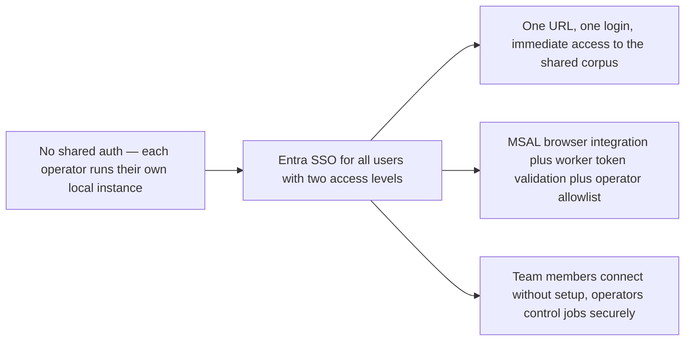

## prod_015_user_authentication_and_access_management - User authentication and access management

> Date: 2026-04-18
> Status: Proposed
> Related request: `logics/request/req_020_host_nexus_as_a_shared_multi_user_web_application.md`
> Related backlog: `logics/backlog/item_085_entra_sso_msal_and_worker_token_validation.md`, `logics/backlog/item_086_operator_allowlist_and_access_log.md`, `logics/backlog/item_087_hosted_mode_ui.md`
> Related task: `logics/tasks/task_043_orchestrate_hosted_auth_access_and_deployment.md`
> Related architecture: `logics/architecture/adr_034_nexus_hosted_deployment_topology_and_multi_user_access_model.md`
> Related product: `logics/product/prod_014_host_nexus_as_a_shared_multi_user_web_application.md`
> Reminder: Update status, linked refs, scope, decisions, success signals, and open questions when you edit this doc.

# Overview

Define how users connect to the hosted Nexus application, what they experience when they open the URL, how access levels are enforced, and how operators are provisioned and revoked.
All team members have Microsoft 365 accounts and their machines have internet access from the local network — Entra SSO is the authentication mechanism.
On Windows domain-joined machines with Edge or Chrome, the experience is typically silent: users open Nexus and land directly in the application without a visible login prompt.
On other browsers or non-domain machines, users go through a standard Microsoft login redirect and return to Nexus within seconds.

# Product problem

In the current local-first model there is no authentication — each person runs their own instance and the tool is only accessible on their own machine.
In the hosted model, Nexus is reachable from any browser on the local network, which means anyone who discovers the URL could access the shared corpus and potentially trigger worker jobs.
The product needs a lightweight access control mechanism that:
- requires no extra account or password beyond what team members already have (Microsoft 365),
- is transparent for Windows users already signed into their corporate account,
- clearly distinguishes read-only team members from operators who can trigger jobs,
- lets administrators add or remove operators without redeploying the application.

# Target users and situations

**Team members connecting for the first time:**
- Open the Nexus URL on a domain-joined Windows machine → land in the app immediately (silent SSO).
- Open the Nexus URL on a non-domain machine or non-Microsoft browser → brief Microsoft login redirect → land in the app.
- No account creation, no password to remember beyond their existing Microsoft 365 credentials.

**Operators managing the worker:**
- Same login experience as team members.
- After login, the Sync panel job controls (ingest, analyze, evaluate) and the Artifacts panel are unlocked.
- Operators are provisioned by adding their Entra object ID to the worker configuration file.

**Administrators provisioning access:**
- Add or remove an operator by editing `OPERATOR_ALLOWLIST` in the worker config and restarting the worker process.
- No Entra admin portal change needed for operator gating — only the worker config file.

# Goals

- Let every team member with a Microsoft 365 account access Nexus from any browser on the local network with no extra setup.
- Make the login experience transparent on Windows domain-joined machines (silent SSO via MSAL).
- Enforce two access levels — team member (read) and operator (read + job control) — without a complex RBAC system.
- Let administrators provision and revoke operator access by editing a single config file on the worker machine.
- Keep the local development mode completely unaffected — no SSO, no token, no registration needed.

# Non-goals

- Not a full RBAC system with fine-grained per-user permissions in the first wave.
- Not a custom user directory — Entra is the only identity source.
- Not a guest access mechanism — all users must have a Microsoft 365 account in the organization's Entra tenant.
- Not a per-user corpus filtering system — all authenticated users see the same shared corpus.
- Not a session audit log in the first wave — token validation logs are sufficient.

# Scope and guardrails

**In scope:**
- Entra app registration with the Nexus local URL as a redirect URI.
- `@azure/msal-browser` integration in the React app for browser-side token acquisition.
- Silent SSO attempt first on every load; explicit redirect flow only if the silent attempt fails.
- Access token attached to all requests to the worker API (`Authorization: Bearer <token>`).
- Worker-side token validation using Microsoft's public JWKS endpoint.
- Operator access gate: the worker checks the authenticated user's Entra object ID against `OPERATOR_ALLOWLIST` in the worker config before allowing job control requests.
- A visible display of the authenticated user's name or email in the Nexus shell (top bar or Settings) so users can confirm which account is active.
- A sign-out option that clears the MSAL session and redirects to the Microsoft logout endpoint.
- Local development mode bypasses all of the above — no token, no MSAL, no worker auth.

**Out of scope:**
- Guest accounts or external users outside the Entra tenant.
- Per-user activity logs or audit trails in the first wave.
- Token refresh UI (MSAL handles token refresh silently and transparently).
- Multi-tenant support.
- Offline authentication — if Microsoft's auth endpoint is unreachable, users cannot log in.

# Key product decisions

- **MSAL browser-side** (`@azure/msal-browser`) is the integration library. It is Microsoft's official SPA auth library, handles token acquisition, caching, and refresh transparently, and is already a pattern in the codebase via the existing Entra settings.
- **Silent SSO first**: on every app load, MSAL attempts a silent token acquisition using the cached account. If it succeeds, the user sees the app immediately with no redirect. Only if it fails (first visit, token expired, account mismatch) does MSAL trigger the redirect flow.
- **Access token scope**: the token is scoped to the Nexus Entra app registration only (a custom scope like `api://<client-id>/Nexus.Access`). It is not a Microsoft Graph token — this keeps the token's blast radius minimal.
- **Worker validates every request**: the worker validates the token on every incoming request using Microsoft's JWKS endpoint. No server-side session is maintained — the token is the session.
- **Operator allowlist in worker config**: `OPERATOR_ALLOWLIST` is a comma-separated list of Entra object IDs in the worker environment or config file. The worker extracts the `oid` claim from the validated token and checks it against the list. If present, the request is granted operator access.
- **Auth config stays minimal**: the first hosted wave standardizes on `ENTRA_TENANT_ID`, `ENTRA_CLIENT_ID`, `WORKER_AUTH_ENABLED`, and `OPERATOR_ALLOWLIST` as the required runtime auth surface.
- **No Entra app role claims**: custom Entra role assignments are not used. The allowlist in the worker config is simpler and does not require Entra admin portal access to manage operators.
- **Token storage**: MSAL stores tokens in `sessionStorage` by default for SPAs. This means the token is cleared when the browser tab closes, requiring a new (usually silent) acquisition on the next visit. This is acceptable — silent SSO makes the re-acquisition transparent.
- **Sign-out**: clears the MSAL cache and posts a logout to `https://login.microsoftonline.com/<tenant-id>/oauth2/v2.0/logout`. After logout, the next visit triggers the login flow again.
- **Browser-side operator UI gating**: the browser does not inspect token claims directly to infer operator access. It consumes a worker-returned runtime/operator flag and hides restricted surfaces entirely for non-operators.

# User experience — connection flows

**Flow A — Windows domain-joined machine, Edge or Chrome (most common)**
1. User opens the Nexus URL.
2. MSAL detects a cached Windows account matching the Entra tenant and silently acquires a token — no redirect, no login prompt.
3. The app loads immediately with the team member's name visible in the shell.
4. Total time: indistinguishable from opening any other internal web app.

**Flow B — First visit or token expired (any browser)**
1. User opens the Nexus URL.
2. MSAL silent acquisition fails (no cached account or expired token).
3. MSAL redirects the browser to `https://login.microsoftonline.com/<tenant-id>/oauth2/v2.0/authorize`.
4. If the user is already signed into Microsoft 365 in the browser, Microsoft redirects back immediately without showing a login form.
5. If not signed in, the user enters their Microsoft 365 credentials once.
6. Microsoft redirects back to the Nexus URL with an auth code. MSAL exchanges it for a token.
7. The app loads with the team member's name visible in the shell.
8. Total time: 2–5 seconds for an already-signed-in user; 10–30 seconds for a fresh credential entry.

**Flow C — Operator connecting**
1. Same as Flow A or B.
2. After login, the worker validates the token and checks the `oid` claim against `OPERATOR_ALLOWLIST`.
3. If the operator's object ID is in the list, the Sync panel job controls and the Artifacts panel are unlocked.
4. No additional prompt or credential — access level is determined silently from the token.

# Entra app registration requirements

The following configuration is needed in the Entra portal (one-time setup by an Entra admin):

- **Application type**: Single-page application (SPA).
- **Redirect URIs**: the Nexus local URL (e.g. `http://nexus.local` or `http://192.168.1.100`). Add both HTTP and HTTPS if the local setup uses a self-signed certificate.
- **Expose an API**: define a custom scope `Nexus.Access` with `api://<client-id>/Nexus.Access`. Grant it to the application itself (client credentials are not needed — users grant consent).
- **API permissions**: no Microsoft Graph permissions are needed for authentication. The token is scoped only to the Nexus app.
- **Supported account types**: accounts in this organizational directory only (single tenant).
- **Implicit flow**: disabled — MSAL for SPA uses the authorization code flow with PKCE.

Two values from the app registration are needed in the Nexus build:
- `VITE_ENTRA_TENANT_ID` — the Entra tenant ID.
- `VITE_ENTRA_CLIENT_ID` — the Nexus app registration client ID.

# Worker-side token validation

- On startup the worker fetches the JWKS (public key set) from `https://login.microsoftonline.com/<tenant-id>/discovery/v2.0/keys` and caches it with a periodic refresh.
- On every incoming API request the worker:
  1. Extracts the `Authorization: Bearer <token>` header.
  2. Verifies the token signature against the cached JWKS.
  3. Checks the `aud` claim matches the Nexus client ID.
  4. Checks the `iss` claim matches the expected tenant issuer.
  5. Checks the `exp` claim has not passed.
  6. Extracts the `oid` claim (Entra object ID) for operator gating.
- If validation fails, the worker returns `401 Unauthorized`.
- If the `oid` is not in `OPERATOR_ALLOWLIST` and the request targets a job control or artifacts endpoint, the worker returns `403 Forbidden`.
- The worker never calls the Entra token introspection endpoint at runtime — JWKS validation is fully local after the initial key fetch.

# Operator provisioning workflow

**Adding an operator:**
1. The Entra admin finds the user's object ID in the Entra portal (Users → select user → Object ID).
2. The system administrator adds the object ID to `OPERATOR_ALLOWLIST` in the worker config or environment.
3. The worker process is restarted.
4. The user's next request to a job control endpoint is granted operator access.

**Revoking an operator:**
1. Remove the object ID from `OPERATOR_ALLOWLIST`.
2. Restart the worker process.
3. The user's existing token remains valid for read access but job control requests return `403 Forbidden`.

**No Entra portal change needed** for operator gating — the Entra app registration does not need to be modified when operators are added or removed.

# What team members see in the UI

- Their display name or email is visible in the Nexus shell (top bar or a compact identity line in Settings).
- A sign-out option is accessible from the shell or Settings.
- In hosted mode, the API key input fields in Settings are hidden — users cannot enter or see API keys.
- Team members see Explorer, Bishop, and Sync (read-only job history). Artifacts and job control buttons are not rendered for non-operators.
- In local development mode, no identity information is shown and no sign-out option is present.

# Success signals

- A team member on a domain-joined Windows machine opens Nexus and lands in the Explorer panel with no login prompt.
- A team member on a non-domain machine completes the Microsoft login redirect in under 10 seconds and lands in the app.
- An operator sees the Sync job controls and Artifacts panel; a team member does not.
- Removing an object ID from the allowlist and restarting the worker revokes operator access within one restart cycle.
- No API key is visible in the browser network tab or browser storage for any user in hosted mode.
- Opening Nexus in local development mode (`npm run dev`) requires no token and shows no identity UI.

# References

- `logics/product/prod_014_host_nexus_as_a_shared_multi_user_web_application.md`
- `logics/architecture/adr_034_nexus_hosted_deployment_topology_and_multi_user_access_model.md`
- `logics/architecture/adr_015_deepvault_security_audit_logging_and_retention_boundaries.md`

# Resolved decisions

- **Hosted mode indicator**: a subtle `Shared` label visible only inside the Settings panel — not a persistent banner. The authenticated user's name in the shell already implicitly signals shared mode; the Settings label is for developers who run both modes.
- **Access audit log**: a structured JSON log line per request on the worker — `{ ts, oid, endpoint, status }`. Daily rotation, 30-day retention, no external infrastructure. Implemented as a lightweight middleware. Sufficient to reconstruct who triggered what if an incident occurs.
- **Token lifetime**: keep the Microsoft tenant defaults (1-hour access token, 24-hour refresh token). MSAL handles silent refresh transparently — users never notice. No custom configuration in the app registration; this simplifies setup and uses the most battle-tested values.
