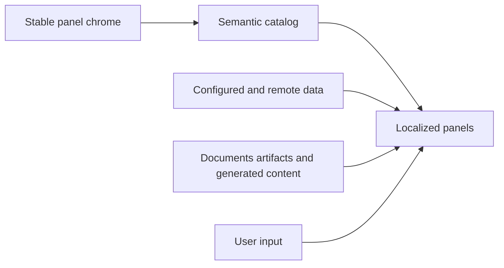

## prod_016_complete_localized_panel_experience - Complete localized panel experience
> Date: 2026-07-13
> Status: Proposed
> Related request: `req_023_complete_semantic_i18n_adoption_across_remaining_application_panels`
> Related backlog: `item_093_migrate_settings_runtime_provider_worker_and_synchronization_chrome`, `item_094_migrate_explorer_and_artifact_panel_chrome_with_strict_content_boundaries`, `item_095_migrate_assisted_work_ai_view_and_changelog_product_chrome`, `item_096_enforce_panel_catalog_coverage_and_close_the_migration`
> Related task: `task_046_orchestrate_completion_of_panel_localization`
> Related architecture: (none yet)
> Reminder: Update status, linked refs, scope, decisions, success signals, and open questions when you edit this doc.

# Overview
Finish semantic localization across the settings, synchronization, exploration, artifact, and assisted-work panels while preserving technical, remote, generated, and user-owned content as data.

# Goals
- Give every stable panel control and state an explicit semantic key.
- Keep dynamic technical and content values outside locale catalogs.
- Provide testable locale parity and placeholder semantics.
- Prevent localization coverage from regressing as panels evolve.

# Non-goals
- Translating repository content, documents, artifacts, prompts, generated answers, traces, provider names, paths, or raw remote errors.
- Changing provider, worker, synchronization, exploration, or AI behavior.
- Adding a hosted translation-management service.
- Redesigning panel layouts.

# Scope and guardrails
- In: settings, runtime, providers, workers, synchronization, explorer, artifacts, assisted work, AI view, changelog framing, accessibility copy, coverage guard, tests, and closure evidence.
- Out: translation of repository content, artifacts, prompts, answers, traces, provider names, paths, raw remote errors, and user input; behavioral or layout redesign.

# Key product decisions
- Catalogs own stable product chrome; configured, remote, generated, technical, and user-owned values remain data.
- Dynamic panel messages use named placeholders and locale-aware formatting.
- Changelog framing may be localized while version-authored entry bodies remain content.
- A reviewed source guard enforces the boundary after migration.

# Success signals
- All targeted panel states and accessibility attributes are catalog-driven.
- Locale and placeholder parity pass with no unclassified product-owned copy.
- Boundary fixtures preserve paths, documents, artifacts, prompts, generated output, and remote details.
- Contract checks, repository tests, type checks, and production build pass.

# References
- Product back-reference: `req_023_complete_semantic_i18n_adoption_across_remaining_application_panels`
- Task back-reference: `task_046_orchestrate_completion_of_panel_localization`
