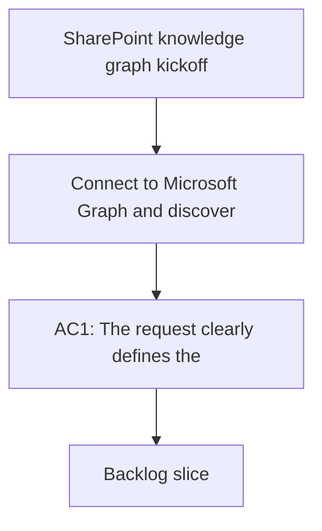

## req_000_sharepoint_knowledge_graph_kickoff - SharePoint knowledge graph kickoff
> From version: 0.0.0
> Schema version: 1.0
> Status: Draft
> Understanding: 99%
> Confidence: 95%
> Complexity: High
> Theme: General
> Reminder: Keep the scope focused on SharePoint ingestion, knowledge storage, and LLM-ready retrieval. Update links and indicators as the project evolves.

# Needs
- Connect to Microsoft Graph and discover the initial SharePoint sites, libraries, and lists.
- Navigate SharePoint content and extract useful metadata and documents from selected spaces.
- Build an ingestion pipeline that can normalize SharePoint content into a durable knowledge store.
- Build a durable knowledge store from collected SharePoint content.
- Add a retrieval layer that can assemble grounded context for LLM answers without leaking unauthorized content.
- Prepare the data layer so an LLM agent can answer questions from the indexed knowledge base.
- Define how the system should sync, refresh, and filter content as SharePoint changes.
- Allow the pilot site list to be updated through environment configuration.
- Record observability and audit signals for ingestion runs, retrieval decisions, and chat answers.

# Context
This project starts from a working Microsoft Graph connection against the tenant and a verified SharePoint site structure.

Validated context so far:
- The app can obtain an access token with the current Entra credentials.
- The app can list SharePoint sites through Graph.
- The app can list libraries and lists for a site.
- The Circle SAS site is reachable at `https://circlesas.sharepoint.com/sites/CircleSAS`.
- The default `Documents` library on that site is currently empty at the root, so useful content will likely live in other libraries or deeper folder trees.

Product direction:
- The tool should act as a SharePoint explorer and ingestion layer.
- The platform should separate ingestion, storage, retrieval, and answer generation into clear layers.
- The long-term goal is to expose a searchable knowledge database built from SharePoint content.
- A future LLM agent should be able to answer questions using the collected data.

Validated product choices:
- Ingestion should run autonomously, while LLM chat access must verify the current user's rights before answering.
- The first navigation experience should be a local companion app with explorer, chat, and sync/status views.
- The knowledge base should be hybrid, combining source objects with chunked text for retrieval.
- Retrieval should filter by user permissions before context reaches the LLM.
- The chat experience should be delivered through the local companion app first, with Teams kept as a later integration option.
- The local app should authenticate through Entra, verify the current user's rights, call the LLM, and return the answer inside the app.
- The chat backend should be provider-agnostic and able to route through OpenAI API or Gemini API.
- The configurable pilot site list should stay in environment configuration for V1.

Pilot scope:
- Start with two sites: `Circle SAS` and `https://circlesas.sharepoint.com/sites/CSAS-OP-Prod`.
- Keep the pilot site list configurable through the environment so it can be updated without code changes.
- Index all available content types, with priority given to the most useful and queryable sources first.
- Keep the first pilot focused on read-only discovery, ingestion, retrieval, and answer traceability.

Default indexing strategy:
- Priority order: documents, lists, pages, metadata, then versions if supported later.
- Index title, path, author, dates, type, tags, and full text where available.
- Keep the latest version as the default V1 source of truth.
- Preserve links back to the original SharePoint source for traceability and navigation.
- Prefer incremental refreshes over full reindexing whenever the source system can provide stable change markers.

Security direction:
- Start with site-level visibility based on what the ingestion account can see.
- Add Microsoft user-based access checks for the chat layer as the next step.
- Keep the design open for future group-based and finer-grained permission checks.
- Prefer a governed local app identity over a faux profile, and keep any later Teams integration governed as well.
- Enforce authorization again at retrieval time so the LLM only receives permitted context.

Operational direction:
- Track crawl progress, refresh status, and answer provenance in a way that is easy to inspect from the local companion app.
- Log the source objects, retrieval filters, and provider choice used for each answer.
- Keep the observability surface simple enough for V1, but explicit enough to support debugging and audit later.

Open framing questions:
- What sync cadence should be the default for planned refreshes?
- Which search and retrieval signals should weigh most heavily in the first question-answering experience?
- Which local companion app views should ship first: explorer, chat, or sync status?
- Which user-visible metric should define "usefulness" first: coverage, freshness, browse speed, or answer quality?
- What additional SharePoint sites should enter scope after the pilot?
- Should OpenAI be the default provider in V1, with Gemini as a fallback or secondary option?
- Which observability signals should be surfaced in the local companion app versus kept in backend logs only?

# Acceptance criteria
- AC1: The request clearly defines the SharePoint ingestion and knowledge-base kickoff goal.
- AC2: The request identifies the initial Microsoft Graph surfaces needed for site discovery and content listing.
- AC3: The request states the intended end state of an LLM-ready knowledge store.
- AC4: The request captures the main open scope decisions needed before backlog grooming.
- AC5: The pilot site list is explicitly configurable so new SharePoint sites can be added without code changes.
- AC6: The request records the intended priority order across documents, lists, pages, and metadata.
- AC7: The request acknowledges the future Microsoft account-based user rights model.
- AC8: The request defines the first explorer UI as a required part of the product direction.
- AC9: The request captures the hybrid ingestion and chunked retrieval model for the knowledge base.
- AC10: The request explicitly allows a local companion app chatbot path with Entra-backed identity and permission checks, while keeping Teams as a later integration.
- AC11: The request explicitly allows the chat backend to route through OpenAI API or Gemini API behind a single abstraction.
- AC12: The request explicitly defines the layered path from Graph ingestion to normalization, storage, retrieval, and answer generation.
- AC13: The request explicitly calls out permission-aware retrieval so unauthorized content never reaches the LLM context.
- AC14: The request explicitly captures observability and audit needs for ingestion runs, retrieval decisions, and chat answers.

# Definition of Ready (DoR)
- [ ] Problem statement is explicit and user impact is clear.
- [ ] Scope boundaries are explicit.
- [ ] Acceptance criteria are testable.
- [ ] Dependencies and known risks are listed.

# Companion docs
- Product brief(s): `prod_000_sharepoint_knowledge_graph_product_vision`
  - `logics/product/prod_000_sharepoint_knowledge_graph_product_vision.md`
- Architecture decision(s): `adr_001_identity_and_access_model_for_sharepoint_knowledge_graph`, `adr_002_sharepoint_ingestion_and_sync_pipeline`, `adr_003_hybrid_knowledge_store_and_retrieval_model`, `adr_004_teams_bot_architecture_for_llm_chat`, `adr_005_explorer_ui_for_sharepoint_navigation`, `adr_006_runtime_configuration_and_operations`, `adr_007_local_companion_app_architecture_for_explorer_and_chat`, `adr_008_llm_provider_abstraction_for_openai_and_gemini`, `adr_009_permission_aware_retrieval_and_source_filtering`, `adr_010_sharepoint_sync_orchestration_and_refresh_policy`, `adr_011_observability_audit_and_answer_traceability`
  - `logics/architecture/adr_001_identity_and_access_model_for_sharepoint_knowledge_graph.md`
  - `logics/architecture/adr_002_sharepoint_ingestion_and_sync_pipeline.md`
  - `logics/architecture/adr_003_hybrid_knowledge_store_and_retrieval_model.md`
  - `logics/architecture/adr_004_teams_bot_architecture_for_llm_chat.md`
  - `logics/architecture/adr_005_explorer_ui_for_sharepoint_navigation.md`
  - `logics/architecture/adr_006_runtime_configuration_and_operations.md`
  - `logics/architecture/adr_007_local_companion_app_architecture_for_explorer_and_chat.md`
  - `logics/architecture/adr_008_llm_provider_abstraction_for_openai_and_gemini.md`
  - `logics/architecture/adr_009_permission_aware_retrieval_and_source_filtering.md`
  - `logics/architecture/adr_010_sharepoint_sync_orchestration_and_refresh_policy.md`
  - `logics/architecture/adr_011_observability_audit_and_answer_traceability.md`
# AI Context
- Summary: Kickoff request for a SharePoint knowledge graph and retrieval tool built on Microsoft Graph.
- Keywords: microsoft graph, sharepoint, knowledge graph, ingestion, retrieval, llm
- Use when: Use when framing the first delivery slice for SharePoint discovery, indexing, and question answering.
- Skip when: Skip when the work is about unrelated app features or a later delivery stage.
# Backlog
- `item_000_graph_discovery_and_pilot_scope`
- `item_001_sharepoint_ingestion_and_sync_pipeline`
- `item_002_hybrid_knowledge_store_and_retrieval`
- `item_003_explorer_ui_for_sharepoint_navigation`
- `item_004_teams_bot_chat_and_permissions`
- `item_005_runtime_config_and_operations`
- `item_006_local_companion_app_for_explorer_and_chat`
- `item_007_llm_provider_abstraction_for_openai_and_gemini`
