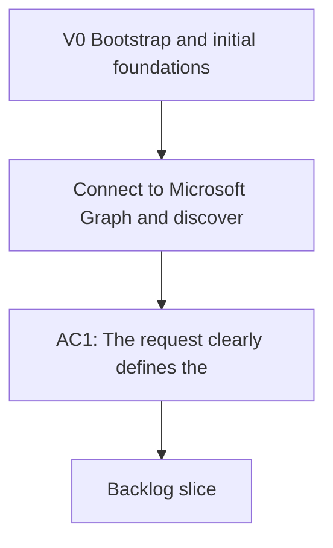

## req_000_v0_bootstrap_and_initial_foundations - V0 — Bootstrap and initial foundations
> From version: 0.0.3
> Schema version: 1.0
> Status: Done
> Understanding: 99%
> Confidence: 99%
> Complexity: High
> Theme: General
> Reminder: This request is closed. It captures the bootstrap context, initial product and architecture decisions, and V1 local delivery. Do not re-open — create a new request for any new scope.

# Naming
- `DeepVault` is the product family and the Microsoft-facing application.
- `Nexus` is the internal tooling and orchestration brain in this repository.
- `DeepVault - Navy` is the local exploration UI.
- `DeepVault - Bishop` is the local LLM chatbot.
- `DeepVault - Gordon` is the Teams chatbot.

# Needs
- Connect to Microsoft Graph and discover the initial SharePoint sites, libraries, and lists.
- Navigate SharePoint content and extract useful metadata and documents from selected spaces.
- Build an ingestion pipeline that normalizes SharePoint content into a durable knowledge store.
- Add a retrieval layer that assembles grounded context for LLM answers without leaking unauthorized content.
- Prepare the data layer so an LLM agent can answer questions from the indexed knowledge base.
- Define how the system should sync, refresh, and filter content as SharePoint changes.
- Allow the pilot site list to be updated through environment configuration.
- Record observability and audit signals for ingestion runs, retrieval decisions, and chat answers.
- Define the local runtime and hosted runtime so the chatbot surface can evolve without rewriting the product.
- Write the initial ADRs and product briefs that align the full team on architecture and product direction.
- Deliver the V1 local product: explorer, chatbot, sync visibility, ingestion, and retrieval evaluation.

# Context
This request bootstrapped the DeepVault project from a working Microsoft Graph connection against the tenant.

Validated context at kickoff:
- The app can obtain an access token with the current Entra credentials.
- The app can list SharePoint sites through Graph.
- The app can list libraries and lists for a site.
- The first pilot site is reachable and listed in `DEEPVAULT_ENTRA_SITES` in `.env.local`.

Key product decisions made during this phase:
- Local phase stays local-only: explorer and chatbot in `DeepVault - Navy` and `DeepVault - Bishop`.
- Hosted phase moves the backend to a hosted service and adds a Teams chatbot channel.
- Ingestion runs autonomously; LLM chat access verifies the current user's rights before answering.
- Knowledge base is hybrid: source objects + chunked text for retrieval.
- Retrieval filters by user permissions before context reaches the LLM.
- Chat backend is provider-agnostic: routes through OpenAI API or Gemini API behind a single abstraction.
- `DeepVault - Bishop` ships first locally; `DeepVault - Gordon` becomes the primary channel once the backend is hosted.

Default decisions made:
- Sync cadence: incremental daily refresh, with manual refresh on demand.
- LLM provider default: OpenAI primary, Gemini fallback.
- Observability surfaced in UI: crawl progress, last refresh, and answer provenance.
- Local vs hosted split: local validation and UI, hosted ingestion/retrieval/auth/orchestration/audit.

# Acceptance criteria
- AC1: The request clearly defines the SharePoint ingestion and knowledge-base kickoff goal.
- AC2: The initial Microsoft Graph surfaces needed for site discovery and content listing are identified.
- AC3: The intended end state of an LLM-ready knowledge store is stated.
- AC4: The main open scope decisions needed before backlog grooming are captured.
- AC5: The pilot site list is explicitly configurable so new SharePoint sites can be added without code changes.
- AC6: The priority order across documents, lists, pages, and metadata is recorded.
- AC7: The future Microsoft account-based user rights model is acknowledged.
- AC8: `DeepVault - Navy` is defined as a required part of the product direction.
- AC9: The hybrid ingestion and chunked retrieval model for the knowledge base is captured.
- AC10: The `DeepVault - Bishop` chatbot path is explicitly allowed, with `DeepVault - Gordon` as a later integration.
- AC11: The chat backend routes through OpenAI API or Gemini API behind a single abstraction.
- AC12: The layered path from Graph ingestion to normalization, storage, retrieval, and answer generation is defined.
- AC13: Permission-aware retrieval is explicitly called out so unauthorized content never reaches the LLM context.
- AC14: Observability and audit needs for ingestion runs, retrieval decisions, and chat answers are captured.
- AC15: The local runtime is explicitly distinguished from the hosted backend plus Teams channel.
- AC16: All initial ADRs and product briefs are written and committed.
- AC17: V1 local delivery is complete: explorer, Bishop chat, sync visibility, ingestion, and retrieval evaluation.

# Definition of Ready (DoR)
- [x] Problem statement is explicit and user impact is clear.
- [x] Scope boundaries are explicit.
- [x] Acceptance criteria are testable.
- [x] Dependencies and known risks are listed.

# Companion docs
- Product brief(s):
  - `logics/product/prod_000_sharepoint_knowledge_graph_product_vision.md`
  - `logics/product/prod_001_local_first_development_and_test_strategy.md`
  - `logics/product/prod_002_hosted_production_strategy_with_teams_at_the_end.md`
- Architecture decision(s):
  - `logics/architecture/adr_001_identity_and_access_model_for_sharepoint_knowledge_graph.md`
  - `logics/architecture/adr_002_sharepoint_ingestion_and_sync_pipeline.md`
  - `logics/architecture/adr_003_hybrid_knowledge_store_and_retrieval_model.md`
  - `logics/architecture/adr_004_teams_bot_architecture_for_llm_chat.md`
  - `logics/architecture/adr_005_explorer_ui_for_sharepoint_navigation.md`
  - `logics/architecture/adr_006_runtime_configuration_and_operations.md`
  - `logics/architecture/adr_007_local_companion_app_architecture_for_explorer_and_chat.md`
  - `logics/architecture/adr_008_llm_provider_abstraction_for_openai_and_gemini.md`
  - `logics/architecture/adr_009_permission_aware_retrieval_and_source_filtering.md`
  - `logics/architecture/adr_010_sharepoint_sync_orchestration_and_refresh_policy.md`
  - `logics/architecture/adr_011_observability_audit_and_answer_traceability.md`
  - `logics/architecture/adr_012_local_companion_runtime_for_explorer_and_chat.md`
  - `logics/architecture/adr_013_hosted_backend_and_teams_chat_channel.md`

# Specs
- `logics/specs/spec_000_deepvault_navy_experience_and_state_matrix.md`
- `logics/specs/spec_002_deepvault_bishop_chat_flow_and_answer_quality.md`
- `logics/specs/spec_004_deepvault_data_schema_and_storage_contracts.md`
- `logics/specs/spec_005_deepvault_permission_mapping_and_retrieval_filters.md`
- `logics/specs/spec_006_deepvault_prompt_and_context_assembly.md`

# AI Context
- Summary: Bootstrap request for DeepVault — initial foundations, ADRs, product briefs, and V1 local delivery. Closed.
- Keywords: bootstrap, v0, kickoff, foundations, ADR, product brief, V1, local, ingestion, retrieval
- Use when: Use when tracing the origin of a product or architecture decision back to the initial kickoff.
- Skip when: Skip when the work is about V1 scope evolution or V2 delivery — use req_001 or req_002 instead.

# Backlog
- `item_000_v1_graph_discovery_and_pilot_scope` — Done
- `item_001_v1_sharepoint_ingestion_and_sync_pipeline` — Done
- `item_002_v1_hybrid_knowledge_store_and_retrieval` — Done
- `item_003_v1_explorer_ui_for_sharepoint_navigation` — Done
- `item_005_v1_runtime_config_and_operations` — Done
- `item_006_v1_local_companion_app_for_explorer_and_chat` — Done
- `item_007_v1_llm_provider_abstraction_for_openai_and_gemini` — Done
- `item_008_v1_local_explorer_shell_and_navigation` — Done
- `item_009_v1_local_chat_surface_and_answer_flow` — Done
- `item_010_v1_local_sync_status_and_operational_view` — Done

# Delivery children
- `task_001_v1_local_companion_vertical_slice` — Done
- `task_002_v1_ingestion_sync_and_retrieval_hardening` — Done
- `task_005_v1_local_development_and_validation_milestone` — Done
- `task_008_v1_retrieval_evaluation_set_and_quality_gates` — Done

# Report
- V1 local delivery complete: explorer, Bishop chat, sync view, ingestion snapshot, and OpenAI baseline evaluation all pass.
- All initial ADRs (001–013) and product briefs (prod_000, prod_001, prod_002) written and committed.
- Baseline evaluation stored at `data/eval/v1_baseline_2026-04-10.json` — 100% pass rate on OpenAI.
