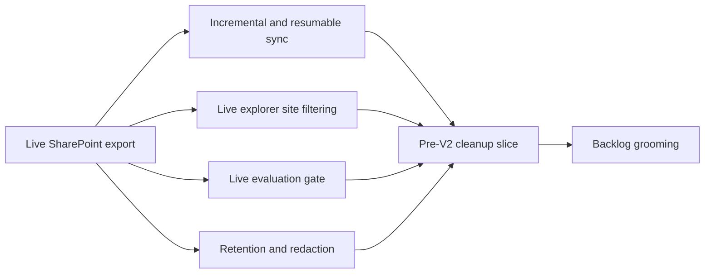

## req_001_live_corpus_hardening_and_pre_v2_cleanup - Live corpus hardening and pre-V2 cleanup
> From version: 1.0.0
> Schema version: 1.0
> Status: Draft
> Understanding: 95%
> Confidence: 92%
> Complexity: High
> Theme: General
> Reminder: Keep this request focused on pre-V2 hardening, live corpus quality, and cleanup before hosted industrialization starts.

# Needs
- Keep live corpus generation incremental and resumable so unchanged SharePoint content is not reparsed on every run.
- Make the DeepVault - Navy site filter behave consistently in the live explorer so the selected site actually bounds visible results.
- Define a live evaluation set and quality gate that reflects exported SharePoint content, not only the mock corpus.
- Harden large-site crawling with checkpoints, pagination visibility, bounded memory behavior, and predictable progress reporting.
- Define retention and redaction rules for generated live artifacts and business content before moving further toward hosted V2 work.
- Clean up the remaining pre-V2 backlog and doc framing so the open work is split into clearer, smaller slices.

# Context
- DeepVault already has a working local V1 release and a live SharePoint export path.
- The live exporter can generate `public/live-corpus.json`, but it currently rebuilds too much on each run and needs incremental sync behavior.
- Live test runs exposed a UX gap where site filtering in the explorer did not clearly constrain the rendered results.
- The current evaluation flow still reflects the mock corpus more than the live corpus, so the live path needs its own quality gate.
- Live exports can contain business content, so local generated artifacts need clear handling rules before V2 hosted work expands scope.
- This request is about stabilizing the live local path and cleaning the pre-V2 surface, not about implementing the hosted backend or Teams channel.

# Acceptance criteria
- AC1: The request clearly frames the work as pre-V2 hardening and cleanup, not hosted backend delivery.
- AC2: The request explicitly calls for incremental and resumable live sync instead of full reparses on every run.
- AC3: The request explicitly calls for the live site filter and visible results to stay aligned in the explorer UI.
- AC4: The request explicitly calls for a live evaluation set and quality gate aligned to exported SharePoint content.
- AC5: The request explicitly calls for large-site crawl resilience with checkpoints, progress visibility, and bounded memory behavior.
- AC6: The request explicitly defines retention and redaction boundaries for generated live artifacts and business content.
- AC7: The request explicitly sets up a cleanup path for remaining pre-V2 backlog and doc framing into smaller slices.
- AC8: The request remains separate from hosted backend and Teams implementation work.

# Definition of Ready (DoR)
- [x] Problem statement is explicit and user impact is clear.
- [x] Scope boundaries (in/out) are explicit.
- [x] Acceptance criteria are testable.
- [x] Dependencies and known risks are listed.

# Companion docs
- Product brief(s): `prod_001_local_first_development_and_test_strategy`
- Architecture decision(s): `adr_010_sharepoint_sync_orchestration_and_refresh_policy`, `adr_015_deepvault_security_audit_logging_and_retention_boundaries`
# AI Context
- Summary: Pre-V2 hardening request for live corpus sync, explorer filtering, evaluation quality, and generated artifact governance.
- Keywords: live corpus, incremental sync, explorer, evaluation, retention, cleanup
- Use when: Use when splitting pre-V2 live hardening into backlog items before hosted backend work starts.
- Skip when: Skip when the work is strictly about hosted backend, Teams, or other V2 delivery.
# Backlog
- `item_014_incremental_live_sync_and_resumable_export`
- `item_015_live_explorer_site_filter_alignment`
- `item_016_live_evaluation_set_and_quality_gate`
- `item_017_crawl_resilience_and_artifact_governance`
- `item_018_pre_v2_backlog_and_doc_cleanup`
