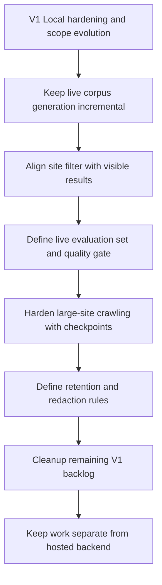

## req_001_v1_local_hardening_and_scope_evolution - V1 — Local hardening and scope evolution
> From version: 1.0.1
> Schema version: 1.0
> Status: Done
> Understanding: 98%
> Confidence: 96%
> Complexity: High
> Theme: General
> Reminder: Keep this request focused on V1 local hardening and scope evolution. No Azure or Teams dependencies. Update links and indicators as backlog items complete. Closed after task_009 completed and items_014-018 were synced.

# Needs
- Keep live corpus generation incremental and resumable so unchanged SharePoint content is not reparsed on every run.
- Make the DeepVault - Navy site filter behave consistently in the live explorer so the selected site actually bounds visible results.
- Define a live evaluation set and quality gate that reflects exported SharePoint content, not only the mock corpus.
- Harden large-site crawling with checkpoints, pagination visibility, bounded memory behavior, and predictable progress reporting.
- Define retention and redaction rules for generated live artifacts and business content before any future expansion.
- Clean up the remaining V1 backlog and doc framing so the open work is split into clearer, smaller slices.

# Context
- DeepVault has a working local V1 release and a live SharePoint export path.
- The live exporter can generate `public/live-corpus.json` but currently rebuilds too much on each run.
- Live test runs exposed a UX gap where site filtering in the explorer did not clearly constrain the rendered results.
- The current evaluation flow still reflects the mock corpus more than the live corpus.
- Live exports can contain business content, so local generated artifacts need clear handling rules before any future expansion.
- This request is about stabilizing the live local path and closing the V1 scope cleanly — not about implementing the hosted backend or Teams channel.

# Acceptance criteria
- AC1: The request clearly frames the work as V1 hardening and scope evolution, not hosted backend delivery.
- AC2: The request explicitly calls for incremental and resumable live sync instead of full reparses on every run.
- AC3: The request explicitly calls for the live site filter and visible results to stay aligned in the explorer UI.
- AC4: The request explicitly calls for a live evaluation set and quality gate aligned to exported SharePoint content.
- AC5: The request explicitly calls for large-site crawl resilience with checkpoints, progress visibility, and bounded memory behavior.
- AC6: The request explicitly defines retention and redaction boundaries for generated live artifacts and business content.
- AC7: The request explicitly sets up a cleanup path for remaining V1 backlog and doc framing into smaller slices.
- AC8: The request remains separate from hosted backend and Teams implementation work.

# Definition of Ready (DoR)
- [x] Problem statement is explicit and user impact is clear.
- [x] Scope boundaries (in/out) are explicit.
- [x] Acceptance criteria are testable.
- [x] Dependencies and known risks are listed.

# Companion docs
- Product brief(s):
  - `logics/product/prod_001_local_first_development_and_test_strategy.md`
- Architecture decision(s):
  - `logics/architecture/adr_010_sharepoint_sync_orchestration_and_refresh_policy.md`
  - `logics/architecture/adr_014_deepvault_retrieval_ranking_quality_and_cost_policy.md`
  - `logics/architecture/adr_015_deepvault_security_audit_logging_and_retention_boundaries.md`
  - `logics/architecture/adr_016_deepvault_persistence_and_storage_layout.md`
  - `logics/architecture/adr_014_deepvault_retrieval_ranking_quality_and_cost_policy.md`
  - `logics/architecture/adr_015_deepvault_security_audit_logging_and_retention_boundaries.md`
  - `logics/architecture/adr_016_deepvault_persistence_and_storage_layout.md`

# Specs
- `logics/specs/spec_003_deepvault_pilot_site_onboarding_and_retrieval_quality.md`

# AI Context
- Summary: V1 scope evolution request — live corpus hardening, explorer UX, live quality gate, and cleanup. No Azure or Teams.
- Keywords: V1, local, live corpus, incremental sync, explorer, evaluation, retention, cleanup
- Use when: Use when splitting V1 live hardening into backlog items before hosted backend work starts.
- Skip when: Skip when the work is about hosted backend or Teams.

# Backlog
- `item_014_v1_incremental_live_sync_and_resumable_export`
- `item_015_v1_live_explorer_site_filter_alignment`
- `item_016_v1_live_evaluation_set_and_quality_gate`
- `item_017_v1_crawl_resilience_and_artifact_governance`
- `item_018_v1_pre_v2_backlog_and_doc_cleanup`

# Delivery children
- `task_009_local_hardening_and_v1_scope_evolution`
