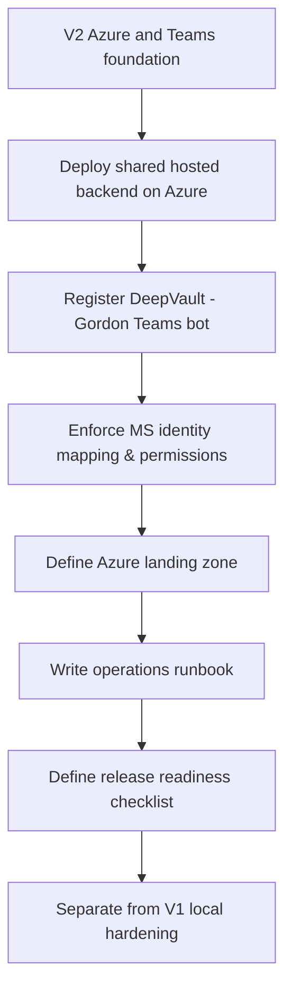

## req_002_v2_azure_and_teams_foundation - V2 — Azure and Teams foundation
> From version: 1.0.0
> Schema version: 1.0
> Status: Draft
> Understanding: 92%
> Confidence: 88%
> Complexity: High
> Theme: General
> Reminder: This request is V2 — do not prioritize or start until req_001 is Done and the team is ready to introduce Azure and Teams dependencies. Update links and indicators when the scope becomes active.

# Needs
- Deploy the shared hosted backend on Azure so ingestion, retrieval, and provider routing run as a centralized service.
- Register and wire the `DeepVault - Gordon` Teams bot so it routes messages to the hosted backend.
- Enforce Microsoft identity mapping and permission checks for every answer served through the Teams channel.
- Define the Azure landing zone: compute, storage, Key Vault, and monitoring.
- Write the operations runbook covering deploy, rollback, disable, secrets rotation, and smoke checks.
- Define the release readiness checklist: approvals, monitoring gates, and incident response before go-live.

# Context
- This request covers everything that requires Azure hosting or Microsoft Teams.
- It is deliberately deferred to V2 — nothing here should be started while V1 local hardening is still open.
- The hosted backend will centralize the same ingestion and retrieval contracts validated in V1, making them accessible to both the local app and the Teams channel.
- `DeepVault - Gordon` becomes the primary chat surface once the backend is hosted and the Teams channel is live.
- Azure is the default hosting target; Render remains a documented fallback if cost or complexity justifies it.

**Start condition**: `req_001_v1_local_hardening_and_scope_evolution` must be Done and Azure prerequisites must be confirmed (subscription, App Registration, Key Vault, Bot Framework registration) before this request opens.

# Acceptance criteria
- AC1: The request clearly scopes V2 as the Azure and Teams delivery phase, separate from V1 local work.
- AC2: The request explicitly calls for a hosted backend on Azure that centralizes ingestion, retrieval, and provider routing.
- AC3: The request explicitly calls for the `DeepVault - Gordon` Teams bot to be registered and wired to the hosted backend.
- AC4: The request explicitly calls for Microsoft identity mapping and permission enforcement in the Teams channel.
- AC5: The request defines the Azure landing zone shape including compute, storage, Key Vault, and monitoring.
- AC6: The request explicitly calls for an operations runbook covering deploy, rollback, disable, and secrets.
- AC7: The request explicitly calls for a release readiness checklist before go-live.
- AC8: The request remains clearly separated from V1 local hardening work.

# Definition of Ready (DoR)
- [ ] req_001 is Done.
- [ ] Azure subscription, App Registration, Key Vault, and Bot Framework registration are confirmed.
- [ ] Scope boundaries (in/out) are explicit.
- [ ] Acceptance criteria are testable.
- [ ] Dependencies and known risks are listed.

# Companion docs
- Product brief(s):
  - `logics/product/prod_000_sharepoint_knowledge_graph_product_vision.md`
  - `logics/product/prod_002_hosted_production_strategy_with_teams_at_the_end.md`
- Architecture decision(s):
  - `logics/architecture/adr_001_identity_and_access_model_for_sharepoint_knowledge_graph.md`
  - `logics/architecture/adr_004_teams_bot_architecture_for_llm_chat.md`
  - `logics/architecture/adr_006_runtime_configuration_and_operations.md`
  - `logics/architecture/adr_009_permission_aware_retrieval_and_source_filtering.md`
  - `logics/architecture/adr_013_hosted_backend_and_teams_chat_channel.md`
  - `logics/architecture/adr_015_deepvault_security_audit_logging_and_retention_boundaries.md`
  - `logics/architecture/adr_016_deepvault_persistence_and_storage_layout.md`
- Spec(s):
  - `logics/specs/spec_001_deepvault_gordon_teams_channel_experience_and_rollout.md`
  - `logics/specs/spec_007_deepvault_hosted_backend_api_contract.md`

# Specs
- `logics/specs/spec_001_deepvault_gordon_teams_channel_experience_and_rollout.md`
- `logics/specs/spec_007_deepvault_hosted_backend_api_contract.md`

# AI Context
- Summary: V2 foundation request — Azure hosted backend, DeepVault - Gordon Teams channel, and release readiness. Deferred, do not start before V1 hardening is Done.
- Keywords: V2, Azure, Teams, hosted backend, DeepVault Gordon, bot, identity, runbook, release
- Use when: Use when the team is ready to introduce Azure and Teams dependencies after V1 is closed.
- Skip when: Skip if V1 hardening is still open — use req_001 instead.

# Backlog
- `item_004_v2_teams_bot_chat_and_permissions`
- `item_011_v2_hosted_backend_core`
- `item_012_v2_teams_bot_channel_and_permissions`
- `item_013_v2_operations_runbook_and_release_readiness`

# Delivery children
- `task_010_v2_azure_and_teams_delivery`
