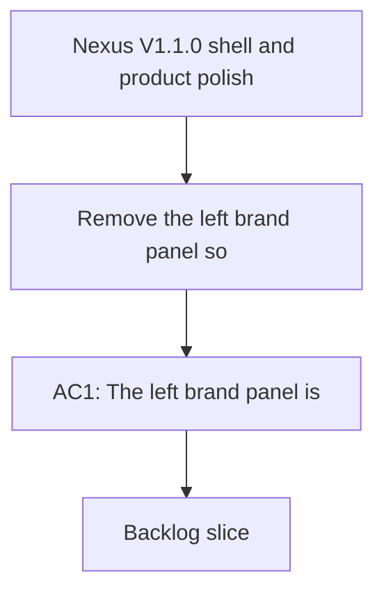

## req_003_nexus_v1_1_ui_and_product_polish - Nexus V1.1.0 shell and product polish
> From version: 1.0.0
> Schema version: 1.0
> Status: Ready
> Understanding: 96%
> Confidence: 94%
> Complexity: Medium
> Theme: UI
> Reminder: Keep this request focused on the V1.1 polish pass for the local shell and information hierarchy. Split into backlog items before implementation if the slice grows.

# Needs
- Remove the left brand panel so the shell feels less like a developer workspace and more like a product surface.
- Rename the main header title to `Nexus`.
- Change the header subtitle from a local build label to the real repo version, using the value from `VERSION`.
- Rewrite the top-level product copy so it reads as a more commercial product explanation instead of a technical systems summary.
- Make the key status panel much more compact, with explanatory text available on hover instead of always visible.
- Make the recent sync runs panel much more compact too, so each run reads as a short summary and any long explanation only appears on hover or drill-in.
- Make the live state visually distinct by using a different color treatment for each live state, so users can immediately tell whether live data is loaded, missing with fallback, or in error.
- Expose the live corpus state on hover with explicit messages for `Live corpus loaded`, `Live corpus missing, fallback to mock`, and `Live corpus error` plus the underlying detail.
- Add a proper application favicon that matches the Nexus brand so the browser tab feels complete and recognizable.
- Split the page layout so the left menu stays fixed while the right content area scrolls independently.

# Context
- The current local shell is functional but still reads like an internal validation workspace rather than a polished product experience.
- This request is for the probable V1.1.0 pass after V1 stabilization, with a focus on presentation, hierarchy, and information density.
- The main implementation surface is the React app shell and top bar in `src/App.tsx`.
- The version label should stay aligned with the repository version in `VERSION`.
- The compact status treatment should preserve operational visibility without dominating the layout.
- The recent sync runs area in the current shell shows too much narrative text inline; it should be reduced to a denser summary pattern with hover-only detail.
- The app currently has a generic or insufficient favicon treatment, so the browser tab identity should be updated as part of the polish pass.
- The current layout behaves like one long page, but the desired experience is a split shell with a stable left rail and a separately scrolling content area on the right.
- Any UI or frontend implementation work should follow `logics/skills/logics-ui-steering/SKILL.md`.

# Acceptance criteria
- AC1: The left brand panel is removed from the shell.
- AC2: The main header title is `Nexus`.
- AC3: The subtitle shows the real repository version from `VERSION`.
- AC4: The top-level explanatory copy reads as a more commercial product description.
- AC5: The key status panel and recent sync runs area become compact and move supporting descriptions into hover-only affordances.
- AC6: The application favicon is added or replaced with a Nexus-branded icon.
- AC7: The shell uses a split layout with a fixed left menu and an independently scrolling right content area.
- AC8: The live state uses a distinct visual color treatment for loaded, fallback, and error states.
- AC9: Hovering the live state surfaces the messages `Live corpus loaded`, `Live corpus missing, fallback to mock`, and `Live corpus error` with detail.
- AC10: The shell still feels coherent on desktop and does not lose the core local validation surfaces.

# Definition of Ready (DoR)
- [x] Problem statement is explicit and user impact is clear.
- [x] Scope boundaries (in/out) are explicit.
- [x] Acceptance criteria are testable.
- [x] Dependencies and known risks are listed.

# Companion docs
- Product brief(s): `prod_001_local_first_development_and_test_strategy`
- Architecture decision(s): (none yet)
# AI Context
- Summary: V1.1 shell and product polish request for the local Nexus surface.
- Keywords: nexus, v1.1, shell, polish, compact status, commercial copy
- Use when: Use when polishing the local shell and product-facing copy before the next release.
- Skip when: Skip when the work is about backend behavior, sync logic, or non-UI infrastructure.

# Backlog
- `item_019_shell_rebrand_and_split_layout`
- `item_020_compact_live_state_and_sync_panels`
