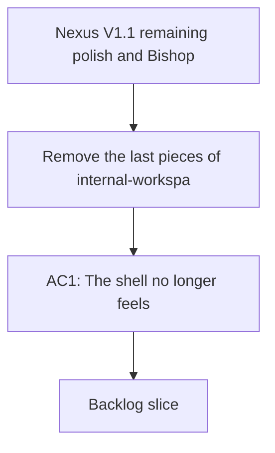

## req_004_nexus_v1_1_remaining_polish_and_bishop_ux_follow_up - Nexus V1.1 remaining polish and Bishop UX follow-up
> From version: 1.0.0
> Schema version: 1.0
> Status: Done
> Understanding: 93%
> Confidence: 91%
> Complexity: High
> Theme: UI
> Reminder: Keep this request focused on the remaining V1 feedback that should carry into V1.1. Split into backlog items before implementation if the slice grows.

# Needs
- Remove the last pieces of internal-workspace framing from the shell so the app reads as Nexus first, not as a validation tool.
- Remove the page subtitle entirely so the page does not show `Version 1.0.0` under the main title.
- Keep the shell split into a fixed left rail and an independently scrolling right content area.
- Remove the left-menu analytics block that currently shows `State`, `visible documents`, and `estimated chunks`.
- Make the top-level product copy feel more commercial and product-facing while still staying grounded in the local validation story.
- Keep the live-state presentation unmistakable by using color and hover detail to explain loaded, fallback, and error states.
- Rename the live state pill from `Live data` to `Live`.
- Reduce the rendered size of the `Last refresh` value so the timestamp fits on one line in the compact status row.
- Tighten the compact status surfaces so the key stats and recent sync runs remain scannable without long inline narrative text.
- Make Bishop feel less instant and more like a grounded assistant flow by adding a clearer thinking or answer-building transition.
- Give Bishop a more natural response pattern with a visible thinking state, a disabled send button while the answer is being built, a short animated delay before the answer appears, and an optional draft to answering to answered progression.
- Preserve provenance and retrieval traceability without making the answer panel feel heavy or overly technical.
- Keep the browser tab identity complete with a Nexus favicon.
- Keep any file or folder path shown in the app concise inline, while revealing the full path on hover.

# Context
- V1 stabilized the core local validation surface, but the current UI still carries a few internal-looking patterns that should be polished before V1.1.
- The earlier V1.1 request covered the first shell polish slice, so this follow-up request captures the remaining feedback that still needs to land.
- The main product surface is the React shell in `src/App.tsx`, with layout and density work in `src/styles.css`.
- The current page subtitle still shows the repository version under the main title, and that subtitle should be removed instead of replaced.
- The left navigation still carries a dense analytics block that belongs in the main content area rather than the menu rail.
- Bishop currently answers synchronously from local retrieval logic, which makes the response feel instantaneous even though the UI presents latency metadata.
- The Bishop interaction should feel deliberate and grounded rather than purely instant, so the UI should make the thinking step visible.
- The live corpus state should remain explicit so users can tell when live data is truly loaded versus missing or falling back.
- The current live state pill still says `Live data`, and it should be shortened to `Live` to better fit the compact header treatment.
- The current `Last refresh` timestamp is too large for the compact layout, so its rendered size should be reduced while keeping the same value.
- The right side of the app should remain the primary scrolling content area while the left rail stays fixed.
- Several places in the app currently show long SharePoint-style or document paths, and those paths should be condensed visually while staying inspectable on hover.
- The implementation should keep the polished shell coherent on desktop and should not regress the existing explorer or sync surfaces.
- Any UI or frontend implementation work should follow `logics/skills/logics-ui-steering/SKILL.md`.

# Acceptance criteria
- AC1: The shell no longer feels like an internal validation workspace and instead reads as Nexus.
- AC2: The page subtitle is removed so the page does not show `Version 1.0.0` under the main title.
- AC3: The left rail stays fixed while the right content area scrolls independently.
- AC4: The left menu no longer shows the `State`, `visible documents`, and `estimated chunks` analytics block.
- AC5: The top-level copy feels more commercial and product-facing than the current technical phrasing.
- AC6: The live state uses color and hover text to distinguish loaded, fallback, and error states.
- AC7: The compact status and sync surfaces keep their details discoverable without long inline paragraphs.
- AC8: Bishop includes a visible thinking state, a disabled send button during answer generation, and a short answer-building transition.
- AC9: The live state pill label is shortened to `Live`.
- AC10: The `Last refresh` value fits on one line in the compact status row.
- AC11: The browser tab uses a Nexus favicon.
- AC12: File and folder paths in the app display a concise inline label and reveal the full path on hover.
- AC13: The request is clear enough to be split into backlog items without losing the user intent.

# Definition of Ready (DoR)
- [x] Problem statement is explicit and user impact is clear.
- [x] Scope boundaries (in/out) are explicit.
- [x] Acceptance criteria are testable.
- [x] Dependencies and known risks are listed.

# Companion docs
- Product brief(s): (none yet)
- Architecture decision(s): (none yet)

# AI Context
- Summary: Remaining V1 feedback for the Nexus V1.1 polish pass and Bishop UX follow-up.
- Keywords: nexus, v1.1, polish, shell, live state, bishop, loading, favicon
- Use when: Use when framing the remaining V1 polish work before splitting into backlog items.
- Skip when: Skip when the work is about backend sync behavior, unrelated features, or release work outside V1.1.
# Backlog
- `item_021_shell_chrome_and_layout_cleanup`
- `item_022_live_state_and_status_density_polish`
- `item_023_bishop_response_flow_and_answer_trace_polish`
- `item_024_path_display_and_hover_cleanup`
