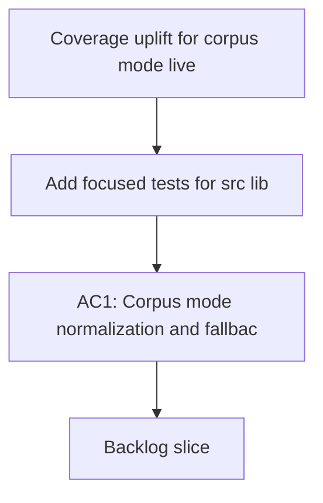

## req_005_coverage_uplift_for_corpus_mode_live_fetch_and_deepvault_core - Coverage uplift for corpus mode, live fetch, and deepvault core
> From version: 1.0.0
> Schema version: 1.0
> Status: Draft
> Understanding: 90%
> Confidence: 90%
> Complexity: Medium
> Theme: General
> Reminder: Keep this request focused on improving test coverage for the core data and retrieval surfaces. Split into backlog items before implementation if the slice grows.

# Needs
- Add focused tests for `src/lib/corpus-mode.ts` to cover corpus mode normalization and fallback behavior.
- Extend `tests/corpus.spec.ts` so live corpus fetch success, missing corpus, and request error branches are covered.
- Add targeted tests for `src/lib/deepvault.ts` to cover no-answer, permission-boundary, and grounded-answer paths.

# Context
- The current coverage report is already healthy overall, but a few branches and function paths remain under-covered.
- `src/lib/corpus-mode.ts` is the weakest area for function coverage and should be exercised directly.
- `src/data/corpus.ts` has fetch branches that need explicit tests for success, missing-file fallback, and error handling.
- `src/lib/deepvault.ts` still has meaningful retrieval branches that can be covered with focused query and permission tests.
- The goal is to improve confidence in the core data/retrieval helpers without bloating the UI test suite.
- Any test work should stay small, deterministic, and aligned with the existing Vitest setup.

# Acceptance criteria
- AC1: Corpus mode normalization and fallback behavior are covered by direct tests.
- AC2: Live corpus fetch success, missing corpus, and request error branches are covered.
- AC3: Deepvault retrieval tests cover no-answer, permission-boundary, and grounded-answer paths.
- AC4: The request is clear enough to split into backlog items without losing the test coverage intent.

# Definition of Ready (DoR)
- [x] Problem statement is explicit and user impact is clear.
- [x] Scope boundaries (in/out) are explicit.
- [x] Acceptance criteria are testable.
- [x] Dependencies and known risks are listed.

# Companion docs
- Product brief(s): (none yet)
- Architecture decision(s): (none yet)

# AI Context
- Summary: Coverage uplift request for the corpus mode, live fetch, and deepvault core helpers.
- Keywords: coverage, corpus mode, live fetch, deepvault, tests
- Use when: Use when framing targeted test coverage work for the core data and retrieval helpers.
- Skip when: Skip when the work belongs to UI polish, unrelated features, or release management.
# Backlog
- `item_025_corpus_mode_normalization_tests`
- `item_026_live_corpus_fetch_branch_coverage`
- `item_027_deepvault_retrieval_branch_coverage`
