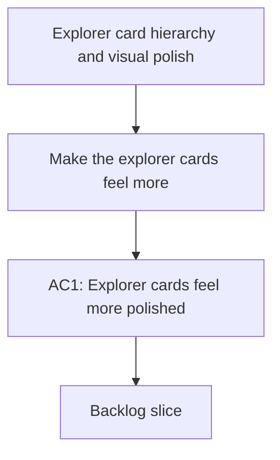

## req_006_explorer_card_hierarchy_and_visual_polish - Explorer card hierarchy and visual polish
> From version: 1.0.0
> Schema version: 1.0
> Status: Draft
> Understanding: 93%
> Confidence: 90%
> Complexity: Medium
> Theme: UI
> Reminder: Keep this request focused on making the explorer cards feel more deliberate, less mechanical, and easier to scan. Split into backlog items before implementation if the slice grows.

# Needs
- Make the explorer cards feel more polished and less like a technical list.
- Reduce the visual weight of the repeated score badge so it supports the card instead of dominating it.
- Tighten the hierarchy inside each card so the title, metadata, and source detail read as a deliberate stack.
- Reduce or restyle the `Source:` line if it is duplicating information already visible in the title.
- Give the list a stronger point of focus per card so the result set feels easier to scan.
- Keep the existing search and selection behavior intact while improving the card presentation.

# Context
- The current explorer cards are functional, but they still feel a bit utilitarian and mechanically repeated.
- The score badge appears too prominent across every row, which makes the cards feel more like raw results than polished product surfaces.
- The `Source:` line currently repeats the title in many cases and adds visual weight without much extra value.
- The explorer should remain a grounded local validation surface, but the result cards can feel more editorial and easier to scan.
- This work is primarily about hierarchy, spacing, and emphasis inside the explorer list, not about changing retrieval logic or the selected-document model.
- The existing search, filters, and selection behavior should remain stable.
- Any UI or frontend implementation work should follow `logics/skills/logics-ui-steering/SKILL.md`.

# Acceptance criteria
- AC1: Explorer cards feel more polished and less like a technical list.
- AC2: The score badge is less visually dominant and supports the card instead of competing with the title.
- AC3: The title, metadata, and source detail read as a deliberate visual hierarchy.
- AC4: The `Source:` line is reduced or restyled so it does not duplicate the title awkwardly.
- AC5: The result list is easier to scan at a glance without changing the underlying explorer behavior.
- AC6: The request is clear enough to be split into backlog items without losing the intended UI refinement.

# Definition of Ready (DoR)
- [x] Problem statement is explicit and user impact is clear.
- [x] Scope boundaries (in/out) are explicit.
- [x] Acceptance criteria are testable.
- [x] Dependencies and known risks are listed.

# Companion docs
- Product brief(s): (none yet)
- Architecture decision(s): (none yet)

# AI Context
- Summary: Explorer card hierarchy and visual polish for the result list.
- Keywords: explorer, cards, hierarchy, scanability, ui
- Use when: Use when framing a visual refinement pass on the explorer result cards.
- Skip when: Skip when the work targets retrieval logic, sync behavior, or unrelated UI surfaces.
# Backlog
- `item_028_explorer_card_hierarchy_cleanup`
- `item_029_explorer_badge_and_source_line_polish`
