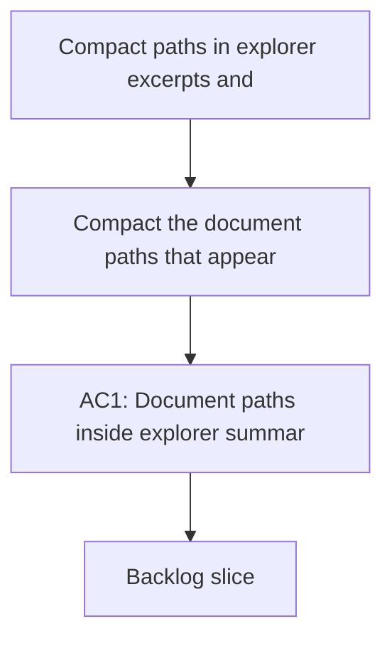

## req_007_compact_paths_in_explorer_excerpts_and_summaries - Compact paths in explorer excerpts and summaries
> From version: 1.0.0
> Schema version: 1.0
> Status: Draft
> Understanding: 93%
> Confidence: 90%
> Complexity: Medium
> Theme: UI
> Reminder: Keep this request focused on making explorer excerpts and summaries readable without losing path inspectability. Split into backlog items before implementation if the slice grows.

# Needs
- Compact the document paths that appear inside explorer summaries and source excerpts so they do not dominate the text.
- Preserve the full path in a hover affordance so users can inspect the original location when needed.
- Keep the explorer summary and source excerpt content readable and grounded rather than visually noisy.
- Apply the same compact-path treatment consistently wherever those raw excerpt strings are rendered in the explorer detail pane.
- Keep the existing document content intact while changing only the visual treatment of the embedded path text.

# Context
- The explorer currently compacted the path labels in cards and traces, but the raw excerpt content still prints full SharePoint-style paths inline.
- That makes the detail pane feel visually heavier than the rest of the shell, especially for long paths with many nested folders.
- The desired behavior is to keep the full information available, but show a concise inline version in the rendered explorer details.
- This is a presentation-only refinement of the explorer detail pane, not a retrieval or indexing change.
- The change should be consistent with the path compaction already used elsewhere in the app.
- Any UI or frontend implementation work should follow `logics/skills/logics-ui-steering/SKILL.md`.

# Acceptance criteria
- AC1: Document paths inside explorer summaries and source excerpts are compacted inline.
- AC2: The full path remains available on hover for inspectability.
- AC3: The content stays readable and the explorer detail pane feels less visually noisy.
- AC4: The change is limited to presentation and does not alter the underlying document content.
- AC5: The request is clear enough to be split into backlog items without losing the intended UI refinement.

# Definition of Ready (DoR)
- [x] Problem statement is explicit and user impact is clear.
- [x] Scope boundaries (in/out) are explicit.
- [x] Acceptance criteria are testable.
- [x] Dependencies and known risks are listed.

# Companion docs
- Product brief(s): (none yet)
- Architecture decision(s): (none yet)

# AI Context
- Summary: Compact path rendering for explorer excerpts and summaries.
- Keywords: explorer, path, excerpts, summaries, hover
- Use when: Use when refining how raw document paths are displayed inside the explorer detail pane.
- Skip when: Skip when the work targets retrieval logic, indexing, or unrelated UI surfaces.
# Backlog
- `item_030_compact_paths_in_explorer_excerpts_and_summaries`
