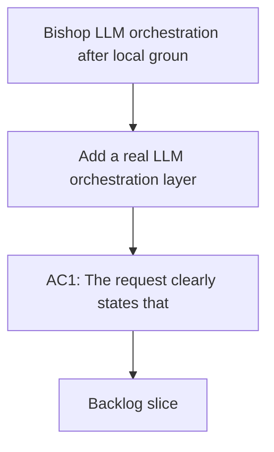

## req_008_bishop_llm_orchestration_after_local_grounding - Bishop LLM orchestration after local grounding
> From version: 1.0.0
> Schema version: 1.0
> Status: Draft
> Understanding: 94%
> Confidence: 92%
> Complexity: Medium
> Theme: General
> Reminder: Update status/understanding/confidence and linked backlog/task references when you edit this doc.

# Needs
- Add a real LLM orchestration layer for Bishop after local retrieval and permission checks.
- Keep the current local grounding boundary intact so the UI never calls a model directly.
- Preserve a fallback path so Bishop still works when the model layer is unavailable.
- Keep the answer trace, sources, and status states readable for users and testable for the repo.

# Context
- Bishop currently answers with deterministic local synthesis after retrieval.
- The intended future flow is local grounding first, then a Bishop orchestration layer that calls the model with only grounded context.
- The UI should stay thin and continue to show trace, sources, and live status states rather than owning model logic.
- The decision direction is captured in `logics/architecture/adr_017_bishop_llm_orchestration_after_local_grounding.md`.
- The main risk is introducing a model dependency without weakening permissions, traceability, or offline/degraded behavior.
- Any implementation work should keep retrieval, orchestration, and display responsibilities separated.

# Acceptance criteria
- AC1: The request clearly states that Bishop must ground locally before any LLM call.
- AC2: The request explicitly keeps the UI free of direct model calls.
- AC3: The request captures the fallback requirement when the model layer is unavailable.
- AC4: The request explains that trace, sources, and status must remain visible and testable.
- AC5: The request is clear enough to be split into backlog items without losing the architectural intent.

# Definition of Ready (DoR)
- [x] Problem statement is explicit and user impact is clear.
- [x] Scope boundaries (in/out) are explicit.
- [x] Acceptance criteria are testable.
- [x] Dependencies and known risks are listed.

# Companion docs
- Product brief(s): (none yet)
- Architecture decision(s): `adr_017_bishop_llm_orchestration_after_local_grounding`

# AI Context
- Summary: Bishop request for a real LLM orchestration layer after local grounding.
- Keywords: bishop, llm, orchestration, grounding, fallback, trace
- Use when: Use when splitting the ADR into executable backlog items.
- Skip when: Skip when the work stays purely in the local retrieval layer or UI polish.
# Backlog
- `item_031_bishop_grounding_contract_and_response_shape`
- `item_032_bishop_llm_orchestration_and_fallback`
- `item_033_bishop_trace_status_and_evaluation_coverage`
