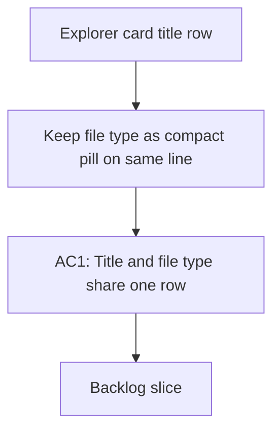

## req_009_explorer_file_type_pill_inline_with_title - Explorer file type pill inline with document title
> From version: 1.0.0
> Schema version: 1.0
> Status: Done
> Understanding: 92%
> Confidence: 90%
> Complexity: Low
> Theme: UI
> Reminder: Update status/understanding/confidence and linked backlog/task references when you edit this doc.

# Needs
- Keep the file type visible as a compact pill on the same line as the Explorer title.
- Make the title and file type feel like one atomic header row with only a small gap between them.
- Avoid adding a separate metadata line for the file type.
- Preserve the existing title click behavior and file opening behavior.
- Keep the layout compact so the list can scale to more rows without becoming tall.

# Context
- In the current Explorer card layout, the file type sits on its own line and reads like a disconnected label.
- The desired pattern is a tight title row where the title remains dominant and the file type appears as a small pill adjacent to it.
- This request is about presentation only, not about changing document selection, retrieval, or SharePoint link behavior.

# Acceptance criteria
- AC1: The Explorer card title row shows the file type as a compact pill on the same line as the title.
- AC2: The spacing between title and file type feels tight and intentional, not like two separate rows.
- AC3: The file type no longer appears as a standalone metadata line.
- AC4: The layout remains compact and readable when many Explorer rows are shown.

# Definition of Ready (DoR)
- [ ] Problem statement is explicit and user impact is clear.
- [ ] Scope boundaries (in/out) are explicit.
- [ ] Acceptance criteria are testable.
- [ ] Dependencies and known risks are listed.

# Companion docs
- Product brief(s): (none yet)
- Architecture decision(s): (none yet)

# AI Context
- Summary: Explorer file type pill inline with document title
- Keywords: explorer, file type, pill, title row, compact, metadata
- Use when: Use when framing scope, context, and acceptance checks for Explorer file type pill inline with document title.
- Skip when: Skip when the work targets another feature, repository, or workflow stage.
# Backlog
- `item_034_inline_file_type_pill_in_explorer_title_row`
- `item_035_compact_title_row_spacing_and_regression_checks`
