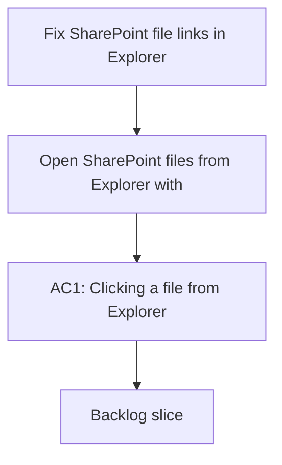

## req_010_fix_sharepoint_file_links_in_explorer - Fix SharePoint file links in Explorer
> From version: 1.0.0
> Schema version: 1.0
> Status: Done
> Understanding: 94%
> Confidence: 92%
> Complexity: Medium
> Theme: UI
> Reminder: Update status/understanding/confidence and linked backlog/task references when you edit this doc.

# Needs
- Open SharePoint files from Explorer with the native web page for the file.
- Prefer the canonical `webUrl` when the export provides it.
- Keep a safe fallback path when the corpus does not yet expose a usable file URL.
- Avoid broken reconstructed URLs that can 404 on SharePoint.
- Preserve the current compact path label behavior in the UI.

# Context
- The current Explorer file click behavior needs to open the SharePoint web version of the file.
- A reconstructed URL based only on site URL and path can point to the wrong location and return a 404.
- The live export already has access to Graph item metadata, so the file web URL should be carried through when available.
- This is a presentation and navigation fix, not a change to retrieval or permissions.

# Acceptance criteria
- AC1: Clicking a file from Explorer opens the SharePoint web page for that file in a new tab.
- AC2: When the corpus exposes a native file `webUrl`, the UI uses it instead of rebuilding a path-based URL.
- AC3: If no native `webUrl` is available, the UI still falls back to a safe SharePoint URL path.
- AC4: The compact inline path presentation remains intact and does not regress the layout.
- AC5: The fix is covered by UI tests that assert the link behavior.

# Definition of Ready (DoR)
- [x] Problem statement is explicit and user impact is clear.
- [x] Scope boundaries (in/out) are explicit.
- [x] Acceptance criteria are testable.
- [x] Dependencies and known risks are listed.

# Companion docs
- Product brief(s): (none yet)
- Architecture decision(s): (none yet)

# AI Context
- Summary: Fix SharePoint file links in Explorer
- Keywords: sharepoint, webUrl, explorer, file links, new tab, fallback
- Use when: Use when framing scope, context, and acceptance checks for Fix SharePoint file links in Explorer.
- Skip when: Skip when the work targets another feature, repository, or workflow stage.
# Backlog
- `item_036_use_native_sharepoint_file_weburl`
- `item_037_fallback_file_link_resolution_and_link_tests`
