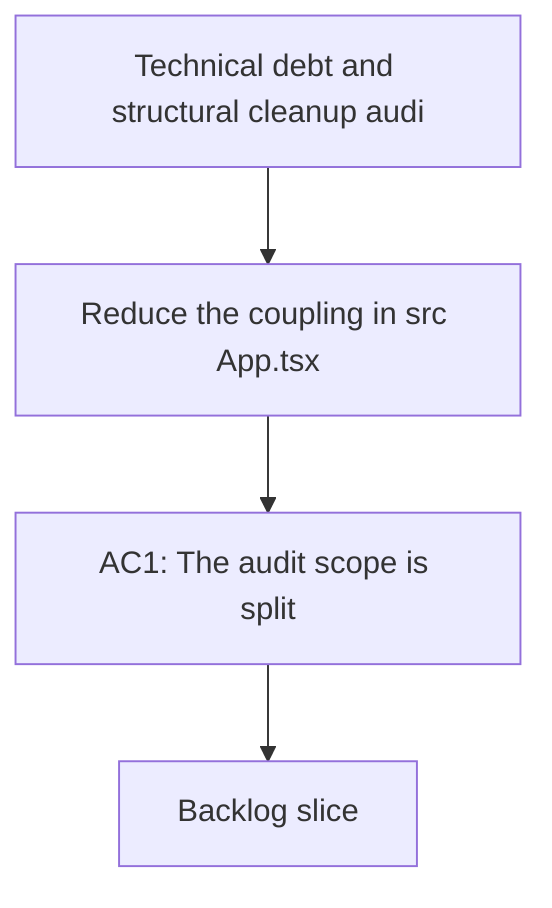

## req_011_audit_de_dette_technique_et_cleanup_structurel - Technical debt and structural cleanup audit
> From version: 1.0.1
> Schema version: 1.0
> Status: Done
> Understanding: 99%
> Confidence: 99%
> Complexity: High
> Theme: General
> Reminder: Update status, understanding, confidence, and linked backlog or task references when you edit this doc.

# Needs
- Reduce the coupling in `src/App.tsx` so the shell, explorer, Bishop view, and sync view become smaller, testable units.
- Split `src/lib/deepvault.ts` into clearer retrieval, scoring, evaluation, and formatting boundaries.
- Clarify the Bishop orchestration contract so local fallback, grounded-only flow, and remote orchestration are explicit and observable.
- Harden the live export pipeline in `scripts/export-live.ts` and `scripts/deepvault-graph.ts` so resume, checkpoint, and failure handling are easier to reason about.
- Clean up Logics workflow hygiene issues such as stale index entries, duplicate-scope docs, and mismatched reference labels.

# Context
- The current app passes lint, typecheck, unit tests, build, and e2e, so the problem is maintainability and clarity rather than a functional outage.
- `src/App.tsx` is a large entrypoint that mixes app state, async orchestration, UI rendering, and live corpus loading.
- `src/lib/deepvault.ts` combines text normalization, ranking, grounding, evaluation rows, and formatting in one module.
- `src/lib/bishop.ts` currently collapses several orchestration outcomes into a single flow, which makes traceability harder to interpret.
- `scripts/export-live.ts` and `scripts/deepvault-graph.ts` handle Graph auth, site export, checkpointing, and output writing in the same delivery slice.
- `README.md` and `package.json` should stay aligned on the actual validation path, especially around `npm run check` versus `npm run e2e`.
- `logics/INDEX.md` still contains a malformed row for `adr_014`, and the duplicate detector shows several overlapping request/backlog/ADR pairs that should be reviewed before the workflow grows further.

# Acceptance criteria
- AC1: The audit scope is split into bounded cleanup slices with no overlap between UI, retrieval, orchestration, export, and workflow hygiene work.
- AC2: Each slice has a clear user value, explicit risk, and a validation path.
- AC3: In-scope and out-of-scope items are documented so the work can be promoted to backlog without ambiguity.
- AC4: The top workflow hygiene issues are identified, including the malformed `logics/INDEX.md` row and the strongest duplicate-document candidates.

# Definition of Ready (DoR)
- [x] Problem statement is explicit and user impact is clear.
- [x] Scope boundaries are explicit.
- [x] Acceptance criteria are testable.
- [x] Dependencies and known risks are listed.

# Companion docs
- Product brief(s): (none yet)
- Architecture decision(s):
  - `logics/architecture/adr_018_split_the_app_shell_and_ui_state_boundaries.md`
  - `logics/architecture/adr_019_split_deepvault_retrieval_and_evaluation_helpers.md`
  - `logics/architecture/adr_020_clarify_bishop_orchestration_states_and_response_contract.md`
  - `logics/architecture/adr_021_harden_live_export_and_checkpoint_boundaries.md`

# AI Context
- Summary: Technical debt and structural cleanup audit for DeepVault Nexus
- Keywords: audit, technical debt, refactor, cleanup, orchestration, export, workflow hygiene
- Use when: Use when framing the maintenance scope, boundaries, and validation path for the project-wide cleanup work.
- Skip when: Skip when the work targets a feature request, product brief, or architecture decision instead of repository hygiene.

# Backlog
- `item_038_refactor_app_shell_and_ui_state`
- `item_039_split_deepvault_retrieval_and_evaluation_helpers`
- `item_040_clarify_bishop_orchestration_contract`
- `item_041_harden_live_export_and_checkpoint_handling`
- `item_042_clean_logics_workflow_hygiene_and_references`

# Outcome
- Completed via `task_016_orchestrate_technical_debt_cleanup_waves` and its five bounded waves.
