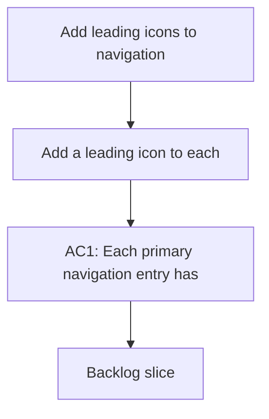

## req_012_add_leading_icons_to_navigation - Add leading icons to navigation
> From version: 1.0.0
> Schema version: 1.0
> Status: Done
> Understanding: 96%
> Confidence: 92%
> Complexity: Medium
> Theme: UI
> Reminder: Update status/understanding/confidence and linked backlog/task references when you edit this doc.

# Needs
- Add a leading icon to each primary navigation entry in the sidebar so the menu is easier to scan and visually distinct.
- Keep the current navigation structure and labels intact while improving the menu affordance.
- Preserve keyboard accessibility and avoid cluttering the sidebar on smaller screens.

# Context
- The sidebar currently shows text-only navigation entries for Explorer, Bishop, and Sync status.
- The new icons should appear before each label and should match the existing visual tone of the app.
- The change should not alter routing, tab state, or navigation behavior.
- The implementation should keep the menu readable in both active and inactive states.

# Acceptance criteria
- AC1: Each primary navigation entry has a leading icon.
- AC2: The text labels, tab order, and click behavior remain unchanged.
- AC3: The icons are visually aligned and readable in active and inactive states.
- AC4: The sidebar remains usable on smaller screens without awkward wrapping or overlap.

# Definition of Ready (DoR)
- [x] Problem statement is explicit and user impact is clear.
- [x] Scope boundaries (in/out) are explicit.
- [x] Acceptance criteria are testable.
- [x] Dependencies and known risks are listed.

# Companion docs
- Product brief(s): (none yet)
- Architecture decision(s): (none yet)

# AI Context
- Summary: Add leading icons to the sidebar navigation entries.
- Keywords: navigation, sidebar, icon, ui, accessibility
- Use when: Use when framing the menu icon refresh for the main navigation.
- Skip when: Skip when the work targets layout, routing, or content changes instead of navigation affordances.
# Backlog
- `item_043_add_leading_icons_to_navigation`
