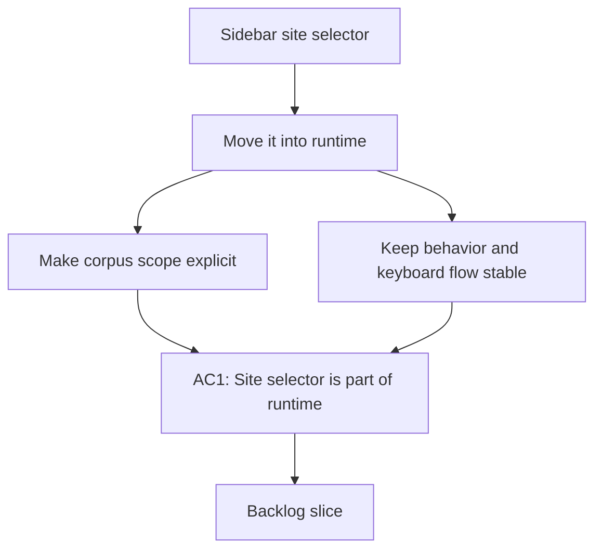

## req_013_d_placer_le_s_lecteur_de_sites_dans_le_runtime - Déplacer le sélecteur de sites dans le runtime
> From version: 1.0.0
> Schema version: 1.0
> Status: Draft
> Understanding: 96%
> Confidence: 92%
> Complexity: Medium
> Theme: UI
> Reminder: Update status/understanding/confidence and linked backlog/task references when you edit this doc.

# Needs
- Move the site selector into the runtime controls so it behaves like a global execution context rather than an explorer-only filter.
- Make the selected site scope visible and editable alongside role and provider.
- Keep the current corpus behavior stable when no site is selected or when all sites remain active.

# Context
- The current sidebar treats site selection like a separate pilot-site filter.
- The runtime controls already group execution-wide parameters such as role and provider.
- A runtime-level site selector should affect all views that depend on the corpus scope, not only the explorer.
- The implementation should preserve keyboard navigation, avoid duplicating the control, and keep the active scope obvious.
- The change may require a clearer label than "Pilot sites" if the control becomes a true runtime scope selector.

# Acceptance criteria
- AC1: The site selector appears in the runtime controls next to role and provider.
- AC2: The selected site scope is clearly labeled and remains easy to change.
- AC3: Explorer, Bishop, and sync views use the same active corpus scope.
- AC4: Keyboard navigation and tab order remain usable after the move.
- AC5: The UI still works when all sites are active or when the scope is narrowed to a single site.

# Definition of Ready (DoR)
- [x] Problem statement is explicit and user impact is clear.
- [x] Scope boundaries (in/out) are explicit.
- [x] Acceptance criteria are testable.
- [x] Dependencies and known risks are listed.

# Companion docs
- Product brief(s): (none yet)
- Architecture decision(s): (none yet)

# AI Context
- Summary: Move the site selector into runtime controls.
- Keywords: runtime, site scope, selector, explorer, bishop
- Use when: Use when framing the navigation/runtime context selection change.
- Skip when: Skip when the work only touches explorer-local filtering or unrelated UI controls.
# Backlog
- `item_044_d_placer_le_s_lecteur_de_sites_dans_le_runtime`
