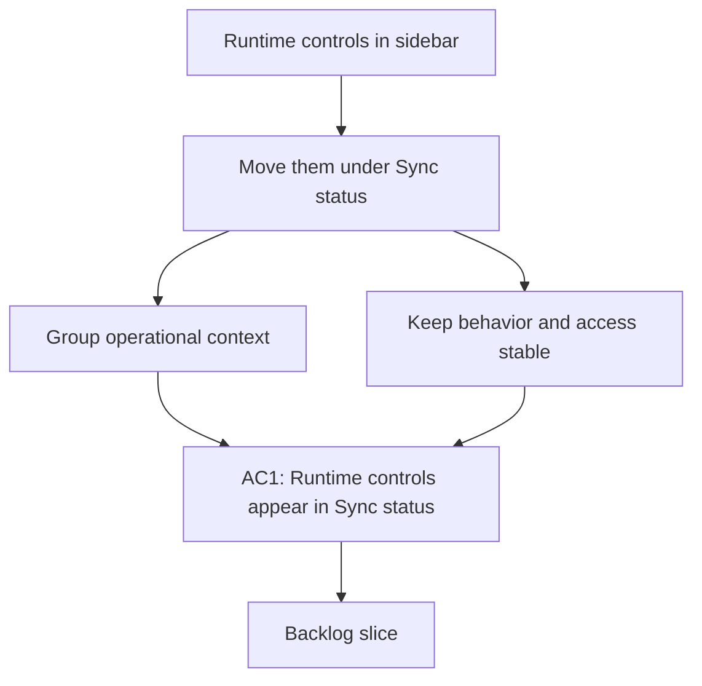

## req_014_d_placer_runtime_sous_sync_status - Déplacer Runtime sous Sync status
> From version: 1.0.0
> Schema version: 1.0
> Status: Draft
> Understanding: 96%
> Confidence: 92%
> Complexity: Medium
> Theme: UI
> Reminder: Update status/understanding/confidence and linked backlog/task references when you edit this doc.

# Needs
- Move the runtime controls into the Sync status page so the execution context lives with the operational state it controls.
- Keep role, provider, and site scope visible together in one place.
- Avoid changing the underlying behavior of the controls or the corpus scope they apply to.

# Context
- The current UI treats Runtime like a standalone sidebar section.
- Sync status already groups operational information about corpus state, sync coverage, and refresh history.
- Moving Runtime under Sync status should reduce sidebar noise and make the operational controls feel like part of the same workflow.
- The new layout must keep keyboard navigation and readability intact on desktop and smaller screens.
- The runtime panel should remain easy to scan and should not hide the active scope behind extra clicks.

# Acceptance criteria
- AC1: Runtime controls are shown inside the Sync status page rather than as a standalone sidebar section.
- AC2: Role, provider, and site scope remain editable in the runtime panel.
- AC3: The active runtime context is clearly visible without changing the existing control behavior.
- AC4: Keyboard navigation and tab order remain usable after the move.
- AC5: The Sync status page still reads well on smaller screens and does not become cluttered.

# Definition of Ready (DoR)
- [x] Problem statement is explicit and user impact is clear.
- [x] Scope boundaries (in/out) are explicit.
- [x] Acceptance criteria are testable.
- [x] Dependencies and known risks are listed.

# Companion docs
- Product brief(s): (none yet)
- Architecture decision(s): (none yet)

# AI Context
- Summary: Move runtime controls into the Sync status page.
- Keywords: runtime, sync status, site scope, role, provider, ui
- Use when: Use when framing the UI move that groups runtime controls with operational status.
- Skip when: Skip when the work only changes sidebar labels or explorer-local filters.
# Backlog
- `item_045_d_placer_runtime_sous_sync_status`
